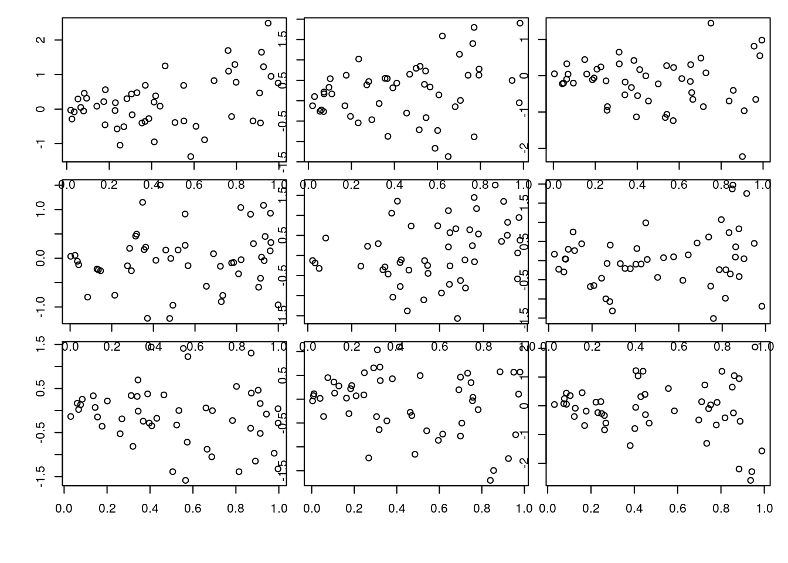
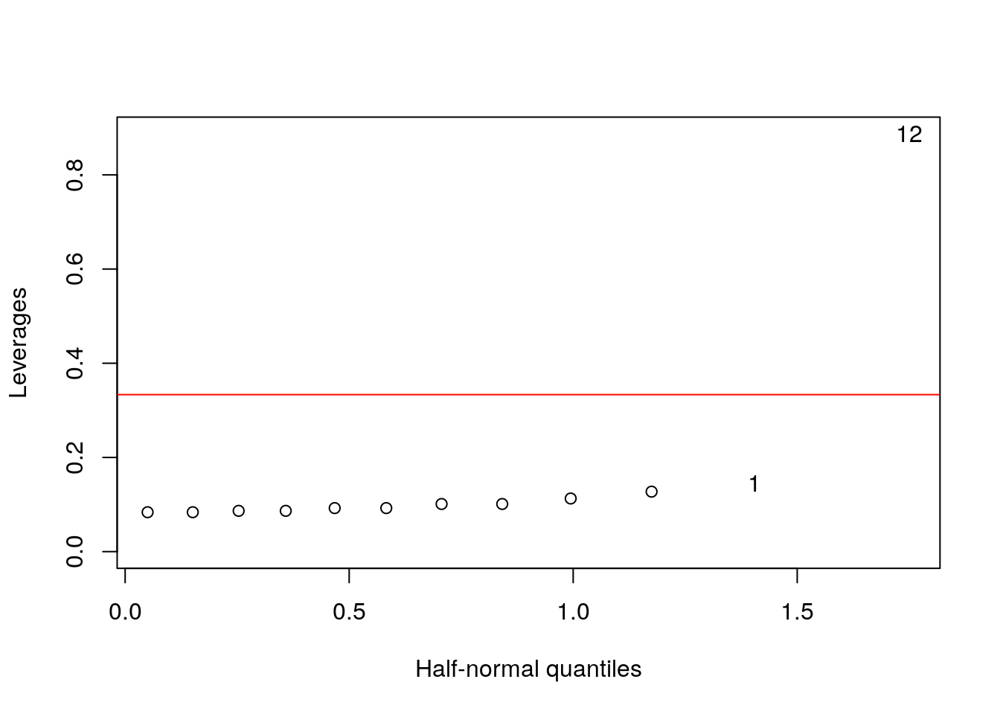
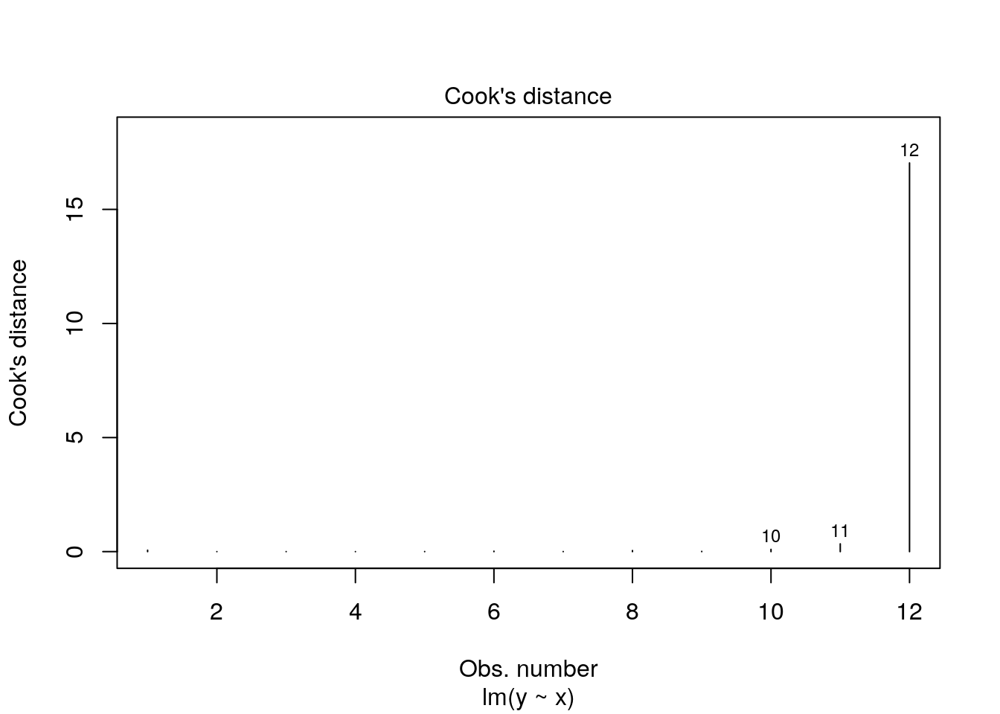
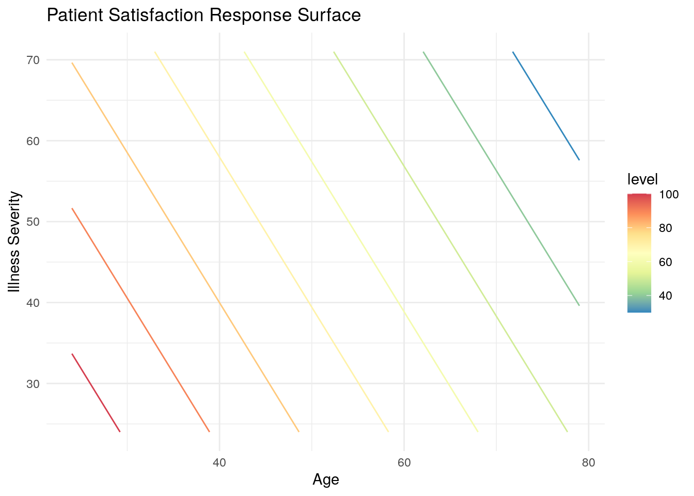
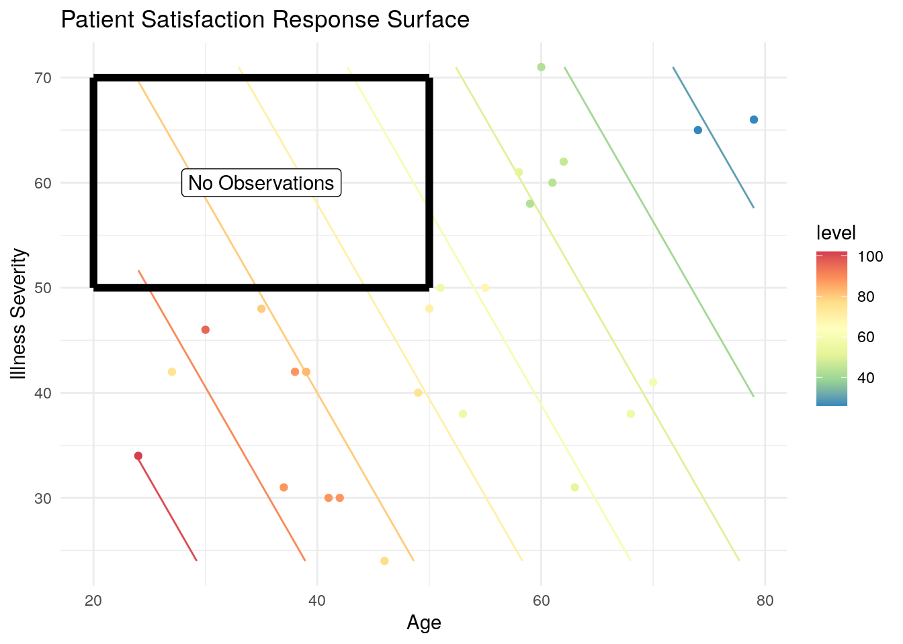
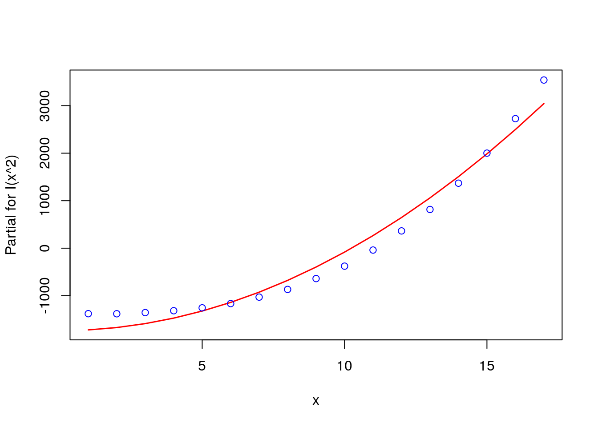
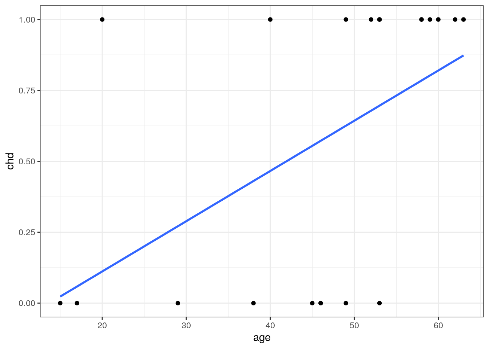

# Fundamentals of Regression


## Admin

For any errors associated with this section, please contact <a href="mailto:john.f.king1.mil@mail.mil">John King</a> or <a href="mailto:stephen.e.gillespie.mil@mail.mil">Steve Gillespie</a>.


This chapter was published using the following software:

* R version 3.6.0 (2019-04-26).
* On x86_64-pc-linux-gnu (64-bit) running Ubuntu 18.04.2 LTS.
* Packages used in this chapter are explicitly shown in the code snippets.


## Simple Linear Regression

The purpose of regression is to describe a relationship that explains one variable (the *response*, or the "y" variable) based on one or more other variables (the *predictors*, or the "x" variables). The simplest deterministic mathematical relationship between two variables $x$ and $y$ is a linear relationship, which we define as:

$$y = \beta_{0} + \beta_{1}x + \varepsilon$$

where,

* $\beta_{0}$ is the y-intercept
* $\beta_{1}$ is the slope
* $\varepsilon$ is the error in $y$ not explained by $\beta_{0}$ and $\beta_{1}$. 

If there is no error in the model and a linear relationship exists, we could predict the true value of y given any value of x. With error, however, we can only estimate y, which we annotate by $\hat{y}$. The regression line itself is determined using the *least squares* method, which involves drawing a line through the centroid of the data, and adjusting the slope until the squared distance between the straight line and each observed value (the *residual*) is minimized. For example, assume we have the following observations of height in inches (predictor) and weight in pounds (response).


```r
library(tidyverse)
library(GGally)

df = tibble(
  height = c(66, 54, 50, 74, 59, 53),
  weight = c(141, 128, 123, 160, 136, 139)
)
```

### Least Squares Method Manually

The centroid coordinates $(\bar{x},\bar{y})$ are calculated simply by $\bar{x}$ = `mean(df$height)` = 59.33, and $\bar{y}$ = `mean(df$weight)` = 137.83. Plotting the data with the centroid, we get:


To find the slope, $\beta_{1}$, we calculate how much each height and weight observation deviate from the centroid, multiply those paired deviations, sum them, and divide that by the sums of the squared height deviations. With the height and weight data, we find:


```r
df = df %>%
  mutate(
    h_dev = height - mean(height),    # height deviation from centroid
    w_dev = weight - mean(weight),    # weight deviation from centroid
    dev_prod = h_dev * w_dev,         # the product of the deviations
    h_dev_squared = h_dev^2           # the squared products
  )
```

| height | weight | height deviance | weight deviance | deviation products | height deviance squared |
|--------|--------|-----------------|-----------------|--------------------|-------------------------|
| x | y | $x_{i}-\bar{x}$ | $y_{i}-\bar{y}$ | $(x_{i}-\bar{x})(y_{i}-\bar{y})$ | $(x_{i}-\bar{x})^{2}$ |
| 66 | 141 | 6.67 | 3.17 | 21.14 | 44.49 |
| 54 | 128 | -5.33 | -9.83 | 52.39 | 28.41 |
| 50 | 123 | -9.33 | -14.83 | 138.36 | 87.05 |
| 74 | 160 | 14.67 | 22.17 | 325.23 | 215.21 |
| 59 | 136 | -0.33 | -1.83 | 0.60 | 0.11 |
| 53 | 139 | -6.33 | 1.17 | -7.41 | 40.07 |
| $\bar{x} = 59.33$ | $\bar{y} = 137.83$ |-|-| $\Sigma = 530.33$ | $\Sigma = 415.33$ |

The slope is found by $\beta_{1} = \frac{\Sigma (x_{i}-\bar{x})(y_{i}-\bar{y})}{\Sigma (x_{i}-\bar{x})^{2}} = \frac{530.33}{415.33} = 1.28$. For our dataset in *R*, that translates to: 


```r
beta1 = sum(df$dev_prod) / sum(df$h_dev_squared)
beta1
```

```
## [1] 1.276886
```

We have now have what we need to calculate the y-intercept, $\beta_{0} =\bar{y}-\beta{_1}\bar{x}$. Equivalently in *R*:


```r
beta0 = mean(df$weight) - beta1 * mean(df$height)
beta0
```

```
## [1] 62.07143
```

When we plot the line defined by our beta values, we find that it does, in fact, pass through the centroid and visually appears to fit the data.  


```r
ggplot(data=df, aes(x=height, y=weight)) +
  geom_point() +
  geom_abline(intercept=beta0, slope=beta1, color='blue') + # note the explicit use of our betas
  #geom_smooth(formula=y~x, method="lm", se=FALSE) + # how it's normally done in practice
  geom_point(data = centroid, aes(x=height, y=weight), color='red', size=5) +
  annotate("text", x=61, y=138, label="centroid", color='red') +
  annotate("text", x=67.5, y=143.5, label="residual", color='blue') +
  annotate("segment", x=50, xend=50, y=123, yend=125.5, color='blue', linetype=2, size=0.5) +
  annotate("segment", x=53, xend=53, y=139, yend=129.5, color='blue', linetype=2, size=0.5) +
  annotate("segment", x=54, xend=54, y=128, yend=131.5, color='blue', linetype=2, size=0.5) +
  annotate("segment", x=59, xend=59, y=136, yend=137.5, color='blue', linetype=2, size=0.5) +
  annotate("segment", x=66, xend=66, y=141, yend=146.5, color='blue', linetype=2, size=0.5) +
  annotate("segment", x=74, xend=74, y=160, yend=156.5, color='blue', linetype=2, size=0.5) +
  theme_bw()
```


This method minimizes the residual sum of squares (RSS), which is represented mathematically by:

$$RSS = \sum\limits_{i=1}^{n}{(y_{i} - \hat{y}_{i})^2} = \sum\limits_{i=1}^{n}{\hat\varepsilon_{i}^{2}}$$

and is calculated as follows.


```r
df = df %>% mutate(
  y_hat = beta0 + beta1 * height,
  error = weight - y_hat,
  error_squared = error^2
)
print(paste("RSS =", round(sum(df$error_squared), 2)))
```

```
## [1] "RSS = 145.66"
```

| height | weight | predicted weight | error | squared error |
|--------|--------|------------------|-------|---------------|
| x | y | $\hat{y}_{i}$ | $y-\hat{y}_{i}$ | $(y-\hat{y}_{i})^2$ |
| 66 | 141 | 146.35 | -5.35 | 28.58 |
| 54 | 128 | 131.02 | -3.02 | 9.14 |
| 50 | 123 | 125.92 | -2.92 | 8.50 |
| 74 | 160 | 156.56 | 3.44 | 11.83 |
| 59 | 136 | 137.41 | -1.41 | 1.98 |
| 53 | 139 | 129.75 | 9.25 | 85.63 |
| $\bar{x} = 59.33$ | $\bar{y} = 137.83$ |-|-| $RSS: \Sigma = 145.66$ |

### Goodness of Fit

While RSS gives us an idea of how well the regression prediction ($\hat{y}$) can approximate the response ($y$), it does not tell us how well the model fits the data because it has the same units as $y$. To obtain a unitless measure of fit, $R^2$ (also called the coefficient of determination), RSS is divided by the total sum of squares (TSS), and that ratio is substracted from 1.

$$R^2 = 1- \frac{RSS}{TSS} = 1 - \frac{\Sigma(y_{i} - \hat{y}_{i})^2}{\Sigma(y_{i} - \bar{y}_{i})^2}$$

We calculate $R^2$ for the height/weight data as follows:


```r
1 - sum(df$error_squared) / sum(df$w_dev^2)
```

```
## [1] 0.8229798
```

We interpret $R^2$ as the proportion of weight variation explained by the linear model. As a proportion, $R^2$ varies from 0 to 1, and ideally we seek models with a high $R^2$. A graphical depiction of RSS and TSS for one of the residuals illustrates their relationship.


### Least Squares Method In *R*

That was a fair amount of work, and of course *R* simplifies the process. Fortunately, the syntax for creating a linear model is very similar to ANOVA.


```r
df.lm = lm(weight ~ height, data=df)
summary(df.lm)
```

```
## 
## Call:
## lm(formula = weight ~ height, data = df)
## 
## Residuals:
##      1      2      3      4      5      6 
## -5.346 -3.023 -2.916  3.439 -1.408  9.254 
## 
## Coefficients:
##             Estimate Std. Error t value Pr(>|t|)  
## (Intercept)  62.0714    17.7405   3.499   0.0249 *
## height        1.2769     0.2961   4.312   0.0125 *
## ---
## Signif. codes:  0 '***' 0.001 '**' 0.01 '*' 0.05 '.' 0.1 ' ' 1
## 
## Residual standard error: 6.034 on 4 degrees of freedom
## Multiple R-squared:  0.823,	Adjusted R-squared:  0.7787 
## F-statistic:  18.6 on 1 and 4 DF,  p-value: 0.01252
```

Going through each section of the output from top to bottom:

**Call:** This is simply the formula we gave the `lm()` function. 

**Residuals:** The residuals in order of observation.

**Coefficients:**

* `Estimate` These are the $\beta$s, and we see that they match our values calculated above.
* `Std. Error` is the standard deviation of each `Estimate` (or $\beta$) and can be used to determine the 95% confidence interval (CI). For example, the 95% CI for `height` is $1.28 \pm 1.96(0.296)$.
* `t value` is `Estimate` / `Std. Error`.
* `Pr(>|t|)` is the probability of observing a value at least as extreme as $\beta$ using a t-distribution and $(n-p-1)$ degrees of freedom. The null hypothesis is $H_{o}: \beta_{i}=0$. Notice that this is a test of each individual predictor.

<!-- Steve comment:  If I'm not mistaken, R doesn't use a z test if you calculate CIs on your estimates.  I think it uses a t test (which, with enough observations is about the same).  It might be worth noting that this CI estimate is similar to what we did in chapter 2.  see confint section below-->

**Residual standard error:** The square root of RSS divided by the difference of number of observations and the number of predictors. Or, $RSE = \sqrt{\frac{RSS}{n-p}}$. Degrees of freedom is $(n-p-1)$.

**Multiple R-squared:** The $R^2$ we calculated above.

**Adjusted R-squared:**Normalizes $R^2$ by accounting for the number of observations and predictors in the model. When conducting multiple linear regression, this is the appropriate method of measuring goodness of fit. Adjusted r-squared is calculated by: $\bar{R}^{2} = 1 - (1 - R^{2}) \frac{n-1}{n-p-1}$.

**F-statistic:** The global test of significance where we wish to determine if *at least one* predictor is sginificant. The null hypothesis is $H_{o}: \beta_{1}=...=\beta_{p-1}=0$ under the F-distribution with $p-1$ and $n-p-1$ degrees of freedom.

We interpret the linear model in the following manner: **for every inch increase in height, we predict a person's weight increases by 1.28 pounds**.

*R* allows us to do several things with a model.  We can use *R* to give us a confidence interval on our coefficients using `confint`:


```r
# Note confint has several options
confint(df.lm)
```

```
##                  2.5 %     97.5 %
## (Intercept) 12.8158877 111.326969
## height       0.4547796   2.098992
```

```r
# Note this is more precise than the Z estimation shown above as it accounts for our sample size and uses a t test
```

We can also predict results using `predict`  Predict can either give you a point estimate, or an interval based on either the mean predictions (using `'confidence'`) or a single point (using `'prediction'`).  You can read more about these options <a href = 'http://www.sthda.com/english/articles/40-regression-analysis/166-predict-in-r-model-predictions-and-confidence-intervals/'>here</a>. 


```r
predict(df.lm, list(height = 66))
```

```
##        1 
## 146.3459
```

```r
predict(df.lm, list(height = 66), interval = 'confidence')
```

```
##        fit      lwr      upr
## 1 146.3459 137.5811 155.1108
```

```r
predict(df.lm, list(height = 66), interval = 'prediction')
```

```
##        fit      lwr      upr
## 1 146.3459 127.4375 165.2544
```

Note, *R* will not prevent one from extrapolating beyond the data. Predicting a result on values outside the observed data is bad practice and should generally be avoided.

Finally, one can plot the results and a regression quite simply with `ggplot` using `stat_smooth`:


```r
ggplot(data = df, aes(x = height, y = weight)) + # Provide your data and aesthetics as usual
  geom_point() +  # plot the observations
  # stat_smooth creates a linear regression based on your given x and y values (i.e. lm(y~x))
  # you can also plot the standard error
  stat_smooth(method = 'lm', se = T) 
```

```
## `geom_smooth()` using formula 'y ~ x'
```


### Simple Linear Regression Problem Set 

**For this problem set, you will have to read the next section on assumptions and diagnostics if you are not familiar with the assumptions necessary for simple linear regression.**

The problem set for this section is located <a href = '/_Chapter6_ProblemSets/Simple_Linear_Regression_PS_Questions.html'>here</a>.

For your convenience, the R markdown version is <a href = '/_Chapter6_ProblemSets/Simple_Linear_Regression_PS_Questions.Rmd'>here</a>.

The solutions are located <a href = '/_Chapter6_ProblemSets/Simple_Linear_Regression_PS_Answers.html'>here</a>.

## Assumptions and Diagnostics

There are four assumptions fundamental to linear regression:

1. **Linearity:** The relationship between x and the mean of y is linear.
2. **Homoscedasticity:** The variance of residual is the same for any value of x (i.e, constant variance).
3. **Independence:** Independence of the prediction error from every one of the predictor variables.
4. **Normality:** The prediction error is normally distributed.

When conducting linear regression, we need to always perform diagnostic check to ensure we are not violating any of the inherent assumptions.

### Linearity

The assumption is that the relationship between x and the mean of y is linear, but what does that mean exactly? A regression model is linear if $E[Y|X =x]$ is a linear function **of the $\beta$ parameters**, not of $x$. That means each of the following is a linear model:

* $\beta_{0} + \beta_{1}x$ (note^[This model is linear in $\beta$ **and** $x$])
* $\beta_{0} + \beta_{1}x + \beta_{2}x^{2} + \beta_{3}x^{3}$
* $\beta_{0} + \beta_{1}log(x) + \beta_{2}sin(x)$

These are *not* linear models:

* $\beta_{0} + x^{\beta_{1}}$
<p>&nbsp;</p>
* $\frac{1}{\beta_{0} + \beta_{1}x}$
<p>&nbsp;</p>
* $\frac{e^{\beta_{0}+\beta_{1}x_{1}}}{1+e^{\beta_{0}+\beta_{1}x_{1}}}$ (note^[This is actually logistic regression, which is covered later.])

As with ANOVA, *R* produces diagnostic plots for objects created by the `lm()` function. The first plot may be used to evaluate both linearity and homoscedasticity. A linear relationship will be indicated by a (relatively) horizontal red line on the plot. Since our height-weight data is so simple, we'll switch to the `teengamb` dataset from the `faraway` package. This dataset consists of four predictor variables and one response (`gamble`). Read the help for `teengamb` to familiarize youself with the data. Since one of the predictors is binary (`sex`), we'll exclude it for this example. ^[The variable was excluded for simplicity at this point, not because we can't include binary predictors in a linear model. We'll cover this in a later section.] A summary of the resulting linear model is as follows.


```r
library(faraway)
```

```
## 
## Attaching package: 'faraway'
```

```
## The following object is masked from 'package:GGally':
## 
##     happy
```

```r
tg.lm = lm(gamble ~ . -sex, data=teengamb)
summary(tg.lm)
```

```
## 
## Call:
## lm(formula = gamble ~ . - sex, data = teengamb)
## 
## Residuals:
##     Min      1Q  Median      3Q     Max 
## -49.649 -12.008  -1.242   8.239 103.390 
## 
## Coefficients:
##             Estimate Std. Error t value Pr(>|t|)    
## (Intercept)  -1.3044    15.7760  -0.083   0.9345    
## status        0.4701     0.2509   1.873   0.0678 .  
## income        5.7707     1.0494   5.499 1.95e-06 ***
## verbal       -4.1211     2.2785  -1.809   0.0775 .  
## ---
## Signif. codes:  0 '***' 0.001 '**' 0.01 '*' 0.05 '.' 0.1 ' ' 1
## 
## Residual standard error: 24.28 on 43 degrees of freedom
## Multiple R-squared:  0.445,	Adjusted R-squared:  0.4062 
## F-statistic: 11.49 on 3 and 43 DF,  p-value: 1.161e-05
```

The diagnostic plot to check the linearity assumption is the first plot returned, and we see a slight "U" shape to the red line. Notice that there are only three observations on the far right which appear to be heavily influencing the results. The conical spread of the data also strongly suggests heteroscedasticity might be an issue.


```r
plot(tg.lm, which = 1)
```


Another screening method is with a paris plot, which we can quickly produce in base *R* with `pairs()`. This is a great way to do a quick check potential nonlinear relationships between pairs of variables. This is a screening method only, however, because we're projecting onto two dimensions, so we may be missing things lurking in higher dimensions.


```r
pairs(teengamb[, 2:5], upper.panel=NULL, lower.panel=panel.smooth)
```


If evidence of a nonlinear relationship exists, a linear model can still be used; however, either the response variable or one or more of the predictors must be transformed. This topic is covered in detail in the Advanced Designs chapter.

### Homoscedasticity

The procedure for testing constant variance in residuals in a linear model is similar to ANOVA. A plot of residuals versus fitted values is shown two plots ago, and we can look at the square root of standardized residuals versus fitted values. Both plots show strong evidence of heteroscedasticity.


```r
plot(tg.lm, which = 3)
```


There is no doubt some subjectivity to visual inspections. As a guide, consider the next three sets of plots that show constance variance, mild heteroscedasticity, and strong heteroscedasticity.

Constant variance:


```r
par(mfrow = c(3,3), oma = c(5,4,0,0) + 0.1, mar = c(0,0,1,1) + 0.1)

n <- 50 
for(i in 1:9) {x <- runif(n); plot(x,rnorm(n))} 
```


Mild heteroscedasticity:


```r
par(mfrow = c(3,3), oma = c(5,4,0,0) + 0.1, mar = c(0,0,1,1) + 0.1)

for(i in 1:9) {x <- runif(n); plot(x,sqrt((x))*rnorm(n))} 
```



Strong heteroscedasticity:


```r
par(mfrow = c(3,3), oma = c(5,4,0,0) + 0.1, mar = c(0,0,1,1) + 0.1)

for(i in 1:9) {x <- runif(n); plot(x,x*rnorm(n))}
```


The linear model analog to the Levene test is the Breusch-Pagan test. The null hypothesis is that the residuals have constant variance, and the alternative is that the error variance changes with the level of the response or with a linear combination of predictors. The `ncvTest()` from the `car` (companion to applied regression) package performs the test, and when applied to the `tg.lm` object confirms our suspicion of non-constant variance based on our visual inspection.


```r
car::ncvTest(tg.lm)
```

```
## Non-constant Variance Score Test 
## Variance formula: ~ fitted.values 
## Chisquare = 26.18623, Df = 1, p = 3.1003e-07
```

### Independence

The concept of indepedent (and identically distributed) data was covered in the statistics review and ANOVA chapters. It is no different when conducting linear regression and so will not be repeated here. 

### Normality

Again, checking whether the residuals are normally distributed is the same for linear regression as for ANOVA. Create a Q-Q plot and apply the Shapiro-Wilk test as shown below. 


```r
plot(tg.lm, which=2)
```


```r
shapiro.test(residuals(tg.lm))
```

```
## 
## 	Shapiro-Wilk normality test
## 
## data:  residuals(tg.lm)
## W = 0.8651, p-value = 6.604e-05
```

### Unusual Observations

Although not an assumption inherent to a linear model, it's good practice to also check for unusual observations when performing diagnostic checks. There are two types of unusual observations: outliers and influential. An *outlier* is an observation with a large residual - it plots substantially above or below the regression line. An *influential observation* is one that substantially changes the model fit. Keep in mind that it is possible for an observation to have both characteristics. Examples Both types of observations are shown on the following plot (note that I rigged observations 11 and 12 to be unsual observations).


It's not necessarily bad to have unusual observations, but it's good practice to check for them, and, if found, decide what to do about them. A point with high *leverage* falls within the predictor space but is significantly separated from the other points. It has the potential to influence the fit but may not actually do so.

#### Leverage Points

The amount of leverage associated with each observation is called the *hat value* and are the diagonal elements of the *hat matrix*, which you can read more about <a href="https://www.sciencedirect.com/topics/mathematics/hat-matrix">here</a>, if you're interested (or just really like linear algebra). The gist of it is that the sum of the hat values equals the number of observations. If every observation has exactly the same leverage, then the hat values will all equal $p/n$, where p is the number of parameters and n is the number of observations (in our example we just have two parameters, so it's $2/n$). Increasing the hat value of one observation necessitates decreasing the hat values of the others, so we're essentially looking for hat values significantly greater than this theoretical average. The generally accepted rule of thumb is that hat values greater than ~ $2p/n$ times the averages should be looked at more carefully. Extracting hat values from a linear model in *R* is done using the `hatvalues()` or `influence()` functions.


```r
df.lm = lm(y~x, data=df)
hatv = hatvalues(df.lm)
print(hatv)
```

```
##          1          2          3          4          5          6          7 
## 0.14483261 0.12736536 0.11280932 0.10116448 0.09243086 0.08660844 0.08369723 
##          8          9         10         11         12 
## 0.08369723 0.08660844 0.09243086 0.10116448 0.88719068
```

```r
influence(df.lm)$hat
```

```
##          1          2          3          4          5          6          7 
## 0.14483261 0.12736536 0.11280932 0.10116448 0.09243086 0.08660844 0.08369723 
##          8          9         10         11         12 
## 0.08369723 0.08660844 0.09243086 0.10116448 0.88719068
```

Verify that the sum of the hat values equals the number of parameters (2):


```r
print(paste("Sum of hat values:", sum(hatv)))
```

```
## [1] "Sum of hat values: 2"
```

Are any hat values > $2p/n$ (recall I rigged observation 12)?


```r
hatv > 4/length(df$x)
```

```
##     1     2     3     4     5     6     7     8     9    10    11    12 
## FALSE FALSE FALSE FALSE FALSE FALSE FALSE FALSE FALSE FALSE FALSE  TRUE
```

A graphical way of looking at leverage is with the `halfnorm()` function in the `faraway` package, which plots leverage against the positive normal quantiles. I added a red line to indicate the rule of thumb threshold.


```r
faraway::halfnorm(hatv,ylab="Leverages")
abline(h=2*mean(hatv), col='red')
```



Another measure of leaverage is *Cook's Distance*, defined as:

$$D_{i}=\frac{r^{2}_{i}}{p}\left(\frac{h_{i}}{1-h_{i}}\right)$$

The rule of thumb for Cook's Distance is an observation with $D>1$, and we can get these values in *R* with `cooks.distance()`.


```r
cooks.distance(df.lm)
```

```
##            1            2            3            4            5            6 
## 6.193970e-02 4.398193e-05 6.553697e-04 4.789149e-10 3.736810e-03 1.917568e-02 
##            7            8            9           10           11           12 
## 3.490432e-03 4.701066e-02 1.130421e-02 9.893220e-02 3.409595e-01 1.703556e+01
```

The fourth linear model plot also contains Cook's Distance.


```r
plot(df.lm, which=4)
```



#### Outliers

The hat values from the previous section are also used to calculate *standardized residuals*, $r_{i}$.

$$r_{i}=\frac{\hat{\varepsilon}_{i} }{\hat{\sigma}\sqrt{1-h_{i}}}, i=1,...,n $$

where $\hat{\varepsilon}$ are the residuals, $\hat{\sigma}$ is the estimated residual standard error, and $h$ is the leverage. The rule of thumb for identifying unusually large standardised residuals is if $|r_{i}| > 2$. We can get standardized residuals in *R* with `rstandard()`.


```r
rstandard(df.lm)
```

```
##             1             2             3             4             5 
##  8.552478e-01 -2.454950e-02  1.015300e-01 -9.225082e-05 -2.708924e-01 
##             6             7             8             9            10 
## -6.359731e-01 -2.764512e-01 -1.014559e+00 -4.882963e-01 -1.393847e+00 
##            11            12 
##  2.461458e+00  2.081408e+00
```

Here we see that observation 11 is a potential outlier, and the observation 12 is both a high leverage point and a potential outlier.

We can also look at *studentized residuals*, which are defined as:

$$t_{i} = r_{i}\sqrt{\frac{n-p-1}{n-p-r^{2}_{i}}}$$

In *R*, we can use `rstudent()`:


```r
rstudent(df.lm)
```

```
##             1             2             3             4             5 
##  8.427665e-01 -2.329041e-02  9.636946e-02 -8.751682e-05 -2.579393e-01 
##             6             7             8             9            10 
## -6.159215e-01 -2.632726e-01 -1.016216e+00 -4.688619e-01 -1.473142e+00 
##            11            12 
##  3.719616e+00  2.622850e+00
```

It may be useful to view all of these measures together and apply some conditional formatting.


```r
library(kableExtra)

df %>% 
  mutate(
    obs = 1:nrow(df),
    r.standard = round(rstandard(df.lm), 3),
    r.student = round(rstudent(df.lm), 3), 
    i.hatv = round(hatvalues(df.lm), 3),
    i.cook = round(cooks.distance(df.lm), 3)) %>%
  mutate(
    r.standard = cell_spec(r.standard, "html", color=ifelse(abs(r.standard)>2,"red", "black")),
    r.student = cell_spec(r.student, "html", color=ifelse(abs(r.student)>2,"red", "black")),
    i.hatv = cell_spec(i.hatv, "html", color=ifelse(i.hatv>4/nrow(df),"red", "black")),
    i.cook = cell_spec(i.cook, "html", color=ifelse(i.cook>1,"red", "black"))) %>%
  kable(format = "html", escape = F) %>%
  kable_styling("striped", full_width = F)
```

<table class="table table-striped" style="width: auto !important; margin-left: auto; margin-right: auto;">
 <thead>
  <tr>
   <th style="text-align:right;"> x </th>
   <th style="text-align:right;"> y </th>
   <th style="text-align:right;"> obs </th>
   <th style="text-align:left;"> r.standard </th>
   <th style="text-align:left;"> r.student </th>
   <th style="text-align:left;"> i.hatv </th>
   <th style="text-align:left;"> i.cook </th>
  </tr>
 </thead>
<tbody>
  <tr>
   <td style="text-align:right;"> 0.0000000 </td>
   <td style="text-align:right;"> 1.6854792 </td>
   <td style="text-align:right;"> 1 </td>
   <td style="text-align:left;"> <span style="     color: black !important;">0.855</span> </td>
   <td style="text-align:left;"> <span style="     color: black !important;">0.843</span> </td>
   <td style="text-align:left;"> <span style="     color: black !important;">0.145</span> </td>
   <td style="text-align:left;"> <span style="     color: black !important;">0.062</span> </td>
  </tr>
  <tr>
   <td style="text-align:right;"> 0.3333333 </td>
   <td style="text-align:right;"> 0.7509842 </td>
   <td style="text-align:right;"> 2 </td>
   <td style="text-align:left;"> <span style="     color: black !important;">-0.025</span> </td>
   <td style="text-align:left;"> <span style="     color: black !important;">-0.023</span> </td>
   <td style="text-align:left;"> <span style="     color: black !important;">0.127</span> </td>
   <td style="text-align:left;"> <span style="     color: black !important;">0</span> </td>
  </tr>
  <tr>
   <td style="text-align:right;"> 0.6666667 </td>
   <td style="text-align:right;"> 1.2482309 </td>
   <td style="text-align:right;"> 3 </td>
   <td style="text-align:left;"> <span style="     color: black !important;">0.102</span> </td>
   <td style="text-align:left;"> <span style="     color: black !important;">0.096</span> </td>
   <td style="text-align:left;"> <span style="     color: black !important;">0.113</span> </td>
   <td style="text-align:left;"> <span style="     color: black !important;">0.001</span> </td>
  </tr>
  <tr>
   <td style="text-align:right;"> 1.0000000 </td>
   <td style="text-align:right;"> 1.4164313 </td>
   <td style="text-align:right;"> 4 </td>
   <td style="text-align:left;"> <span style="     color: black !important;">0</span> </td>
   <td style="text-align:left;"> <span style="     color: black !important;">0</span> </td>
   <td style="text-align:left;"> <span style="     color: black !important;">0.101</span> </td>
   <td style="text-align:left;"> <span style="     color: black !important;">0</span> </td>
  </tr>
  <tr>
   <td style="text-align:right;"> 1.3333333 </td>
   <td style="text-align:right;"> 1.3354675 </td>
   <td style="text-align:right;"> 5 </td>
   <td style="text-align:left;"> <span style="     color: black !important;">-0.271</span> </td>
   <td style="text-align:left;"> <span style="     color: black !important;">-0.258</span> </td>
   <td style="text-align:left;"> <span style="     color: black !important;">0.092</span> </td>
   <td style="text-align:left;"> <span style="     color: black !important;">0.004</span> </td>
  </tr>
  <tr>
   <td style="text-align:right;"> 1.6666667 </td>
   <td style="text-align:right;"> 1.1136044 </td>
   <td style="text-align:right;"> 6 </td>
   <td style="text-align:left;"> <span style="     color: black !important;">-0.636</span> </td>
   <td style="text-align:left;"> <span style="     color: black !important;">-0.616</span> </td>
   <td style="text-align:left;"> <span style="     color: black !important;">0.087</span> </td>
   <td style="text-align:left;"> <span style="     color: black !important;">0.019</span> </td>
  </tr>
  <tr>
   <td style="text-align:right;"> 2.0000000 </td>
   <td style="text-align:right;"> 1.9557610 </td>
   <td style="text-align:right;"> 7 </td>
   <td style="text-align:left;"> <span style="     color: black !important;">-0.276</span> </td>
   <td style="text-align:left;"> <span style="     color: black !important;">-0.263</span> </td>
   <td style="text-align:left;"> <span style="     color: black !important;">0.084</span> </td>
   <td style="text-align:left;"> <span style="     color: black !important;">0.003</span> </td>
  </tr>
  <tr>
   <td style="text-align:right;"> 2.3333333 </td>
   <td style="text-align:right;"> 1.1860038 </td>
   <td style="text-align:right;"> 8 </td>
   <td style="text-align:left;"> <span style="     color: black !important;">-1.015</span> </td>
   <td style="text-align:left;"> <span style="     color: black !important;">-1.016</span> </td>
   <td style="text-align:left;"> <span style="     color: black !important;">0.084</span> </td>
   <td style="text-align:left;"> <span style="     color: black !important;">0.047</span> </td>
  </tr>
  <tr>
   <td style="text-align:right;"> 2.6666667 </td>
   <td style="text-align:right;"> 2.2758785 </td>
   <td style="text-align:right;"> 9 </td>
   <td style="text-align:left;"> <span style="     color: black !important;">-0.488</span> </td>
   <td style="text-align:left;"> <span style="     color: black !important;">-0.469</span> </td>
   <td style="text-align:left;"> <span style="     color: black !important;">0.087</span> </td>
   <td style="text-align:left;"> <span style="     color: black !important;">0.011</span> </td>
  </tr>
  <tr>
   <td style="text-align:right;"> 3.0000000 </td>
   <td style="text-align:right;"> 1.2686430 </td>
   <td style="text-align:right;"> 10 </td>
   <td style="text-align:left;"> <span style="     color: black !important;">-1.394</span> </td>
   <td style="text-align:left;"> <span style="     color: black !important;">-1.473</span> </td>
   <td style="text-align:left;"> <span style="     color: black !important;">0.092</span> </td>
   <td style="text-align:left;"> <span style="     color: black !important;">0.099</span> </td>
  </tr>
  <tr>
   <td style="text-align:right;"> 1.0000000 </td>
   <td style="text-align:right;"> 5.0000000 </td>
   <td style="text-align:right;"> 11 </td>
   <td style="text-align:left;"> <span style="     color: red !important;">2.461</span> </td>
   <td style="text-align:left;"> <span style="     color: red !important;">3.72</span> </td>
   <td style="text-align:left;"> <span style="     color: black !important;">0.101</span> </td>
   <td style="text-align:left;"> <span style="     color: black !important;">0.341</span> </td>
  </tr>
  <tr>
   <td style="text-align:right;"> 10.0000000 </td>
   <td style="text-align:right;"> 11.0000000 </td>
   <td style="text-align:right;"> 12 </td>
   <td style="text-align:left;"> <span style="     color: red !important;">2.081</span> </td>
   <td style="text-align:left;"> <span style="     color: red !important;">2.623</span> </td>
   <td style="text-align:left;"> <span style="     color: red !important;">0.887</span> </td>
   <td style="text-align:left;"> <span style="     color: red !important;">17.036</span> </td>
  </tr>
</tbody>
</table>

#### What To Do About Unusual Observations

In the book, Linear Models With R, @faraway2014 gives advice on this topic that I'll paraphrase.

1. Check for data entry errors and correct any that are found.
2. Consider the context. An unusual observation may be the single most important observation in the study.
3. Exclude the observation from the dataset and refit a model. If it makes little to no difference in your analysis, then it's usually best to leave it in.
4. Do not automate the process of excluding outliers (see #2 above).
5. If you exclude an observation, document it in your report and explain your rationale so that your analytic integrety is not questioned.


### Linear Regression Assumptions and Diagnostics Problem Set

There is no problem set associated with this section.  We check our assumptions and do diagnostic checks in all our analyses.

## Multiple Linear Regression

In the previous section we considered just one predictor and one response. The linear model can be expanded to include multiple predictors by simply adding terms to the equation:

$$y = \beta_{0} + \beta_{1}x_{1}+ \beta_{2}x_{2} + ... + \beta_{(p-1)}x_{(p-1)} + \varepsilon$$

With one predictor, least squares regression produces a regression line. With two predictors, we get a regression plane (shown below), and so on up to a $(p-1)$ dimensional hyperplane. 


```{=html}
<div id="htmlwidget-2a8e9539872343d5916c" style="width:672px;height:480px;" class="plotly html-widget"></div>
<script type="application/json" data-for="htmlwidget-2a8e9539872343d5916c">{"x":{"visdat":{"e9c77bd48e2":["function () ","plotlyVisDat"],"e9c251029ac":["function () ","data"],"e9c6d33b6b0":["function () ","data"]},"cur_data":"e9c6d33b6b0","attrs":{"e9c251029ac":{"alpha_stroke":1,"sizes":[10,100],"spans":[1,20],"x":{},"y":{},"z":{},"type":"scatter3d","mode":"markers","marker":{"color":"black","size":7},"showlegend":false,"inherit":true},"e9c6d33b6b0":{"alpha_stroke":1,"sizes":[10,100],"spans":[1,20],"x":{},"y":{},"z":{},"type":"mesh3d","facecolor":["blue","blue"],"opacity":0.75,"showlegend":false,"inherit":true}},"layout":{"margin":{"b":40,"l":60,"t":25,"r":10},"title":"Best Fit Plane","showlegend":false,"scene":{"xaxis":{"range":[0,10],"title":"x1"},"yaxis":{"range":[0,10],"title":"x2"},"camera":{"eye":{"x":0,"y":-2,"z":0.3}},"zaxis":{"title":"y"}},"hovermode":"closest"},"source":"A","config":{"showSendToCloud":false},"data":[{"x":[9.14806043496355,9.37075413297862,2.86139534786344,8.30447626067325,6.41745518893003,5.19095949130133,7.36588314641267,1.3466659723781,6.56992290401831,7.05064784036949],"y":[4.5774177624844,7.19112251652405,9.34672247152776,2.55428824340925,4.62292822543532,9.40014522755519,9.78226428385824,1.17487361654639,4.74997081561014,5.60332746244967],"z":[5.99114356409588,7.11473922517624,3.22154518985722,4.26414945838675,4.41869783432461,5.3655056340129,4.57315445009747,1.46962155854145,2.1255277574059,5.95281211087115],"type":"scatter3d","mode":"markers","marker":{"color":"black","size":7,"line":{"color":"rgba(31,119,180,1)"}},"showlegend":false,"error_y":{"color":"rgba(31,119,180,1)"},"error_x":{"color":"rgba(31,119,180,1)"},"line":{"color":"rgba(31,119,180,1)"},"frame":null},{"colorbar":{"title":"y<br />y","ticklen":2},"colorscale":[["0","rgba(68,1,84,1)"],["0.0416666666666667","rgba(70,19,97,1)"],["0.0833333333333333","rgba(72,32,111,1)"],["0.125","rgba(71,45,122,1)"],["0.166666666666667","rgba(68,58,128,1)"],["0.208333333333333","rgba(64,70,135,1)"],["0.25","rgba(60,82,138,1)"],["0.291666666666667","rgba(56,93,140,1)"],["0.333333333333333","rgba(49,104,142,1)"],["0.375","rgba(46,114,142,1)"],["0.416666666666667","rgba(42,123,142,1)"],["0.458333333333333","rgba(38,133,141,1)"],["0.5","rgba(37,144,140,1)"],["0.541666666666667","rgba(33,154,138,1)"],["0.583333333333333","rgba(39,164,133,1)"],["0.625","rgba(47,174,127,1)"],["0.666666666666667","rgba(53,183,121,1)"],["0.708333333333333","rgba(79,191,110,1)"],["0.75","rgba(98,199,98,1)"],["0.791666666666667","rgba(119,207,85,1)"],["0.833333333333333","rgba(147,214,70,1)"],["0.875","rgba(172,220,52,1)"],["0.916666666666667","rgba(199,225,42,1)"],["0.958333333333333","rgba(226,228,40,1)"],["1","rgba(253,231,37,1)"]],"showscale":true,"x":[0,10,0,10],"y":[0,0,10,10],"z":[0.167243763471062,5.07605548829849,2.13181054993435,7.04062227476178],"type":"mesh3d","facecolor":["blue","blue"],"opacity":0.75,"showlegend":false,"frame":null}],"highlight":{"on":"plotly_click","persistent":false,"dynamic":false,"selectize":false,"opacityDim":0.2,"selected":{"opacity":1},"debounce":0},"shinyEvents":["plotly_hover","plotly_click","plotly_selected","plotly_relayout","plotly_brushed","plotly_brushing","plotly_clickannotation","plotly_doubleclick","plotly_deselect","plotly_afterplot","plotly_sunburstclick"],"base_url":"https://plot.ly"},"evals":[],"jsHooks":[]}</script>
```

With two or more predictors, we can't solve for the linear model coefficients the same way we did for the one predictor case. Solving for the coefficients (the $\beta$s) requires some linear algebra. Given a data set with $n$ observations and one predictor, the $y$ (response), $X$ (predictor), and $\beta$ (coefficient) matrices are written as: 

$$y= \begin{pmatrix} y_1 \\ \vdots \\ y_n \end{pmatrix} , X= \begin{pmatrix} 1 & x_1 \\ \vdots & \vdots \\ 1 & x_n \end{pmatrix}, \beta= \begin{pmatrix} \beta_0 \\ \beta_1 \end{pmatrix}$$

Incorporating the error term, we have:

$$\varepsilon= \begin{pmatrix} \varepsilon_1 \\ \vdots \\ \varepsilon_n \end{pmatrix} = \begin{pmatrix} y_1-\beta_0-\beta_1x_1 \\ \vdots \\ y_n-\beta_0-\beta_1x_n \end{pmatrix} = y-X\beta$$

Once we solve for the coefficients, multiplying them by the predictors gives the estimated response, $\hat{y}$.

$$X\beta \equiv \hat{y}$$

With multiple linear regression, we expand the $X$ and $\beta$ matrices accordingly.

$$y= \begin{pmatrix} y_1 \\ \vdots \\ y_n \end{pmatrix} , X= \begin{pmatrix} 1 & x_{11} & \ldots & x_{1p-1} \\ \vdots & \vdots & \ddots & \vdots \\ 1 & x_{n1} & \ldots & x_{np-1} \end{pmatrix}, \beta= \begin{pmatrix} \beta_0 \\ \vdots \\ \beta_{p-1} \end{pmatrix}$$

Incorporating error:

$$\varepsilon= \begin{pmatrix} \varepsilon_1 \\ \vdots \\ \varepsilon_n \end{pmatrix} = \begin{pmatrix} y_1-(\beta_0-\beta_1x_{11} + \ldots + \beta_{p-1}x_{1p-1}) \\ \vdots \\ y_n-(\beta_0-\beta_1x_{n1} + \ldots + \beta_{p-1}x_{np-1}) \end{pmatrix} = y-X\beta$$

However, notice that the final equation remains unchanged.

$$X\beta \equiv \hat{y}$$

The residual sum of squares (RSS) also remains unchanged, and so do the other equations that have RSS as a term, such as residual standard error and $R^2$. The following is an example of solving the system of equations for a case with two predictors and no error. Given $n=4$ observations, we have the following system of equations:

$$x_0 = 10$$
$$x_0 + x_2 = 17$$
$$x_0 + x_1 = 15$$
$$x_0 + x_1 + x_2 = 22$$

In this example, we technically have all of the information we need to solve this system of equations without linear algebra, but we'll apply it anyway to demonstrate the method. Rewriting the above system of equations into matrix form gives:

$$X= \begin{pmatrix} 1 & 0 & 0 \\ 1 & 0 & 1 \\ 1 & 1 & 0 \\ 1 & 1 & 1 \end{pmatrix}, y= \begin{pmatrix} 10 \\ 17 \\ 15 \\ 22 \end{pmatrix}$$

One way to solve for the $\beta$ vector is to transpose the $X$ matrix and multiply it by the $X|y$ augmented matrix.

$$X^TX|y = \begin{pmatrix} 1&1&1&1 \\ 0&0&1&1 \\ 0&1&0&1 \end{pmatrix} \begin{pmatrix} 1&0&0&|&10 \\ 1&0&1&|&17 \\ 1&1&0&|&15 \\ 1&1&1&|&22 \end{pmatrix} = \begin{pmatrix} 4&2&2&|&64 \\ 2&2&1&|&37 \\ 2&1&2&|&39 \end{pmatrix}$$

Use Gaussian elimination to reduce the resulting matrix by first multiplying the top row by $-\frac{1}{2}$ and adding those values to the second row.

$$\begin{pmatrix} 4&2&2&|&64 \\ 0&1&0&|&5 \\ 2&1&2&|&39 \end{pmatrix}$$

Reduce further using the same process on the third row.

$$\begin{pmatrix} 4&2&2&|&64 \\ 0&1&0&|&5 \\ 0&0&1&|&7 \end{pmatrix}$$

We find that

$$\beta_2 = 7$$
and 

$$\beta_1 = 5$$

and using back substitution we get

$$4\beta_0 + 2(5) + 2(7) = 64, \enspace so \enspace \beta_0 = 10$$

The resulting equation:

$$y=10+5x_1+7x_2$$

defines the best fit plane for this data, which is visualized below.


```{=html}
<div id="htmlwidget-5bc403e1f7b162d7d6b0" style="width:672px;height:480px;" class="plotly html-widget"></div>
<script type="application/json" data-for="htmlwidget-5bc403e1f7b162d7d6b0">{"x":{"visdat":{"e9c57c9ebd0":["function () ","plotlyVisDat"],"e9c248ee3ad":["function () ","data"],"e9c7df6bdda":["function () ","data"]},"cur_data":"e9c7df6bdda","attrs":{"e9c248ee3ad":{"alpha_stroke":1,"sizes":[10,100],"spans":[1,20],"x":{},"y":{},"z":{},"type":"scatter3d","mode":"markers","marker":{"color":"black","size":7},"showlegend":false,"inherit":true},"e9c7df6bdda":{"alpha_stroke":1,"sizes":[10,100],"spans":[1,20],"x":{},"y":{},"z":{},"type":"mesh3d","facecolor":["blue","blue"],"showlegend":false,"inherit":true}},"layout":{"margin":{"b":40,"l":60,"t":25,"r":10},"title":"Best Fit Plane","showlegend":false,"scene":{"camera":{"eye":{"x":-1.5,"y":-1.5,"z":0.3}},"xaxis":{"title":"x1"},"yaxis":{"title":"x2"},"zaxis":{"title":"y"}},"hovermode":"closest"},"source":"A","config":{"showSendToCloud":false},"data":[{"x":[0,0,1,1],"y":[0,1,0,1],"z":[10,17,15,22],"type":"scatter3d","mode":"markers","marker":{"color":"black","size":7,"line":{"color":"rgba(31,119,180,1)"}},"showlegend":false,"error_y":{"color":"rgba(31,119,180,1)"},"error_x":{"color":"rgba(31,119,180,1)"},"line":{"color":"rgba(31,119,180,1)"},"frame":null},{"colorbar":{"title":"y<br />y","ticklen":2},"colorscale":[["0","rgba(68,1,84,1)"],["0.0416666666666667","rgba(70,19,97,1)"],["0.0833333333333333","rgba(72,32,111,1)"],["0.125","rgba(71,45,122,1)"],["0.166666666666667","rgba(68,58,128,1)"],["0.208333333333333","rgba(64,70,135,1)"],["0.25","rgba(60,82,138,1)"],["0.291666666666667","rgba(56,93,140,1)"],["0.333333333333333","rgba(49,104,142,1)"],["0.375","rgba(46,114,142,1)"],["0.416666666666667","rgba(42,123,142,1)"],["0.458333333333333","rgba(38,133,141,1)"],["0.5","rgba(37,144,140,1)"],["0.541666666666667","rgba(33,154,138,1)"],["0.583333333333333","rgba(39,164,133,1)"],["0.625","rgba(47,174,127,1)"],["0.666666666666667","rgba(53,183,121,1)"],["0.708333333333333","rgba(79,191,110,1)"],["0.75","rgba(98,199,98,1)"],["0.791666666666667","rgba(119,207,85,1)"],["0.833333333333333","rgba(147,214,70,1)"],["0.875","rgba(172,220,52,1)"],["0.916666666666667","rgba(199,225,42,1)"],["0.958333333333333","rgba(226,228,40,1)"],["1","rgba(253,231,37,1)"]],"showscale":true,"x":[0,0,1,1],"y":[0,1,0,1],"z":[10,17,15,22],"type":"mesh3d","facecolor":["blue","blue"],"showlegend":false,"frame":null}],"highlight":{"on":"plotly_click","persistent":false,"dynamic":false,"selectize":false,"opacityDim":0.2,"selected":{"opacity":1},"debounce":0},"shinyEvents":["plotly_hover","plotly_click","plotly_selected","plotly_relayout","plotly_brushed","plotly_brushing","plotly_clickannotation","plotly_doubleclick","plotly_deselect","plotly_afterplot","plotly_sunburstclick"],"base_url":"https://plot.ly"},"evals":[],"jsHooks":[]}</script>
```

Of course, *R* has linear algebra functions, so we don't have to do all of that by hand. For example, we can solve for the $\beta$ vector by multiplying both sides of the equation $X\beta \equiv \hat{y}$ by $X^T$. 

$$X^TX\beta = X^Ty$$

Solving for $\beta$, we get:

$$\beta=(X^TX)^{-1}X^Ty$$

Now use `solve()` function to calculate the $\beta$ vector (note that `solve()` inverts $X^TX$ automatically).


```r
X = matrix(c(1,0,0,
             1,0,1,
             1,1,0,
             1,1,1), byrow = TRUE, ncol=3)

y = 10 + 5*X[, 2] + 7*X[, 3]

solve(t(X) %*% X) %*% (t(X) %*% y)
```

```
##      [,1]
## [1,]   10
## [2,]    5
## [3,]    7
```

Fitting a linear model in *R* using the `lm()` function produces coefficients identical to the above results.


```r
coef(lm(y ~ X[, 2] + X[, 3]))
```

```
## (Intercept)      X[, 2]      X[, 3] 
##          10           5           7
```

Technically, neither the `solve()` nor the `lm()` functions use Gaussian elimination when solving the system of equations. According to <a href="https://software.intel.com/content/www/us/en/develop/documentation/mkl-developer-reference-c/top/lapack-routines/lapack-least-squares-and-eigenvalue-problem-routines.html">this site</a>, for overdetermined systems (where there are more equations than unknowns) like the example we're working with, they use QR factorization instead. The details of QR factorization are beyond the scope of this course, but are explained well on <a href="http://www.seas.ucla.edu/~vandenbe/133A/lectures/ls.pdf">these slides</a> for a course at UCLA's School of Engineering and Applied Sciences. In essence, the $X$ matrix is decomposed into $Q$ and $R$ matrices that are substituted for $X$ in the equation.

$$X^TX\beta = X^Ty$$

$$(QR)^T(QR)\beta = (QR)^Ty$$
Skipping a lot of math, we end up with:

$$R\beta=Q^Ty$$

In *R*, use `qr(X)` to decompose $X$, and then use `solve.qr()` to calculate the $\beta$ vector.


```r
QR = qr(X)
solve.qr(QR, y)
```

```
## [1] 10  5  7
```

Now we'll make it a little more complicated by returning to the data set plotted at the beginning of this section. It consists of $n=10$ observations with random error. 


```r
mlr # multiple linear regression data set
```

```
## # A tibble: 10 x 3
##       x1    x2     y
##    <dbl> <dbl> <dbl>
##  1  9.15  4.58  5.99
##  2  9.37  7.19  7.11
##  3  2.86  9.35  3.22
##  4  8.30  2.55  4.26
##  5  6.42  4.62  4.42
##  6  5.19  9.40  5.37
##  7  7.37  9.78  4.57
##  8  1.35  1.17  1.47
##  9  6.57  4.75  2.13
## 10  7.05  5.60  5.95
```

Using QR decomposition, we get the following coefficients:


```r
# we need to add a column of 1's to get beta_0 for the intercept
intercept = rep(1, 10)
QR = qr(cbind(intercept, mlr[, 1:2])) 
betas = solve.qr(QR, mlr$y)
betas
```

```
## intercept        x1        x2 
## 0.1672438 0.4908812 0.1964567
```

And we get the following coefficients in the linear model:


```r
coef(lm(y ~ ., data=mlr))
```

```
## (Intercept)          x1          x2 
##   0.1672438   0.4908812   0.1964567
```

The following code chunk shows how the earlier interactive plot was generated. Note the following:

* The value of `y` defined by the plane at (`x1`, `x2`) = (0,0) is $\beta_0$ (shown by the red dot).

* The slope of the line at the intersection of the plane with the `x1` axis is $\beta_1$.

* The slope of the line at the intersection of the plane with the `x2` axis is $\beta_2$,


```r
# define the bast fit plane using the betas from QR decomposition
plane = tibble(x1=c(0, 10, 0, 10),
               x2=c(0, 0, 10, 10),
               y=c(betas[1], betas[1]+10*betas[2], betas[1]+10*betas[3], betas[1]+sum(10*betas[2:3])))

# use plotly for interactive 3D graphs
plot_ly() %>%
  # add the points to the graph
  add_trace(data = mlr, x=~x1, y = ~x2, z = ~y, type='scatter3d', mode='markers', 
            marker=list(color='black', size=7), showlegend=FALSE) %>%
  # add the plane
  add_trace(data = plane, x=~x1, y = ~x2, z = ~y, type='mesh3d', 
            facecolor=c('blue', 'blue'), opacity = 0.75, showlegend=FALSE) %>%
  # add the red dot
  add_trace(x=0, y=0, z=betas[1], type='scatter3d', mode='markers',
            marker=list(color='red', size=7), showlegend=FALSE) %>%
  # adjust the layout
  layout(title = 'Best Fit Plane', showlegend = FALSE,
         scene = list(xaxis = list(range=c(0,10)),
                      yaxis = list(range=c(0,10)),
                      camera = list(eye = list(x = 0, y = -2, z = 0.3))))
```

```{=html}
<div id="htmlwidget-f4997105858173027594" style="width:672px;height:480px;" class="plotly html-widget"></div>
<script type="application/json" data-for="htmlwidget-f4997105858173027594">{"x":{"visdat":{"e9c52ff8cd":["function () ","plotlyVisDat"],"e9c5617dad0":["function () ","data"],"e9c6be9b850":["function () ","data"]},"cur_data":"e9c6be9b850","attrs":{"e9c5617dad0":{"alpha_stroke":1,"sizes":[10,100],"spans":[1,20],"x":{},"y":{},"z":{},"type":"scatter3d","mode":"markers","marker":{"color":"black","size":7},"showlegend":false,"inherit":true},"e9c6be9b850":{"alpha_stroke":1,"sizes":[10,100],"spans":[1,20],"x":{},"y":{},"z":{},"type":"mesh3d","facecolor":["blue","blue"],"opacity":0.75,"showlegend":false,"inherit":true},"e9c6be9b850.1":{"alpha_stroke":1,"sizes":[10,100],"spans":[1,20],"x":0,"y":0,"z":0.167243763471062,"type":"scatter3d","mode":"markers","marker":{"color":"red","size":7},"showlegend":false,"inherit":true}},"layout":{"margin":{"b":40,"l":60,"t":25,"r":10},"title":"Best Fit Plane","showlegend":false,"scene":{"xaxis":{"range":[0,10],"title":"x1"},"yaxis":{"range":[0,10],"title":"x2"},"camera":{"eye":{"x":0,"y":-2,"z":0.3}},"zaxis":{"title":"y"}},"hovermode":"closest"},"source":"A","config":{"showSendToCloud":false},"data":[{"x":[9.14806043496355,9.37075413297862,2.86139534786344,8.30447626067325,6.41745518893003,5.19095949130133,7.36588314641267,1.3466659723781,6.56992290401831,7.05064784036949],"y":[4.5774177624844,7.19112251652405,9.34672247152776,2.55428824340925,4.62292822543532,9.40014522755519,9.78226428385824,1.17487361654639,4.74997081561014,5.60332746244967],"z":[5.99114356409588,7.11473922517624,3.22154518985722,4.26414945838675,4.41869783432461,5.3655056340129,4.57315445009747,1.46962155854145,2.1255277574059,5.95281211087115],"type":"scatter3d","mode":"markers","marker":{"color":"black","size":7,"line":{"color":"rgba(31,119,180,1)"}},"showlegend":false,"error_y":{"color":"rgba(31,119,180,1)"},"error_x":{"color":"rgba(31,119,180,1)"},"line":{"color":"rgba(31,119,180,1)"},"frame":null},{"colorbar":{"title":"y<br />y","ticklen":2},"colorscale":[["0","rgba(68,1,84,1)"],["0.0416666666666667","rgba(70,19,97,1)"],["0.0833333333333333","rgba(72,32,111,1)"],["0.125","rgba(71,45,122,1)"],["0.166666666666667","rgba(68,58,128,1)"],["0.208333333333333","rgba(64,70,135,1)"],["0.25","rgba(60,82,138,1)"],["0.291666666666667","rgba(56,93,140,1)"],["0.333333333333333","rgba(49,104,142,1)"],["0.375","rgba(46,114,142,1)"],["0.416666666666667","rgba(42,123,142,1)"],["0.458333333333333","rgba(38,133,141,1)"],["0.5","rgba(37,144,140,1)"],["0.541666666666667","rgba(33,154,138,1)"],["0.583333333333333","rgba(39,164,133,1)"],["0.625","rgba(47,174,127,1)"],["0.666666666666667","rgba(53,183,121,1)"],["0.708333333333333","rgba(79,191,110,1)"],["0.75","rgba(98,199,98,1)"],["0.791666666666667","rgba(119,207,85,1)"],["0.833333333333333","rgba(147,214,70,1)"],["0.875","rgba(172,220,52,1)"],["0.916666666666667","rgba(199,225,42,1)"],["0.958333333333333","rgba(226,228,40,1)"],["1","rgba(253,231,37,1)"]],"showscale":true,"x":[0,10,0,10],"y":[0,0,10,10],"z":[0.167243763471062,5.07605548829849,2.13181054993435,7.04062227476178],"type":"mesh3d","facecolor":["blue","blue"],"opacity":0.75,"showlegend":false,"frame":null},{"x":[0],"y":[0],"z":[0.167243763471062],"type":"scatter3d","mode":"markers","marker":{"color":"red","size":7,"line":{"color":"rgba(44,160,44,1)"}},"showlegend":false,"error_y":{"color":"rgba(44,160,44,1)"},"error_x":{"color":"rgba(44,160,44,1)"},"line":{"color":"rgba(44,160,44,1)"},"frame":null}],"highlight":{"on":"plotly_click","persistent":false,"dynamic":false,"selectize":false,"opacityDim":0.2,"selected":{"opacity":1},"debounce":0},"shinyEvents":["plotly_hover","plotly_click","plotly_selected","plotly_relayout","plotly_brushed","plotly_brushing","plotly_clickannotation","plotly_doubleclick","plotly_deselect","plotly_afterplot","plotly_sunburstclick"],"base_url":"https://plot.ly"},"evals":[],"jsHooks":[]}</script>
```

### *R* Example

Below is a short example on doing multiple linear regression in *R*.  This example uses a <a href = '/_Chapter6_ProblemSets/PatientSatData.csv'> data set </a> on patient satisfaction as a function of their age, illness severity, anxiety level, and a surgery variable (this is a binary variable, we will ignore for this exercise).  We will attempt to model patient satisfaction as a function of age, illness severity, and anxiety level.

First, read the data and build the linear model.


```r
# Read the data
pt <- read.csv('../html/_Chapter6_ProblemSets/PatientSatData.csv', sep = ',', header = T)
# let's drop SurgMed as we're not going to use it
pt <- pt %>% select(-SurgMed)
# View the data
pt
```

```
##    Age illSeverity Anxiety Satisfaction
## 1   55          50     2.1           68
## 2   46          24     2.8           77
## 3   30          46     3.3           96
## 4   35          48     4.5           80
## 5   59          58     2.0           43
## 6   61          60     5.1           44
## 7   74          65     5.5           26
## 8   38          42     3.2           88
## 9   27          42     3.1           75
## 10  51          50     2.4           57
## 11  53          38     2.2           56
## 12  41          30     2.1           88
## 13  37          31     1.9           88
## 14  24          34     3.1          102
## 15  42          30     3.0           88
## 16  50          48     4.2           70
## 17  58          61     4.6           52
## 18  60          71     5.3           43
## 19  62          62     7.2           46
## 20  68          38     7.8           56
## 21  70          41     7.0           59
## 22  79          66     6.2           26
## 23  63          31     4.1           52
## 24  39          42     3.5           83
## 25  49          40     2.1           75
```

```r
# Note that our data is formatted in numeric format, which is what we need for this sort of modeling.

# we can look at our data.  In multiple regression, `pairs` is useful:
pairs(pt)
```


```r
# We can see some useful things:
# 1) Age and satisfaction appear to have a linear relationship (the bottom left corner)
# 2) illness severity and satisfaction appear to have a linear relationship, thoguh not as strongly
# 3) it's less clear for anxiety and satisfaction
# 4) Age and illness severity do not appear to have a relationship
# 5) Age and anxiety might have a relationship, but its not fully clear
# 6) illness severity and anxiety do not appear to have a relationship

# Model the data
# Note how this format is analogous to ANOVA with multiple factors
# and simple linear regression
ptLM <- lm(Satisfaction ~ Age + illSeverity + Anxiety, data = pt)
```

We can now view our model results.  We will use $\alpha = .05$ as our appropriate significance level.


```r
# we view the summary results
summary(ptLM)
```

```
## 
## Call:
## lm(formula = Satisfaction ~ Age + illSeverity + Anxiety, data = pt)
## 
## Residuals:
##      Min       1Q   Median       3Q      Max 
## -18.2812  -3.8635   0.6427   4.5324  11.8734 
## 
## Coefficients:
##             Estimate Std. Error t value Pr(>|t|)    
## (Intercept) 143.8952     5.8975  24.399  < 2e-16 ***
## Age          -1.1135     0.1326  -8.398 3.75e-08 ***
## illSeverity  -0.5849     0.1320  -4.430 0.000232 ***
## Anxiety       1.2962     1.0560   1.227 0.233231    
## ---
## Signif. codes:  0 '***' 0.001 '**' 0.01 '*' 0.05 '.' 0.1 ' ' 1
## 
## Residual standard error: 7.037 on 21 degrees of freedom
## Multiple R-squared:  0.9035,	Adjusted R-squared:  0.8897 
## F-statistic: 65.55 on 3 and 21 DF,  p-value: 7.85e-11
```

We see several things.  First, we can say that the intercept, age, and illness severity are all statistically significant.  Anxiety does not appear to be significant.  As expected given our individual results, our F-statistic (sometimes called a model utility test) shows us that there is at least one predictor that is significant.  Further we can see that our $R^2$ and $R_{adj}^2$ are both relatively high, which shows that these predictors explain much of the variability in the data.  We can see our RSE is about 7, which is not too extreme given our the range on our outputs.

As we do not find anxiety significant, we can drop it as an independent variable (we discuss model selection in the next chapter).  Our new model is then:


```r
ptLM2 <- lm(Satisfaction ~ Age + illSeverity, data = pt)
summary(ptLM2)
```

```
## 
## Call:
## lm(formula = Satisfaction ~ Age + illSeverity, data = pt)
## 
## Residuals:
##      Min       1Q   Median       3Q      Max 
## -17.2800  -5.0316   0.9276   4.2911  10.4993 
## 
## Coefficients:
##             Estimate Std. Error t value Pr(>|t|)    
## (Intercept) 143.4720     5.9548  24.093  < 2e-16 ***
## Age          -1.0311     0.1156  -8.918 9.28e-09 ***
## illSeverity  -0.5560     0.1314  -4.231 0.000343 ***
## ---
## Signif. codes:  0 '***' 0.001 '**' 0.01 '*' 0.05 '.' 0.1 ' ' 1
## 
## Residual standard error: 7.118 on 22 degrees of freedom
## Multiple R-squared:  0.8966,	Adjusted R-squared:  0.8872 
## F-statistic: 95.38 on 2 and 22 DF,  p-value: 1.446e-11
```

We get similar results.  We can then build our linear model:

$$[Patient Satisfaction] = 143 + -1.03[Age] + -0.556[Illness Severity] + \epsilon$$

We can interpret this as saying that for every additional year of age, a patient's satisfaction drops about a point and for every additional point of illness severity, a patient loses about half a point of satisfaction.  That is, the older and sicker you are, the less likely you are to be satisfied.  This generally seems to make sense.

Moreover, we can use the model to show our confidence intervals on our coefficients using `confint`.


```r
# Note that confint requires:
# A model, called object in this case
# You can also pass it your 1-alpha level (the default is alpha = .05, or .95 confidence)
# You can also pass it specific parameters to check (useful if working with amodel with many parameters)
confint(ptLM2, level = .95)
```

```
##                  2.5 %      97.5 %
## (Intercept) 131.122434 155.8215898
## Age          -1.270816  -0.7912905
## illSeverity  -0.828566  -0.2835096
```

```r
# We can then say, with 95% confidence that our intercept is in the interval ~ (131, 156)
```

We can use our model to predict a patient's satisfaction given their age and illness severity using `predict` in the same manner as simple linear regression.


```r
# Point estimate
predict(ptLM2, list(Age = 35, illSeverity=50))
```

```
##        1 
## 79.58325
```

```r
# An individual response will be in this interval
predict(ptLM2,list(Age=35, illSeverity=50),interval="prediction")
```

```
##        fit      lwr      upr
## 1 79.58325 63.87546 95.29105
```

```r
# The mean response for someone with these inputs will be
predict(ptLM2,list(Age=35, illSeverity=50),interval="confidence")
```

```
##        fit      lwr      upr
## 1 79.58325 74.21262 84.95388
```

We can also plot these values.  Note that our result with two predictors is a plane in this case.  With 3+ predictors, it is a hyperplane.  Often, we will plot either a contour map where each line corresponds to a fixed level of a predictor or just choose a single predictor.

We can produce a contour plot using `geom_contour` (one can also use `stat_contour`).  Of course, this works for two predictors. As the number of independent variables increases, visualizing the data becomes somewhat more challenging and requires visualizing the solution only a few dimensions at a time.


```r
# produce a contour plot

# Requires a set of points with predictions:
mySurface <- expand_grid( # produce a data frame that is every combination of the following vectors
  Age = seq(min(pt$Age), max(pt$Age), by = 1), # a sequence of ages from the min observation to the max by 1s
  illSeverity = seq(min(pt$illSeverity), max(pt$illSeverity), by = 1)) # a sequence of illness severity min to max observations

# look at our data
head(mySurface)
```

```
## # A tibble: 6 x 2
##     Age illSeverity
##   <dbl>       <dbl>
## 1    24          24
## 2    24          25
## 3    24          26
## 4    24          27
## 5    24          28
## 6    24          29
```

```r
# add in our predictions. Recall predict can take a data frame with 
# columns that have the same name as the variables in the model
mySurface$Satisfaction <- predict(ptLM2, mySurface) 
head(mySurface)
```

```
## # A tibble: 6 x 3
##     Age illSeverity Satisfaction
##   <dbl>       <dbl>        <dbl>
## 1    24          24         105.
## 2    24          25         105.
## 3    24          26         104.
## 4    24          27         104.
## 5    24          28         103.
## 6    24          29         103.
```

```r
# Plot the contours for our response
ggplot(data = mySurface, # requires a data frame with an x and y (your predictors), and z (your response)
               aes(x = Age, y = illSeverity, z = Satisfaction)) + 
  # you can use a number of ways to do this.  geom_contour works
  geom_contour(aes(color = after_stat(level))) + # This color argument varies the color of your contours by their level
  scale_color_distiller(palette = 'Spectral', direction = -1) + # change the color from indecipherable blue
  # clean up the plot
  theme_minimal() + xlab('Age') + ylab('Illness Severity') + ggtitle('Patient Satisfaction Response Surface') 
```



With this plot, we can clearly see at least two things:

* Our mathematical interpretation holds true.  The younger and less severely ill the patient, the more satisfied they are (in general, as based on our model).
* Our model is a plane.  We see this with the evenly spaced, linear contour lines.

It is also useful to overlay the actual observations on the plot.  We can do this as follows:


```r
# This is our original contour plot as produced above, with one exception.  
# We move the data for the contour to the geom_contour so we can also plot the observations
ggplot() + 
  geom_contour(data = mySurface, aes(x = Age, y = illSeverity, z = Satisfaction, color = after_stat(level))) + # This color argument varies the color of your contours by their level
  scale_color_distiller(palette = 'Spectral', direction = -1) + # change the color from indecipherable blue
  theme_minimal() + xlab('Age') + ylab('Illness Severity') + ggtitle('Patient Satisfaction Response Surface')  + 
  geom_point(data = pt, aes(x = Age, y = illSeverity, color = Satisfaction))
```


By plotting these points, we can compare our results (the contour lines) to the observations.  The first thing this allows us to do is look for outliers. For example, there are two around the age 30 and a severity of illness; note how their colors are disjoint from what the contour colors predict.  This, of course, is harder to interpret than a simple linear regression as it involves comparing colors.  In general, it is easier to use the numbers for higher dimensional models.  Second, we can get an idea of leverage or areas of our model that are not informed by data.  For example, there are no observations in this region:



That means that any predictions in this region are ill-informed and extrapolations beyond the data.  In an advanced design section, we will discuss how ensuring we get "coverage" or "space-filling" is an important property for good experimental designs so we can avoid this problem.

Finally, we can check our model to ensure that it is legitimate.

Check assumptions:


```r
# Plot our standard diagnostic plots
par(mfrow = c(2,2))
plot(ptLM2)
```


```r
# It appears that we meet our linearity, independence, normality and homoscedasticity assumptions.
# There are no significant patterns, though we may have a few unusual observations

# Check normality
shapiro.test(ptLM2$residuals)
```

```
## 
## 	Shapiro-Wilk normality test
## 
## data:  ptLM2$residuals
## W = 0.95367, p-value = 0.3028
```

```r
# Check homosceasticity
car::ncvTest(ptLM2)
```

```
## Non-constant Variance Score Test 
## Variance formula: ~ fitted.values 
## Chisquare = 1.380242, Df = 1, p = 0.24006
```

```r
# We meet our assumptions
```

Unusual Observations


```r
# Outliers
# We can identify points that have residuals greater than 2 standard deviations away from our model's prediction
ptLM2$residuals[abs(ptLM2$residuals) >= 2*sd(ptLM2$residuals)]
```

```
##         9 
## -17.27998
```

```r
# Point 9 is an outlier

# We can check for leverage points with a number of ways.  We'll check using Cook's distance
plot(ptLM2, which = 4)
```


```r
# Again point 9 is a point of significant leverage.  
```

Based on these results, we may consider dropping point nine.  Before doing so, we should check for data entry errors or anything unusual about that data point. If we do drop it, we should note that we did so in our analysis.

If we do conclude that point nine should be dropped, we can build a new linear model:


```r
# Just check the summary of the model with Point 9 dropped
summary(lm(Satisfaction ~ Age + illSeverity, data = pt[-9,]))
```

```
## 
## Call:
## lm(formula = Satisfaction ~ Age + illSeverity, data = pt[-9, 
##     ])
## 
## Residuals:
##     Min      1Q  Median      3Q     Max 
## -11.870  -3.700   0.834   3.595  12.169 
## 
## Coefficients:
##             Estimate Std. Error t value Pr(>|t|)    
## (Intercept) 147.9415     5.2186  28.349  < 2e-16 ***
## Age          -1.1484     0.1044 -11.003 3.54e-10 ***
## illSeverity  -0.5054     0.1120  -4.513 0.000191 ***
## ---
## Signif. codes:  0 '***' 0.001 '**' 0.01 '*' 0.05 '.' 0.1 ' ' 1
## 
## Residual standard error: 6.003 on 21 degrees of freedom
## Multiple R-squared:  0.9292,	Adjusted R-squared:  0.9224 
## F-statistic: 137.8 on 2 and 21 DF,  p-value: 8.449e-13
```

```r
# Note that our standard errors decrease somewhat and our R^2 increases, indicating this is a better model
# (though on a smaller subset of the data)
```


### Multiple Linear Regression Problem Set 

The problem set for this section is located <a href = '/_Chapter6_ProblemSets/Multi_Linear_Regression_PS_Questions.html'>here</a>.

For your convenience, the R markdown version is <a href = '/_Chapter6_ProblemSets/Multi_Linear_Regression_PS_Questions.Rmd'>here</a>.

The solutions are located <a href = '/_Chapter6_ProblemSets/Multi_Linear_Regression_PS_Answers.html'>here</a>.

<!-------------------------------------------------------------------------------------------------------------------------->


## Categorical Variables

In the ANOVA chapter, you were introduced to a method for evaluating differences in a response for three or more sample populations. In the dataset, each sample population was associated with a different level of a categorical variable. In linear regression, the categorical variable itself can be included as one of the predictors as long as we ensure that the categorical variable is a `factor` variable type in the formula we supply to the `lm()` function. 

We'll revisit the `ames` dataset from the ANOVA chapter. We'll just consider one predictor, `Mo.Sold`, with `SalePrice` as the response. Recall that `Mo.Sold` is a discrete number between 1 and 12 that represents the month a house was sold. When we read the data into a tibble, `Mo.Sold` is a numeric data type since it consists of discrete numbers.


```r
library(tidyverse)

ames = readr::read_csv('../html/_Chapter3_ProblemSets/ames.csv') %>% select(Mo.Sold, SalePrice)

class(ames$Mo.Sold)
```

```
## [1] "numeric"
```

We need to convert `Mo.Sold` to a factor to correctly perform ANOVA.


```r
ames$Mo.Sold = as.factor(ames$Mo.Sold)

ames.aov = aov(SalePrice ~ Mo.Sold, data=ames)
summary(ames.aov)
```

```
##               Df    Sum Sq  Mean Sq F value Pr(>F)  
## Mo.Sold       11 1.353e+11 1.23e+10   1.934  0.031 *
## Residuals   2918 1.856e+13 6.36e+09                 
## ---
## Signif. codes:  0 '***' 0.001 '**' 0.01 '*' 0.05 '.' 0.1 ' ' 1
```

And now we can also include `Mo.Sold` as a predictor in a linear model.


```r
summary(lm(SalePrice ~ Mo.Sold, data=ames))
```

```
## 
## Call:
## lm(formula = SalePrice ~ Mo.Sold, data = ames)
## 
## Residuals:
##     Min      1Q  Median      3Q     Max 
## -168754  -51556  -19087   33297  560790 
## 
## Coefficients:
##             Estimate Std. Error t value Pr(>|t|)    
## (Intercept)   194210       7190  27.009  < 2e-16 ***
## Mo.Sold2      -15846       9976  -1.588  0.11231    
## Mo.Sold3      -18080       8895  -2.033  0.04218 *  
## Mo.Sold4      -26498       8631  -3.070  0.00216 ** 
## Mo.Sold5      -20510       8234  -2.491  0.01280 *  
## Mo.Sold6      -12668       8018  -1.580  0.11427    
## Mo.Sold7       -9843       8116  -1.213  0.22529    
## Mo.Sold8       -7988       8888  -0.899  0.36890    
## Mo.Sold9       -2658       9550  -0.278  0.78080    
## Mo.Sold10     -14153       9406  -1.505  0.13250    
## Mo.Sold11      -6559       9807  -0.669  0.50368    
## Mo.Sold12      -9756      10623  -0.918  0.35851    
## ---
## Signif. codes:  0 '***' 0.001 '**' 0.01 '*' 0.05 '.' 0.1 ' ' 1
## 
## Residual standard error: 79750 on 2918 degrees of freedom
## Multiple R-squared:  0.007239,	Adjusted R-squared:  0.003497 
## F-statistic: 1.934 on 11 and 2918 DF,  p-value: 0.03103
```

Notice that the model F-statistic, degrees of freedom, and p-value of the linear model are identical to those of ANOVA. If we extract the coefficients from the ANOVA model, we see that they, too, are identical to the linear model coefficients. 


```r
ames.aov$coefficients
```

```
## (Intercept)    Mo.Sold2    Mo.Sold3    Mo.Sold4    Mo.Sold5    Mo.Sold6 
##  194210.016  -15845.670  -18079.555  -26498.027  -20509.801  -12667.454 
##    Mo.Sold7    Mo.Sold8    Mo.Sold9   Mo.Sold10   Mo.Sold11   Mo.Sold12 
##   -9843.152   -7987.553   -2657.873  -14152.953   -6558.751   -9755.968
```

The difference between ANOVA and linear regression is that in ANOVA, the categorical variable is effect coded, and in linear regression, the categorical variable is "dummy" coded. Effect coding means that each factor level is coded with 1s and -1s so that each category's mean is compared to the overall mean. For example, the mean sale price for the month of January is:


```r
ames %>% filter(Mo.Sold==1) %>% summarize(meanPrice = mean(SalePrice))
```

```
## # A tibble: 1 x 1
##   meanPrice
##       <dbl>
## 1   194210.
```

Dummy coding means that factor levels are coded with 0s for all levels except the one of interest, which is coded with a 1 ^[This is also called one-hot encoding]. This creates dummy variables in the linear regression equation where each level is represented in the equation by its own variable. For the `ames` data, the regression equation becomes:

<center> $$y=\beta_{0}+\beta_{1}x_{1}+...+\beta_{11}x_{11}+\varepsilon$$ </center>

Here, $\beta_{0}$ represents the coefficient for January, $\beta_{1}$ is the coefficient for February, and so on. If we want to find the mean sale price for January, we set $x_{1}$ through $x_{11}$ to 0, and we're left with $y=\beta_{0}$. In other words, the y-intercept is the mean sale price for January. We can do this explicitly by:


```r
ames %>% 
  mutate(dummy = ifelse(Mo.Sold==1, 1, 0),  # one-hot encoding
         jan = dummy * SalePrice) %>%       # multiply dummy variable and sale price
  filter(jan!=0) %>%                        # don't include the zeros in the mean
  summarize(meanPrice = mean(jan))
```

```
## # A tibble: 1 x 1
##   meanPrice
##       <dbl>
## 1   194210.
```

You can see that this is the same value as the intercept coefficient in the linear model summary. Fundamentally, these two coding techniques are just different ways of doing the same thing, and so in *R*, the `aov()` function is just a wrapper for the `lm()` function. For a more detailed discussion on effect versus dummy coding, please refer to <a href="https://stats.idre.ucla.edu/spss/faq/coding-systems-for-categorical-variables-in-regression-analysis/">this site</a> at the UCLA Institute for Digital Research and Education.

A nice feature of the `lm()` function is that we don't have to manually create dummy variables for factor levels - it does it for us. The following code demonstrates. First the manual example with just the first three months.


```r
ames = ames %>% 
  mutate(feb=ifelse(Mo.Sold==2, 1, 0),
         mar=ifelse(Mo.Sold==3, 1, 0))

summary(lm(SalePrice ~ feb + mar, data=ames %>% filter(Mo.Sold %in% c(1,2,3))))
```

```
## 
## Call:
## lm(formula = SalePrice ~ feb + mar, data = ames %>% filter(Mo.Sold %in% 
##     c(1, 2, 3)))
## 
## Residuals:
##     Min      1Q  Median      3Q     Max 
## -165264  -53701  -17997   30319  560790 
## 
## Coefficients:
##             Estimate Std. Error t value Pr(>|t|)    
## (Intercept)   194210       7960  24.398   <2e-16 ***
## feb           -15846      11044  -1.435    0.152    
## mar           -18080       9847  -1.836    0.067 .  
## ---
## Signif. codes:  0 '***' 0.001 '**' 0.01 '*' 0.05 '.' 0.1 ' ' 1
## 
## Residual standard error: 88280 on 485 degrees of freedom
## Multiple R-squared:  0.007313,	Adjusted R-squared:  0.003219 
## F-statistic: 1.786 on 2 and 485 DF,  p-value: 0.1687
```

Now let `lm()` do all the work.


```r
summary(lm(SalePrice ~ Mo.Sold, data=ames %>% filter(Mo.Sold %in% c(1,2,3))))
```

```
## 
## Call:
## lm(formula = SalePrice ~ Mo.Sold, data = ames %>% filter(Mo.Sold %in% 
##     c(1, 2, 3)))
## 
## Residuals:
##     Min      1Q  Median      3Q     Max 
## -165264  -53701  -17997   30319  560790 
## 
## Coefficients:
##             Estimate Std. Error t value Pr(>|t|)    
## (Intercept)   194210       7960  24.398   <2e-16 ***
## Mo.Sold2      -15846      11044  -1.435    0.152    
## Mo.Sold3      -18080       9847  -1.836    0.067 .  
## ---
## Signif. codes:  0 '***' 0.001 '**' 0.01 '*' 0.05 '.' 0.1 ' ' 1
## 
## Residual standard error: 88280 on 485 degrees of freedom
## Multiple R-squared:  0.007313,	Adjusted R-squared:  0.003219 
## F-statistic: 1.786 on 2 and 485 DF,  p-value: 0.1687
```


### Categorical Linear Regression Problem Set

The problem set for this section is located <a href = '/_Chapter6_ProblemSets/Categorical_Linear_Regression_PS_Questions.html'>here</a>.

For your convenience, the R markdown version is <a href = '/_Chapter6_ProblemSets/Categorical_Linear_Regression_PS_Questions.Rmd'>here</a>.

The solutions are located <a href = '/_Chapter6_ProblemSets/Categorical_Linear_Regression_PS_Answers.html'>here</a>.


## Transformation

Now that we have designs that include factors with more than two levels, we have the ability to evaluate non-linear relationships between predictor and response variables. Incorporating non-linear terms in a linear model is accomplished by transforming either the response or predictors. For an overview of transformation, read <a href = "http://fmwww.bc.edu/RePEc/bocode/t/transint.html">Transformations: an introduction</a> by Nicholas J. Cox at Durham University. Skip the section titled "How to do transformations in Stata"; we'll replace that with "How to do transformations in *R*" below.

### Identifying Non-Linear Relationships

I think the simplest way to screen your data for potential non-linear relationships is with a pairs plot that includes a smoother. To demonstrate, I'll take the CCD we created earlier and add a response, y, that has a non-linear relationship with the speed and stealth factors. I also substracted 2 from the stealth factor to center it at 0.


```r
set.seed(42)

ccdGrid = tibble(
  x1 = c(c(1,3,2,2,2,2,2), rep(c(1,3), 4)),
  x2 = c(c(2,2,1,3,2,2,2), rep(c(1,3,1,3), each = 2)),
  x3 = c(c(2,2,2,2,1,3,2), rep(1,4), rep(3,4)),
  star = c(rep('y', 7), rep('n',8)),
  line = c(rep('line1',2), rep('line2',2), rep('line3',2), rep('none',9))
)


ccd = tibble(speed = ccdGrid$x1, 
             stealth = ccdGrid$x2 - 2, 
             surv = ccdGrid$x3, 
             y = log(speed) - stealth^2 + surv)

smooth_fn <- function(data, mapping, ...){
  ggplot(data = data, mapping = mapping) + 
    geom_point() + 
    geom_smooth(formula = y~x, method=loess, fill="red", color="red", se=FALSE, ...)
}

ggpairs(ccd, lower=list(continuous=smooth_fn), progress=FALSE) + theme_bw()
```


A visual inspection of the last row of plots is enough to identify the non-linear relationships that speed and stealth have with the response. We can also look at the density plot for the response (the lower right curve) and see some skewness away from a normal distribution. 

### Checking Model Structure

Generating a pairs plot is a screening process only. For a more complete analysis, we need to check the model structure. Recall that one of the key assumptions of the linear regression model is that the regression errors are independent and identically distributed. If that assumption is not true, then the non-linear portion of the relationship between predictor and response will be contained in the (estimated) residuals, $\hat{\varepsilon}$. Plotting the residuals versus the individual predictors is one method of checking model structure. In *R*, we can do this with `termplot`.


```r
# first, we need a linear model
ccd.lm = lm(y ~ ., data=ccd)
par(mfrow=c(1,3))
termplot(ccd.lm, partial.resid = TRUE, col.res='blue', main="Residuals vs. Predictor")
```


In these plots, we're checking for whether there is a non-linear shape to the data by looking for trends in the blue circles. The red lines are the coefficients from the linear model for reference. The non-linear shape to stealth is clearly visible, but we're missing the non-linearity in speed. Unfortunately, partial residual plots only *suggest* transformations for the predictors because they are influenced by other predictor variables, and (if present) influential observations and multicollinearity. The process is done manually in *R*. First, since stealth appears to be an inverse square, we'll transform that variable, then re-fit the model, and check the partial residuals again. Before we do that, we need to know how to transform variables. 

### How To Transform Variables In *R*

To account for non-linear relationships in a linear model, we need to transform the variables in the `lm` function. From the partial residuals plot, we know we should try a quadratic term for stealth. Summaries of linear models without and then with the transformation are shown below for the `ccd` data.


```r
# without transformation
ccd.lm = lm(y ~ speed + stealth + surv, data = ccd)
summary(ccd.lm)
```

```
## 
## Call:
## lm(formula = y ~ speed + stealth + surv, data = ccd)
## 
## Residuals:
##     Min      1Q  Median      3Q     Max 
## -0.3813 -0.3813 -0.3813  0.6187  0.7626 
## 
## Coefficients:
##               Estimate Std. Error t value Pr(>|t|)    
## (Intercept) -1.168e+00  5.462e-01  -2.139  0.05574 .  
## speed        5.493e-01  1.855e-01   2.961  0.01295 *  
## stealth     -2.708e-18  1.855e-01   0.000  1.00000    
## surv         1.000e+00  1.855e-01   5.390  0.00022 ***
## ---
## Signif. codes:  0 '***' 0.001 '**' 0.01 '*' 0.05 '.' 0.1 ' ' 1
## 
## Residual standard error: 0.5867 on 11 degrees of freedom
## Multiple R-squared:  0.7747,	Adjusted R-squared:  0.7132 
## F-statistic: 12.61 on 3 and 11 DF,  p-value: 0.0006996
```

```r
# with transformation
ccd_t.lm = lm(y ~ speed + I(stealth^2) + surv, data = ccd)
summary(ccd_t.lm)
```

```
## 
## Call:
## lm(formula = y ~ speed + I(stealth^2) + surv, data = ccd)
## 
## Residuals:
##      Min       1Q   Median       3Q      Max 
## -0.08631 -0.02877 -0.02877  0.05754  0.11507 
## 
## Coefficients:
##              Estimate Std. Error t value Pr(>|t|)    
## (Intercept)  -0.46300    0.07257   -6.38 5.22e-05 ***
## speed         0.54931    0.02295   23.94 7.72e-11 ***
## I(stealth^2) -1.05754    0.03975  -26.61 2.46e-11 ***
## surv          1.00000    0.02295   43.58 1.13e-13 ***
## ---
## Signif. codes:  0 '***' 0.001 '**' 0.01 '*' 0.05 '.' 0.1 ' ' 1
## 
## Residual standard error: 0.07257 on 11 degrees of freedom
## Multiple R-squared:  0.9966,	Adjusted R-squared:  0.9956 
## F-statistic:  1060 on 3 and 11 DF,  p-value: 8.06e-14
```

Notice in the call to `lm` with the transformed variables, the polynomial term is surrounded by `I()`. This is to avoid confusion between arithmetic and symbolic uses of `+` in the `formula` function (see `?formula` for more details). Let's take another look at the partial residual plots with stealth transformed.


```r
par(mfrow=c(1,3))
termplot(ccd_t.lm, partial.resid = TRUE, col.res='blue', main="Residuals vs. Predictor")
```


Stealth looks much better, and now we're able to see the non-linear relationship with speed. Re-fit and plot again with a log transformation on speed.


```r
ccd_t2.lm = lm(y ~ log(speed) + I(stealth^2) + surv, data = ccd)
par(mfrow=c(1,3))
termplot(ccd_t2.lm, partial.resid = TRUE, col.res='blue', main="Residuals vs. Predictor")
```


I didn't add any error to the data, so we now have a perfect fit. With real-world data, there will be noise, and the best transformation isn't known in advance. The following chart from <a href="https://statswithcats.wordpress.com/2010/11/21/fifty-ways-to-fix-your-data/">Stats With Cats</a> is a useful guide when determining what transformations to try.


<center></center>

Now consider results from the 17-point NOLH we created earlier. I added a response, y, with a non-linear relationship to one of the factors, and I added some noise to make this example more realistic.  Plotting just these two variables with a linear regression line reveals a little curvature to the trend, but it's not extreme. 


```r
nolh.lm1 = lm(y~x, data=nolh)
termplot(nolh.lm1, partial.resid = TRUE, col.res='blue')
```


We've picked up the non-linear shape, and it looks like we need some degree of polynomial as a transformation. For reference, let's look at the linear model summary.


```r
summary(nolh.lm1)
```

```
## 
## Call:
## lm(formula = y ~ x, data = nolh)
## 
## Residuals:
##    Min     1Q Median     3Q    Max 
## -665.4 -497.3 -108.8  364.6 1245.6 
## 
## Coefficients:
##             Estimate Std. Error t value Pr(>|t|)    
## (Intercept)  -1193.3      314.6  -3.793  0.00177 ** 
## x              286.8       30.7   9.343 1.21e-07 ***
## ---
## Signif. codes:  0 '***' 0.001 '**' 0.01 '*' 0.05 '.' 0.1 ' ' 1
## 
## Residual standard error: 620.1 on 15 degrees of freedom
## Multiple R-squared:  0.8534,	Adjusted R-squared:  0.8436 
## F-statistic: 87.29 on 1 and 15 DF,  p-value: 1.212e-07
```

That's not a bad fit, but we can probably improve it by trying a transformation. The curvature suggests a polynomial might be better, so let's try a second degree polynomial fit. First the plot, then the linear model summary.



```
## 
## Call:
## lm(formula = y ~ I(x^2), data = nolh)
## 
## Residuals:
##    Min     1Q Median     3Q    Max 
## -304.4 -243.1  -25.1  228.5  495.9 
## 
## Coefficients:
##              Estimate Std. Error t value Pr(>|t|)    
## (Intercept) -349.0775    97.0449  -3.597  0.00264 ** 
## I(x^2)        16.5459     0.6993  23.660 2.73e-13 ***
## ---
## Signif. codes:  0 '***' 0.001 '**' 0.01 '*' 0.05 '.' 0.1 ' ' 1
## 
## Residual standard error: 261.6 on 15 degrees of freedom
## Multiple R-squared:  0.9739,	Adjusted R-squared:  0.9722 
## F-statistic: 559.8 on 1 and 15 DF,  p-value: 2.73e-13
```

The plot looks better than the first one. This model also has a higher $R^{2}$ than the first one, so perhaps it is a better fit. What happens if we continue to add higher order polynomials? The `poly()` function is useful for this purpose.


```r
nolh.poly = lm(y~poly(x, 15), data = nolh)
summary(nolh.poly)
```

```
## 
## Call:
## lm(formula = y ~ poly(x, 15), data = nolh)
## 
## Residuals:
##          1          2          3          4          5          6          7 
##  0.0003231 -0.0051699  0.0387741 -0.1809457  0.5880735 -1.4113764  2.5875234 
##          8          9         10         11         12         13         14 
## -3.6964620  4.1585197 -3.6964620  2.5875234 -1.4113764  0.5880735 -0.1809457 
##         15         16         17 
##  0.0387741 -0.0051699  0.0003231 
## 
## Coefficients:
##                Estimate Std. Error t value Pr(>|t|)    
## (Intercept)   1388.2398     1.9213 722.541 0.000881 ***
## poly(x, 15)1  5793.9598     7.9218 731.390 0.000870 ***
## poly(x, 15)2  2372.8190     7.9218 299.528 0.002125 ** 
## poly(x, 15)3   371.3985     7.9218  46.883 0.013577 *  
## poly(x, 15)4     6.3875     7.9218   0.806 0.568003    
## poly(x, 15)5    -1.2064     7.9218  -0.152 0.903787    
## poly(x, 15)6    -0.4781     7.9218  -0.060 0.961626    
## poly(x, 15)7    -8.2612     7.9218  -1.043 0.486653    
## poly(x, 15)8    -0.9076     7.9218  -0.115 0.927379    
## poly(x, 15)9    -2.6003     7.9218  -0.328 0.798087    
## poly(x, 15)10    4.4736     7.9218   0.565 0.672730    
## poly(x, 15)11    3.9691     7.9218   0.501 0.704304    
## poly(x, 15)12   -1.8700     7.9218  -0.236 0.852423    
## poly(x, 15)13   -5.3439     7.9218  -0.675 0.622195    
## poly(x, 15)14   -7.5554     7.9218  -0.954 0.515068    
## poly(x, 15)15   -6.5343     7.9218  -0.825 0.560919    
## ---
## Signif. codes:  0 '***' 0.001 '**' 0.01 '*' 0.05 '.' 0.1 ' ' 1
## 
## Residual standard error: 7.922 on 1 degrees of freedom
## Multiple R-squared:      1,	Adjusted R-squared:      1 
## F-statistic: 4.179e+04 on 15 and 1 DF,  p-value: 0.003839
```

With a 15th order polynomial we get an $R^{2}$ of 0.9999745, which is a nearly perfect fit. Notice the p-values, though. They indicate that the best model is actually the one with the second order term. Why is the best model not the one with the highest $R^{2}$? What we've done is over-fit the model to the data. We can see this by plotting the two polynomial fits. 


While the model with a 15th order polynomial perfectly fits these data, the model with the second order polynomial will generalize much better. 

### Transformed Regression Problem Set

The problem set for this section is located <a href = '/_Chapter6_ProblemSets/Transformed_Regression_PS_Questions.html'>here</a>.

For your convenience, the R markdown version is <a href = '/_Chapter6_ProblemSets/Transformed_Regression_PS_Questions.Rmd'>here</a>.

The solutions are located <a href = '/_Chapter6_ProblemSets/Transformed_Regression_PS_Answers.html'>here</a>.


## Logistic Regression

So far, we've seen regression techniques for continuous and categorical response variables. There is a different form of regression called logistic regression for the case when the response is a binary variable. We could encounter this situation when analyzing AWARS results, if we were interested in something like whether a unit defeated a counterattack, reached an objective, or ended the simulation at some strength above a fixed threshold.

### Motivating Example

The need for a different type of regression can be seen using an example. We'll look at just one predictor (`age`) and the response (`chd`) in the `SAheart` dataset from the `bestglm` package. Here the response, `chd` is a binary variable indicating whether someone did (1) or did not (0) develop coronoary heart disease. For now, we'll just look at the first 20 observations with a scatter plot.


```r
SAheart = bestglm::SAheart

# look at the first 20 observations only and only age vs. chd
saheart = SAheart[1:21, c('age', 'chd')]

ggplot(saheart[1:20,], aes(x=age, y=chd)) +
  geom_point() +
  ylim(0, 1) +
  theme_bw()
```


There's a clear trend here - younger typically didn't have heart disease while older people did - but what exactly is the nature of the relationship? We can also think about this relationship in terms of probability. People under 20 have a virtually 0 probability of heart disease, and people over 60 have a near 1.0 probability of heart disease. But how do we connect those two extremes? If we assume there is a linear relationship, we'd get the following plot.


```r
ggplot(saheart[1:20,], aes(x=age, y=chd)) +
  geom_point() +
  geom_smooth(formula = y ~ x, method=lm, se=FALSE) +
  ylim(0, 1) +
  theme_bw()
```


The 21st observation happens to be associated with a 20-year old who happened to have heart disease. If we include this new observation and re-fit the linear regression line, we get the following.


```r
ggplot(saheart[1:21,], aes(x=age, y=chd)) +
  geom_point() +
  geom_smooth(formula = y ~ x, method=lm, se=FALSE) +
  ylim(0, 1) +
  theme_bw()
```



Adding the single observation didn't give us any new information about the probability of heart disease for people in their 40s, 50, and 60s, but considerably changed the fit. Additionally, if we were to extend the regression line to the right to predict the probability of heart disease of an 80-year old, we'd get a probability > 1. For these reasons, linear regression doesn't model the relationship well, so we need to find something better. 

### Logit Function

An alternative to linear regression is to use a *logit function*, $\eta$ to replace $y$ in the linear regression equation.

$$\eta = \beta_{0}+\beta_{1}x_{1}+...+\beta_{i}x_{i}+\varepsilon$$

where,

$$\eta = log\left\lgroup{\frac{p}{1-p}}\right\rgroup$$

and where $p$ is the probability of heart disease. In this form $\eta$ can also be thought of in terms of $log(odds)$. To enforce $0\le p \le 1$, we further define $p$ as:

$$p=\frac{e^{\eta}}{1+e^{\eta}}$$

With one predictor, as in our case, we can rewrite this to become:

$$p=\frac{e^{\beta_{0}+\beta_{1}x_{1}}}{1+e^{\beta_{0}+\beta_{1}x_{1}}}$$

If we now set $\beta_{0}=0$ and allow $\beta_{1}$ to vary, we can see the shape of the response for different coefficient values.


Note that if $\beta_{1}=0$, that is the equivalent of saying that $p$ is not a function of $x$. The reverse (allowing $\beta_{0}$ to vary while holding $\beta_{1}=1$), shifts the curve horizontally.


### Logistic Regression in *R*

To fit a logistic regression model in *R*, use `glm()` instead of `lm()` and specify `family=binomial`.  


```r
sa.glm = glm(chd~age, family=binomial, data=SAheart)
summary(sa.glm)
```

```
## 
## Call:
## glm(formula = chd ~ age, family = binomial, data = SAheart)
## 
## Deviance Residuals: 
##     Min       1Q   Median       3Q      Max  
## -1.4321  -0.9215  -0.5392   1.0952   2.2433  
## 
## Coefficients:
##              Estimate Std. Error z value Pr(>|z|)    
## (Intercept) -3.521710   0.416031  -8.465  < 2e-16 ***
## age          0.064108   0.008532   7.513 5.76e-14 ***
## ---
## Signif. codes:  0 '***' 0.001 '**' 0.01 '*' 0.05 '.' 0.1 ' ' 1
## 
## (Dispersion parameter for binomial family taken to be 1)
## 
##     Null deviance: 596.11  on 461  degrees of freedom
## Residual deviance: 525.56  on 460  degrees of freedom
## AIC: 529.56
## 
## Number of Fisher Scoring iterations: 4
```

From the summary, we see that $\beta_{0} = -3.522$ and $\beta_{1} = 0.064$, which gives us the equation for the estimated linear predictor:

$$\hat{\eta} = -3.522 + 0.064x$$

and the equation for the fitted probabilities.

$$\hat{p}=\frac{e^{-3.522 + 0.064x}}{1+e^{-3.522 + 0.064x}}$$

Given a 40-year old, we find $\hat{\eta}=$ -0.962 and $\hat{p}=$ 0.2764779. This highlights an important distinction when using `predict()` with a binomial response. To calculate $\hat{\eta}$:


```r
predict(sa.glm, newdata=tibble(age=40))
```

```
##         1 
## -0.957389
```

but to calculate $\hat{p}$, we need to specify `type = "response"`.


```r
p.hat = predict(sa.glm, newdata=tibble(age=40), type="response")
p.hat
```

```
##         1 
## 0.2774013
```

We can see that this is a much lower estimate of the probability of heart disease than was estimated by the linear model produced by `lm()`. Since $\beta_{0}$ is negative, the regression curve will be shifted to the right of the mean age, and a low value for $\beta_{1}$ will stretch out the "s" curve. A plot of $\hat{p}$ versus age with the binomial regression curve and our estimated probability for a 40-year old is shown below.


```r
ages = seq(10, 80, length.out = nrow(SAheart))
pred = tibble(
  p = predict(sa.glm, newdata=tibble(age=ages), type="response"),
  se = predict(sa.glm, newdata=tibble(age=ages), type="response", se=TRUE)$se, # standard error
  age = ages
)

ggplot() +
  geom_line(data = pred, aes(x=age, y=p), color='blue') +
  geom_line(data = pred, aes(x=age, y=p+se), color='blue', linetype=3, size=0.5) +
  geom_line(data = pred, aes(x=age, y=p-se), color='blue', linetype=3, size=0.5) +
  geom_jitter(data = SAheart, aes(x=age, y=chd), shape=124, size = 4, width=0.2, height=0, alpha=0.5) +
  geom_segment(aes(x=40, xend=40, y=0, yend=p.hat), color='red', linetype=2, size=0.5) +
  geom_segment(aes(x=10, xend=40, y=p.hat, yend=p.hat), color='red', linetype=2, size=0.5) +
  xlab("Age (years)") +
  ylab("Heart Disease (1=yes, 0=no)\n p.hat") +
  theme_bw()
```


```r
rm(ages, p.hat)
```

### Logistic Regression Diagnostics

Diagnostics for logistic regression follows the same philosophy as linear regression: we will check the model assumptions and look for outliers and high leverage observations. First, we'll look for violations of the equal variance assumption, but instead of using the raw residuals as we did in linear regression, we need to look at the *deviance residuals*. For logistic regression, we have the following definitions:

* Fitted values are $\hat{\eta} = \hat{\beta_0} + \sum_{i=1}^n \hat{\beta_i}x_i$ 
* Raw residuals are $e_{i} = y_{i} - \hat{p_{i}}$
* Deviance residuals are $r_{i} = sign(y_{i}-\hat{p_{i}}) \sqrt{-2 \left\{y_{i} ln(\hat{p_{i}}) + (1-y_{i}) ln(1-\hat{p_{i}})\right\}}$
  + where $y_{i}$ is either 0 or 1, so if $y_{i}=0$, then $sign() = +$

As with linear model diagnostics, we can plot fitted values and deviance residuals; however, the plot is not particularly useful. Note that the upper row of points correspond to $y_{i}=1$, and the lower row to $y_{i}=0$. With a sufficiently large dataset, we can generate a more useful diagnostic plot by binning the observations based on their predicted value, and calculating the mean deviance residual for each bin. 


```r
df = tibble(
  resid = residuals(sa.glm), # for raw residuals, specify residuals(sa.glm, type = "response")
  preds = predict(sa.glm))

ggplot(df) +
  geom_rect(aes(xmin=-2.2, xmax=-1.8, ymin=-0.8, ymax=2.2), fill='lightgray', alpha=0.5) +
  geom_point(aes(x=preds, y=resid)) +
  annotate("text", x=-2, y=1, label="Example\nBin") +
    xlab("Fitted Linear Predictor") +
    ylab("Deviance Residuals") +
    theme_bw()
```


```r
# alternatively, plot(sa.glm, which=1)
```

A general guideline is to create bins with at least 30 observations each, which for the `SAheart` dataset, means `462 %/% 30 = 15` bins. Now we have a much more useful diagnostic plot.


```r
df = df %>%
  arrange(preds) %>%
  mutate(bin = c(rep(1:15, each=30), rep(15, nrow(SAheart)-15*30)))

df %>%
  group_by(bin) %>%
  summarize(
    meanResid = mean(resid),
    meanPred = mean(preds), .groups = 'drop') %>%
  ggplot() +
    geom_point(aes(x=meanPred, y=meanResid)) +
    xlab("Fitted Linear Predictor") +
    ylab("Deviance Residuals") +
    theme_bw()
```


We identify unusual observations in logistic regression the same way as we did with linear regression but with slightly different definitions for residuals. We already covered raw residuals and deviance residuals. If we now represent the deviance residuals as $r_{D}$, then we have the following additional definitions:

| Term | Definition | *R* Command |
|------|:----------:|:-----------:|
| Standardized deviance residuals | $r_{SD}=\frac{r_{D}}{\sqrt{1-h}}$ | `rstandard(sa.glm)` |
| Pearson residuals | $r_{P}=\frac{y-\hat{p}}{\sqrt{\hat{p}(1-\hat{p})}}$ | `residuals(sa.glm, type="pearson")` |
| Pearson standardized residuals | $r_{SP}=\frac{r_{P}}{\sqrt{1-h}}$ | none |
| Cook's Distance | $D=\frac{(r_{SP})^{2}}{q+1} \left({\frac{h}{1-h}} \right)$ | `cooks.distance(sa.glm)` |

Apply the same rules of thumb when identifying unusual observations as with linear regression.

Lastly, we can assess the goodness of fit for a model using several methods. A simple approximation akin to measuring $R^2$ is:

$$R^{2}=\frac{D_{NULL}-D}{D_{NULL}}$$

where $D_{NULL}$ is the null model devience (i.e., the total sum of squares) and $D$ is the logistic regression model deviance. From the calculation below, we find that approximately 12% of the variance in `chd` is explained by `age`.


```r
(sa.glm$null - sa.glm$dev) / sa.glm$null
```

```
## [1] 0.1183444
```

@faraway2006 proposes a more sophisticated measure:

$$R^{2}=\frac{1 - exp\left\{ (D-D_{NULL})/N \right\}} {1 - exp\left\{-D_{NULL}/N \right\}}$$

where $N$ is the number of binary trials.


```r
(1-exp( (sa.glm$dev - sa.glm$null)/nrow(SAheart))) / (1-exp( (- sa.glm$null)/nrow(SAheart)))
```

```
## [1] 0.195377
```

Lastly, there's the Hosmer-Lemeshow goodness of fit test where the null hypothesis is the the model fit is "good", and the alternative hypothesis is the the model is saturated (i.e, not a good fit). For our example, we fail to reject the null hypothesis at the 95% confidence level. For a detailed treatment of the test, read <a href="https://en.wikipedia.org/wiki/Hosmer%E2%80%93Lemeshow_test">this article</a>.


```r
library(ResourceSelection)

p.hat = predict(sa.glm, type="response")
hoslem.test(SAheart$chd, p.hat)
```

```
## 
## 	Hosmer and Lemeshow goodness of fit (GOF) test
## 
## data:  SAheart$chd, p.hat
## X-squared = 9.6408, df = 8, p-value = 0.2911
```


### Logistic Regression Problem Set

The problem set for this section is located <a href = '/_Chapter6_ProblemSets/Logistic_Regression_PS_Questions.html'>here</a>.

For your convenience, the R markdown version is <a href = '/_Chapter6_ProblemSets/Logistic_Regression_PS_Questions.Rmd'>here</a>.

The solutions are located <a href = '/_Chapter6_ProblemSets/Logistic_Regression_PS_Answers.html'>here</a>.


