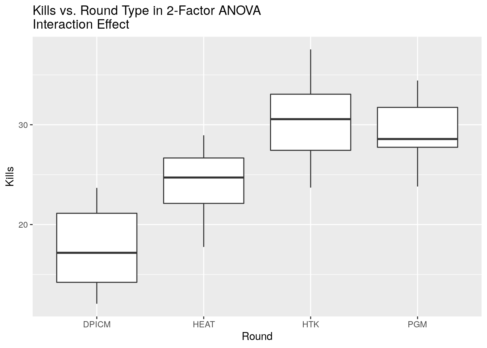
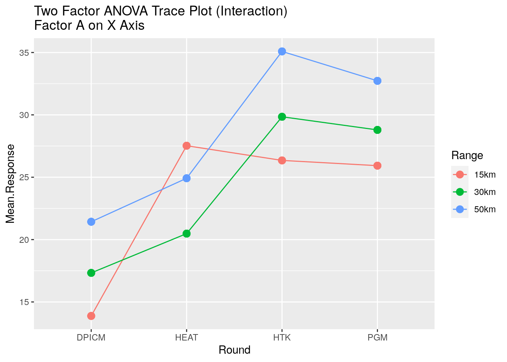
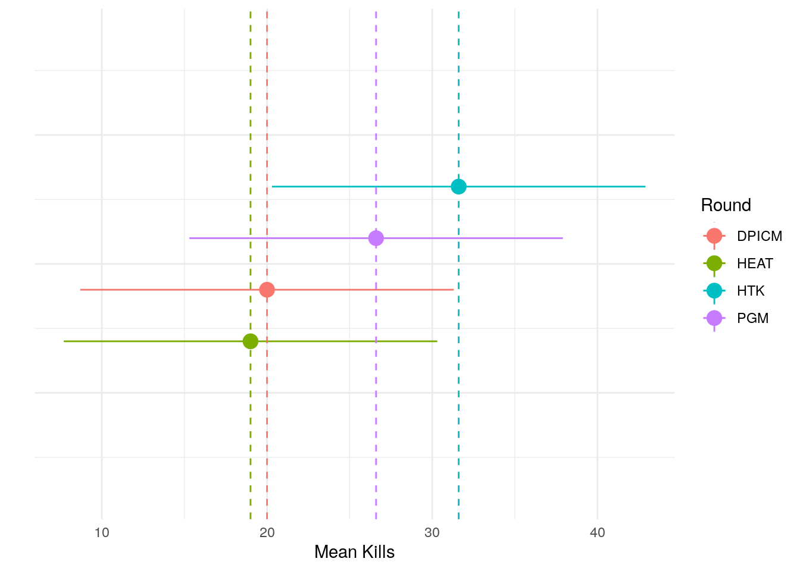

# Analysis of Variance (ANOVA)


## Introduction

This chapter introduces the idea of Analysis of Variance (ANOVA).  ANOVA is a powerful analytic technique in its own right and important to understanding DOE.

- **POC:** For any comments or identified errors, please contact Steve Gillespie at stephen.e.gillespie.mil@mail.mil or Emma Schlagenhauff at emma.schlagenhauff.civ@mail.mil.
- This section was rendered using R version 3.6.0 (2019-04-26) on 24 May 2021.
- The chapter is organized into 8 sections.  Each section includes a description, a tutorial, and a problem set.

## ANOVA Overview

### Motivation

In the previous sections, we had done hypothesis tests to estimate parameters for either a single sample (e.g., estimating the mean of a population from a single sample) or compared two samples to see if they likely came from the same population (e.g., comparison of two means).  Often we have more than two samples that we want to compare.  In particular, we often know something distinguishing about these samples and want to see if that distinction makes a difference.  

For example, consider a simulation where we were testing to see if variations on a system had an effect on the simulation outcome.  If we only had two systems, say A and B, we could do any number of hypothesis tests, e.g., a T-test for comparison on the means.  If we have three systems: say A, B, and C, we run into a problem.  We don't have a three-way hypothesis test.  We could do multiple hypothesis tests, say A vs. B, A vs. C, and B vs. C, but we run into a problem.  Recall that each time we conduct a hypothesis test we have a probability of a Type I error, $\alpha$ for a test with a $1-\alpha$ confidence level.  When we run multiple hypothesis tests for effectively the same question (i.e., does the system make a difference on our outcome), we start to see that our confidence level goes down rather rapidly.  That is, if our $\alpha$ levels are: $\alpha_{A vs. B}, \alpha_{A vs. C}, \alpha_{B vs. C}$, our confidence level is the product of our individual confidence levels, i.e. $(1-\alpha_{A vs. B})*(1-\alpha_{A vs. C})*(1-\alpha_{B vs. C})$.  This number decreases rapidly.  For example, if we have $\alpha = .05$ in our example, we would have a confidence of $(1-.05)*(1-.05)*(1-.05)\approx .86$.  In fact, for a consistent $\alpha$, this number scales by $N \choose 2$, where N is the number of factors.  For $\alpha=.05$ this scales down quickly.


```
## Warning: Continuous limits supplied to discrete scale.
## Did you mean `limits = factor(...)` or `scale_*_continuous()`?
```


This clearly won't do as we need a test that can tell us if there is an effect caused by a change to a factor in a set of observations.

### Broad Concept

Analysis of Variance (ANOVA) solves this exact problem.  It does this by assessing the variance observed in the total population (i.e., all of the observations from all samples) and comparing this variance to the variance observed between the different groups and the variance internal to each group.  This sounds somewhat esoteric, but <a href = 'https://www.khanacademy.org/math/statistics-probability/analysis-of-variance-anova-library'> this set of videos from Khan Academy explain it very clearly.</a>

### Terminology

There is a variety of terminology used in the ANOVA literature.  To aid in communication, we'll adopt the following definitions:

+ **(Treatment) Effect**: A change to the mean response based on a changing level of a factor.
+ **Factor**: An independent variable with two or more levels that may have an effect on the mean response. 
+ **Level**: A value a factor may take.
+ **Replicate**: An observation for a given factor or set of factors in an experiment.
+ **Response**: A dependent variable whose mean we value we would like to measure.

More concretely, consider a simple combat simulation that assesses an indirect fire (IDF) system.  Assume the simulation has a variety of possible inputs, but we are only going to vary the the munition the system fires.  Further, the simulation has multiple possible outputs, but we will only measure the number of armored vehicle kills achieved.  In this situation:

+ The munition the system fires is the **factor**.
+ The various types of munitions (e.g., high explosive, hit-to-kill, etc.) are the **levels** for that factor (this is sometimes called a **treatment**).
+ Each simulation run is a **replicate**.
+ The output, the number of armored vehicle kills achieved is the **response**.
+ The (treatment) effect is a change in the average number of kills based on the choice of munition.

## Single Factor, Fixed Effects ANOVA

### Example

Consider the IDF simulation described above and imagine you are an analyst charged with telling the Army what the best type of ammunition to buy for killing armored vehicles is.  You have four possible munitions:

+ Dual Purpose, Improved Conventional Munition (DPICM).
+ High Explosive, Anti-Tank (HEAT).
+ Hit to Kill (HTK).
+ Precision Guided Munition (PGM).

You ran your simulation using the data for each of these munitions five times and recorded the number of armored vehicle kills achieved and got the following results^[Note: All numbers are notional.  They were made using a random number generator.] ^[Note - you will often see data for ANOVA problems written in this way, particularly in textbooks.  This is perfectly accurate, but not how *R* needs to read the data.  We'll cover how to convert this into a useful manner.]:


```{=html}
<div id="htmlwidget-4094207bda44d8502e79" style="width:100%;height:auto;" class="datatables html-widget"></div>
<script type="application/json" data-for="htmlwidget-4094207bda44d8502e79">{"x":{"filter":"none","caption":"<caption>Armored Vehicle Kills For Each of Five Replicates for Each Munition<\/caption>","data":[["DPICM","HEAT","HTK","PGM"],[23,19,28,29],[10,17,28,32],[13,31,34,27],[27,15,38,26],[27,13,30,19]],"container":"<table class=\"display\">\n  <thead>\n    <tr>\n      <th>Round<\/th>\n      <th>1<\/th>\n      <th>2<\/th>\n      <th>3<\/th>\n      <th>4<\/th>\n      <th>5<\/th>\n    <\/tr>\n  <\/thead>\n<\/table>","options":{"columnDefs":[{"className":"dt-right","targets":[1,2,3,4,5]}],"order":[],"autoWidth":false,"orderClasses":false}},"evals":[],"jsHooks":[]}</script>
```

Before analyzing this data, it is important to note a few things:

+ Your **factor** is the munition.
+ You have four **levels** (or treatments) for the munition factor are: DPICM, HEAT, HTK, PGM.  The number of levels is typically represented as $a$, so we say $a = 4$.
+ You had five **replicates** for each level (i.e., $n = 5$).  You had a total of 20 observations as you had four levels each with five observations.
+ As each level has the same number of replicates, we say this is balanced.
+ Your **response** was the number of armored vehicles killed.  Each response is typically represented mathematically as $y_{ij}$ where $i$ is the level number and $j$ is the replicate number.  For example, in the above table, $y_{12}$ is the value for the 2nd replicate of the first level (DPICM) and it has a value of 14 kills, so $y_{12} = $ 10.


The first question we might have is, does the choice of round even make a difference?  We will do this mathematically with ANOVA!  Often time, however, it is also good to visualize the data.  For these types of problems, boxplots are often useful:


### Model

Consider the following generic description of data for an experiment (i.e., a simulation) with a **single factor** with $a$ levels, and $n$ replicates at each level.  The results for each observation can be described as $y_{ij}$ where $i \in {1, 2, ... a}$ and $j \in {1, 2, ... n}$ are the indices for the treatments and replicates respectively.  This can be seen as a table such as this:

<br>
<center>
<style type="text/css">
.tg  {border-collapse:collapse;border-spacing:0;}
.tg td{font-family:Arial, sans-serif;font-size:14px;padding:10px 16px;border-style:solid;border-width:1px;overflow:hidden;word-break:normal;border-color:black;}
.tg th{font-family:Arial, sans-serif;font-size:14px;font-weight:normal;padding:10px 16px;border-style:solid;border-width:1px;overflow:hidden;word-break:normal;border-color:black;}
.tg .tg-cly1{text-align:left;vertical-align:middle}
.tg .tg-yla0{font-weight:bold;text-align:left;vertical-align:middle}
.tg .tg-0lax{text-align:left;vertical-align:top}
</style>
<table class="tg">
  <tr>
    <th class="tg-cly1"><span style="font-weight:bold">Level (Treatment)</span></th>
    <th class="tg-yla0" colspan="4">Replicates (Observations)</th>
  </tr>
  <tr>
    <td class="tg-cly1">1</td>
    <td class="tg-cly1">$y_{11}$</td>
    <td class="tg-cly1">$y_{12}$</td>
    <td class="tg-cly1">...</td>
    <td class="tg-cly1">$y_{1n}$</td>
  </tr>
  <tr>
    <td class="tg-cly1">2</td>
    <td class="tg-cly1">$y_{21}$</td>
    <td class="tg-cly1">$y_{22}$</td>
    <td class="tg-cly1">...</td>
    <td class="tg-cly1">$y_{1n}$</td>
  </tr>
  <tr>
    <td class="tg-cly1">...</td>
    <td class="tg-cly1">...</td>
    <td class="tg-cly1">...</td>
    <td class="tg-cly1">...</td>
    <td class="tg-cly1">...</td>
  </tr>
  <tr>
    <td class="tg-0lax">a</td>
    <td class="tg-0lax">$y_{a1}$</td>
    <td class="tg-0lax">$y_{a2}$</td>
    <td class="tg-0lax">...</td>
    <td class="tg-0lax">$y_{an}$</td>
  </tr>
</table>
</center>
<br>

We want to be able to say something about the **effect** of the treatment.  We can do that by *modeling* the data.

One possible model is:

<center> $y_{ij} = \mu + \tau_i + \epsilon_{ij}$ </center>

In this model:  

+ $\mu$ is the mean of all the observations from all of the treatments (In the IDF example above, the mean is (486/20)=24.3.  Note that there are 20 *total* observations, 486 happens to be the sum of the kills of armored vehicles).
+ $\tau_i$ is the (treatment) effect^[The terms "treatment effect" and "effect" are often used interchangeably] of the $i^{th}$ level.
+ $\epsilon_{ij}$ is the error associated with the $ij^{th}$ observation.  Note that $\epsilon_{ij} = y_{ij} - (\mu + \tau_i)$ by the model above.

The idea of the **treatment effect** is that by applying a specific level of a factor (i.e., a treatment), there is an overall change to the mean for observations where this treatment.  More concretely, consider this toy example:

Imagine you have selected two people each from two "treatments."^[Note, it may sound odd to call this a treatment as you are not doing anything to the person.  The treatment is that you are selecting from a specific population.] The first treatment is that the person is a professional basketball player.  The second treatment is that the person is an elite gymnast.  You measure the height of each of the people and get the following heights:

+ Basketball Player 1:  7'2"
+ Basketball Player 2:  6'10"
+ Gymnast 1: 5'2"
+ Gymnast 2: 4'10"

We can see the overall mean of these four people is 6'0".  The treatment effect of being a professional basketball player is to add an additional foot of height (i.e., $\tau_{basketball} = +1'$).  The treatment effect of being an elite gymnast is to substract a foot of height (i.e., $\tau_{gymnastics} = -1'$).  The errors associated for each athlete are +/- 2".  For example, for basketball player 1, we can say: $\mu = 6'0"$, $\tau_{basketball} = +1'$, and $\epsilon_{basketball,1}=+2"$.

The above example is a merely a toy problem and generally impractical to calculate by hand.  However, it is the simply the result of a linear statistical model.  For ANOVA, however, we are not attempting to calculate specific $\tau_{i}$, rather the question is: **Are any of the $\tau_i$ non-zero?**  That is, do any of the treatments have an effect?

At this point, we have a hypothesis test, where:

<center> 

$H_0: \tau_1=\tau_2=...=\tau_a=0$ 

$H_A: \tau_i\neq0$ for at least one $i\in{1, 2, ... a}$

</center>

To do this, we must satisfy several assumptions:


### Single Factor ANOVA Assumptions

1. You are only testing a single factor with $a>2$ treatments.  You *can* run an ANOVA with 2 factors, but you really should choose a more explicit hypothesis test (e.g., a t-test).
2. The experiments were performed in a random order to minimize the effect of environmental factors.  In simulation, this is largely a moot point as one can fix the environmental conditions and the stochasticity comes not from changing time (i.e., order) and associated changes to the environment, rather it comes from the selection of random variables.  That stated, be aware of this requirement and ensure the simulation meets the intent.  This is called a **completely randomzied design**.
3. The model errors, $\epsilon_{ij}$ are assumed to be normally and independently distributed with a mean of 0 and constant variance.
4. The observations are assumed to be mutually independent, i.e., there is no connection between the outcome of one simulation run and the next one.
5. The levels are **fixed**.  By this, we mean we (the researcher) have identified specific levels for the factor and are only attempting to make inferences on the observed levels.  Using the IDF example, we are only making inferences about the four round types and not attempting to learn anything about an untested round.  Similarly, with the athlete example, we are only attempting to hypothesize about being a basketball player or gymnast, not being an athlete in general.  This is called the **fixed effects model**.  In a future section, we'll address the **random effects model** where we assess a random sample of levels from a larger population of levels.

### Conducting Single Factor (Fixed Effects) ANOVA

There is a significant amount of math and explanation as to exactly how the ANOVA test works.  For a more detailed understanding, please see any of the following:

+ <a href = 'https://www.khanacademy.org/math/statistics-probability/analysis-of-variance-anova-library'> The set of Khan Academy videos (linked earlier in the chapter) provide a good overview.</a>
+ <a href = 'https://en.wikipedia.org/wiki/One-way_analysis_of_variance'>The wikipedia article has a good overview and example of the actual math </a>^[As of 27 March 2020].
+ Most standard statistics texts explain the calculations, e.g.:^[Note, these are simply examples, any reputable probability and statistics book will have this]
    + Montgomery's *Design and Analysis of Experiments, 8th Edition* Section 3.3.
    + Devore's *Probability and Statistics for Engineering and the Sciences, 7th Edition* Section 10.1.
    + Hayter's *Probability and Statistics for Engineers and Scientists, 4th Edition* Section 11.1.
+ Many *R* books will cover the discussion as well, e.g. Crawley's *The R Book, 2nd Edition* Section 11.1.

Given this wealth of resources, we will only discuss how to actually conduct and interpret the single factor, fixed effects ANOVA in *R* here.

#### Single Factor, Fixed Effects ANOVA: Step 0 - Assumptions

Ensure you have met the required assumptions as listed above.  At this point, we won't worry about the normality and constant variance assumption, we'll assess for it after the fact.

#### Single Factor, Fixed Effects ANOVA: Step 1 - Prepare the data.

Often data is provided in a variety of formats, particularly the format seen in the tables above, where the levels are the rows and the columns are the replicates.  *R*, however needs the data in the form of 2 vectors. This typically looks like a table (i.e., a data frame) where one column is the level and one column is the observation value.  The data should look like:


```
##    Replicate Round Kills
## 1          1 DPICM    23
## 2          5   PGM    19
## 3          5 DPICM    27
## 4          2   PGM    32
## 5          5   HTK    30
## 6          5  HEAT    13
## 7          3   PGM    27
## 8          3   HTK    34
## 9          2  HEAT    17
## 10         4 DPICM    27
```

Note three things:

+ This is only a sample of the data from our IDF example, obviously you need all of the data to actually conduct the ANOVA.
+ We have three columns, the replicate number (not really necessary for this analysis, but maybe for good record keeping), the round (i.e., the level), and the kills (i.e., the response).  In *R*, the levels can be identified as characters or numbers, but the response must be numeric.
+ There is no requirement to order the data in some way.  The analysis occurs the same regardless of order.

If your data is formatted correctly, you can proceed to the next step.  If not, you will have to do some data cleaning.  This is a classic example of why the Tidyverse functions `pivot_wider()` and `pivot_longer()` (formerly `spread()` and `gather()`) exist.  Please read about them in <a href = 'https://r4ds.had.co.nz/tidy-data.html'> *R For Data Scince Chapter 12, Tidy Data* </a>.  Below is an example:


```r
# Suppose your orignal data looks like this:
Original.Data
```

```
##   Round  1  2  3  4  5
## 1 DPICM 23 10 13 27 27
## 2  HEAT 19 17 31 15 13
## 3   HTK 28 28 34 38 30
## 4   PGM 29 32 27 26 19
```

```r
# To convert this to a data frame in a manner you need, use pivot_longer()

Formatted.Data <- Original.Data %>% # We will save our new data in 'Formatted.Data'
                                    # We sart with 'Original.Data' and pipe it to 'pivot_longer'
    pivot_longer(cols = c('1', '2', '3', '4', '5'), 
                 # The first argument is what columns are you gathering together
                 # Note that the names of the columns are 1, 2, ..., but column names are characters
                 # so you have to put the names in quotes or else R will think you are referring to a 
                 # column number
                 names_to = 'Replicate', 
                 # The second argument 'names_to' is asking what do you want to call the column that
                 # will hold the names of the former columns.  We chose 'Replicate'
                 values_to = 'Kills'
                 # The third argument asks for the name of the new column that will hold the values
                 # We chose Kills as that is what the values are in each of columns 1, 2, ... 5
                 # Finally, there are more arguments in pivot_longer that are optional.  
                 # Please read the help `?pivot_longer` for more information
                 )

# View how our Formatted.Data turned out
Formatted.Data
```

```
## # A tibble: 20 x 3
##    Round Replicate Kills
##    <fct> <chr>     <dbl>
##  1 DPICM 1            23
##  2 DPICM 2            10
##  3 DPICM 3            13
##  4 DPICM 4            27
##  5 DPICM 5            27
##  6 HEAT  1            19
##  7 HEAT  2            17
##  8 HEAT  3            31
##  9 HEAT  4            15
## 10 HEAT  5            13
## 11 HTK   1            28
## 12 HTK   2            28
## 13 HTK   3            34
## 14 HTK   4            38
## 15 HTK   5            30
## 16 PGM   1            29
## 17 PGM   2            32
## 18 PGM   3            27
## 19 PGM   4            26
## 20 PGM   5            19
```

```r
# This looks good, so we can progress to the next step.
```

#### Single Factor, Fixed Effects ANOVA: Step 2 - Conduct the ANOVA

In *R*, the function `aov()` is built to calculate a wide variety of ANOVA situations.  We'll use it for our single factor, fixed effects model.  In `aov()`, *R* uses a format the will become quite familiar to you as you progress through the course.  This format is:

<center> `Response ~ Input` </center>

In this, we are saying we want to assess something about the response as a function of (or an effect of) the given input (in our case, levels).  It's best to see this with a concrete example:


```r
# Using our IDF data, we want to conduct a single factor, fixed effects ANOVA.
# We have identified Kills as the response and Round as the factor.
# Round has 4 levels, DPICM, HEAT, HTK, PGM.

# R generally need the factor to be of type 'factor'.  While on the surface a character string
# and factor look similar, R treats them differently.  Sometimes you will still get results
# if you don't change your variable to a factor, but sometimes they won't be fully accurate.
# You can change the variable type as follows:

Formatted.Data$Round <- as.factor(Formatted.Data$Round)
# This takes the column 'Round' in the data frame Formatted.Data and stores the values for the 
# vector as.factor(Formatted.Data$Round)

# We assess the ANOVA as:
aov(Kills ~ Round, data = Formatted.Data)
```

```
## Call:
##    aov(formula = Kills ~ Round, data = Formatted.Data)
## 
## Terms:
##                 Round Residuals
## Sum of Squares  525.8     624.4
## Deg. of Freedom     3        16
## 
## Residual standard error: 6.246999
## Estimated effects may be unbalanced
```

Note two things: 

1) For convenience, we just use the column names in the formula, but then have to identify the data we want for the column names.  We could have done the call `aov(Formatted.Data$Kills ~ Formatted.Data$Round)` but that becomes cumbersome.
2) The output does not look that useful (yet).

The reason the output is not that useful is because `aov()` actually outputs quite a bit of information, but you actually have to save the analysis to a new variable to access the information.  We do this as follows:


```r
myAOV <- aov(Kills ~ Round, data = Formatted.Data)
```

At this point, we're done *doing* the ANOVA, we can move on to the analysis.

#### Single Factor, Fixed Effects ANOVA: Step 3 - Assess the Ouput.

The first thing we want to look at is something called the ANOVA table.  We can access this with the `summary()` function.


```r
summary(myAOV)
```

```
##             Df Sum Sq Mean Sq F value Pr(>F)  
## Round        3  525.8  175.27   4.491 0.0181 *
## Residuals   16  624.4   39.02                 
## ---
## Signif. codes:  0 '***' 0.001 '**' 0.01 '*' 0.05 '.' 0.1 ' ' 1
```

This table has six columns:

+ The first column (unnamed in *R*) identifies the factor in the model.  In our case we have `Round` as that is the factor we assessed, the residuals (i.e., the $\epsilon_{ij}$) as there is always some error.  In some texts, you may see an ANOVA table with `total` as the final row.  *R* does not do this, but it is easy enough to calculate as the total in the DF, Sum Sq, and Mean Sq columns is just the sum of the other rows.
+ The second column, `Df`, is the Degrees of Freedom column.  It tells you how many degrees of freedom are associated with that factor.
+ The third column, `Sum Sq`, is your "Sum of Squares".  See the Khan Academy videos or external text for an explanation.
+ The fourth column, `Mean Sq`, is your "Mean Sum of Squares". See the same resources for a more thorough explanation.
+ The fifth column, `F value`, and the sixth column, `Pr(>F)` is what we are ultimately after.  These are your test statistic and p-value respectively.
+ Finally note, there are relationships among the degrees of freedom, sum of squares, mean sum of squares, and F statistic.  Please see any standard text if you care to calculate these by hand.

Recall that, ultimately, ANOVA is conducting a special kind of hypothesis test that compares the ratio of variation seen in the data across the entire data set vs. internally to each level.  If the assumptions are met, this can be modeled according to the F distribution with the appropriate parameters.  Recall, then, our original hypothesis:

<center>

$H_0: \tau_1=\tau_2=...=\tau_a=0$

$H_A: \tau_i\neq0$ for at least one $i\in{1, 2, ... a}$

</center>

If the F-value is below your chosen $\alpha$ (generally either .01 or .05), we can reject the null hypothesis and say that at least one of the effects is non-zero.  That is, we can say that the factor actually matters in our outcomes.  In our case, if we set $\alpha = .05$, we reject $H_0$ and do say that the choice of round matters in the number of kills achieved.

Before we get too excited, we want to check our assumptions.  Fortunately, `aov()` helps us with that by enabling us to plot several things.


```r
# Plot results of model to check ANOVA assumptions
# Set plotting parameters
# This is a plotting parameter that tells R to plot the next several plots on a 2 x 2 grid
par(mfrow = c(2,2)) 
# Plot the standard ANOVA assessment graphs
plot(myAOV)
```


These four graphs will come up rather frequently both in ANOVA and linear regression.  <a href = 'https://data.library.virginia.edu/diagnostic-plots/'> The University of Virginia has a good explanation of these graphs </a>.  It is in the context of linear regression, but the assessment is the same.


The first (top-left) is the "Residuals vs. Fitted" plot.  It helps us check the assumption that our observations are **independent**.We should see no major pattern in the data and indeed we don't.

The second (top-right) is the "Normal Q-Q" plot.  This plots the residuals (i.e., the $\epsilon_{ij}$) against a normal curve (the residual values are normalized to the standard normal distribution).  If the residuals were froma perfectly normal distribution, they would all fall exactly on the straight line indicated.  Our data looks very well behaved in this case, so we can say we satisfy the assumption of **normally distributed residuals**.

The third (bottom-left) is the "Scale-Location" plot. It is very similar to the first, except the y-axis is the square root of the standardized residuals (standardized to a normal distribution) vs. the actual residual values.  This allows us to check for **constant variance** (homoskedasticity).  We look to meet that assumption.

The fourth (bottom-right) is the "Residuals vs. Levels Plot" that helps us identify influential points that significantly skew our analysis.  We do not see any significant issues so we can continue.

Finally, though this should not be a factor in most simulation experiments, it is often useful to plot the residuals vs. run order or time.  This allows one to identify potential dependence among the runs (this often occurs with physical experiments where test subjects' skills either improve or degrade) or violations to the requirements of constant variance.  The plots above do not show this, but they are easy enough to produce.  The vector `myAOV$residuals` is ordered in the same manner as the initial input.  If one has the time or order in which each response was calculated, one can plot this.  For example:


```r
# In our example above, assume that the order of `Formatted.Data` is the order 
# in which we collected the data.  I.e. Formatted.Data$Kills[1] was 
# the first observation, Formatted.Data$Kills[2] was the second, etc...

# We then create a vector, run order that is simply 1, 2, 3.... 20 and plot that as "time"
# Against the residuals.

ggplot() + 
  geom_point(aes(x = 1:20, y = myAOV$residuals)) + # Plot the residuals
  geom_hline(yintercept = 0, lty = 2) + # Note that your residuals are centered on 0
  xlab("'Observation Order'") + ylab('Residual') + 
  theme_minimal()
```


There does not appear to be any significant patter of residual vs. time, so this appears to meet our assumption.

In addition to the graphic checks, we can check the assumptions mathematically:

*Normality of Residuals*

To assess if the residuals are normally distributed, we can use the Shapiro Wilk test:


```r
shapiro.test(myAOV$residuals)
```

```
## 
## 	Shapiro-Wilk normality test
## 
## data:  myAOV$residuals
## W = 0.98153, p-value = 0.9523
```

Since our p-value is larger than 0.10, we fail-to-reject our null hypothesis that the residuals are normally distributed.

To assess if the residuals have constant variance, we can use the <a href = 'https://www.itl.nist.gov/div898/handbook/eda/section3/eda357.htm'> Bartlett test </a>:^[Note, we have not used the Bartlett test for homoscedasticity yet.  If you are unfamiliar, please read about it at the link provided.]


```r
# we use `bartlett.test()
# You can equivalently check the Kills as a function of Round from your
# original data as follows:
bartlett.test(Kills ~ Round, data = Formatted.Data)
```

```
## 
## 	Bartlett test of homogeneity of variances
## 
## data:  Kills by Round
## Bartlett's K-squared = 1.8243, df = 3, p-value = 0.6097
```

```r
# Or you can check the residuals vs. their associated level
bartlett.test(myAOV$residuals, Formatted.Data$Round)
```

```
## 
## 	Bartlett test of homogeneity of variances
## 
## data:  myAOV$residuals and Formatted.Data$Round
## Bartlett's K-squared = 1.8243, df = 3, p-value = 0.6097
```

```r
# Or check the residuals vs. their fitted values
bartlett.test(myAOV$residuals, myAOV$fitted.values)
```

```
## 
## 	Bartlett test of homogeneity of variances
## 
## data:  myAOV$residuals and myAOV$fitted.values
## Bartlett's K-squared = 1.8243, df = 3, p-value = 0.6097
```

The null hypothesis in the Bartlett test is that the variance among groups is constant.  In the above case, we fail to reject the null and conclude that we have met our assumption.

Finally, we can test for independence of the residuals from time or collection order in a number of ways.  One way is to check for a correlation using `cor()`.  Recall that <a href = 'https://en.wikipedia.org/wiki/Correlation_and_dependence'> correlation </a> measures vary between -1 and 1, where 1 means a perfect correlation and -1 means a completely inverse correlation.  A correlation close to 0 means there is very little correlation.  We can test this as follows:


```r
# Recall we assumed that our data is listed in the order in which the observations were made
cor(myAOV$residuals, 1:20)
```

```
## [1] -0.001551879
```

It appears there is no order dependence.

Having met our assumptions, we can safely conclude two things:

1. Single Factor, Fixed Effects ANOVA was the right sort of analysis for our data.
2. We can reject the null hypothesis and say that the choice of round does have an effect on kills achieved.

We cannot, at this point, say what the effect is, or which round type it was, etc.

### Single Factor, Fixed Effects ANOVA Problem Set

The problem set for this section is located <a href = '/_Chapter3_1_ProblemSets/Single_Factor_ANOVA_ProblemSet_Questions.html'> here </a>.  Note that there are two data sets used in the problem set, tank.csv and soldier.csv.  The links to the data set are in the problem set.

For your convenience, the problem set as an R markdown is located <a href = '/_Chapter3_1_ProblemSets/Single_Factor_ANOVA_ProblemSet_Questions.Rmd'> here </a>

The answers for this problem set are <a href = '/_Chapter3_1_ProblemSets/Single_Factor_ANOVA_ProblemSet_Answers.html'> here </a>.


## Single Factor, Random Effects Model

In the previous section, we assumed that the experimenter had defined set levels for the factor of interest.  For example, in the IDF example above, there were four fixed levels of round type: DPICM, HEAT, HTK, PGM.  Accordingly, our model:  $y_{ij} = \mu + \tau_i + \epsilon_{ij}$ only had one random variable, $\epsilon_{ij}$.  In some cases, we have too many possible levels to assess all of them, but we still want to know if the factor has an effect on our response.  In this case, we use the single factor, **random effects** model.

The random effects model looks the same as the fixed effects model:

<center> $y_{ij} = \mu + \tau_i + \epsilon_{ij}$ </center>

The difference here is that in the random effects model, we are taking both $\epsilon_{ij}$ *and* $\tau_i$ to be random variables (both normally and independently distributed with mean of 0 and constant variances $\sigma_{\tau}^2$ and $\sigma_{\epsilon}^2$ respectively).  This has a few implications:

1. Unlike the fixed effects model, the sum of the effects is not necessarily zero.
2. The distribution of the response $y_{ij}$ is normal as it is the sum of two normal distributions.^[Read more about this fact <a href = 'https://mathworld.wolfram.com/NormalSumDistribution.html'> here </a>]
3. The observations are independent except when drawn from the same level as they have a covariance equal to the variance of $\tau$.  This largely doesn't affect the analysis, however.
4. **The hypothesis test you are conducting is different** relative to the hypothesis test for single factor, fixed effect ANOVA.
    
This last point is the most important.  Recall that in a fixed effect model, recall your null hypothesis is: $H_0: \tau_1 = \tau_2 = ... = \tau_a = 0$.  We were looking to see if at least one of the levels had a (non-zero) effect.  Our question now is, does the population of the levels have an effect.  We address this with the following hypotheses:

<center>

$H_0: \sigma_{\tau}^2 = 0$

$H_A: \sigma_{\tau}^2 > 0$

</center>

Specifically, what we are asking is: are the treatment effects all the same (i.e., is there no variability)?^[Recall, the variance of a set of the same numbers is 0.] Alternatively, is there some variation meaning that there is an effect from the treatment.  Somewhat surprisingly, the computational procedures for the random effects model are the same as for the fixed effects model, but do not forget that the conclusions are different!  Let's do an example:

Consider the IDF situation again as above, but this time, let's consider what happens when we vary the range of the projectile (and fix the choice of munition and all other inputs to the simulation).  Assume we have been told that the range of potential ranges is between 15km and 50km.  Clearly, even if we fixed the levels at every kilometer we'd have 36 levels to check so $36n$ simulations to run if we did $n$ replicates per simulation.  At some point, detailed analysis may be important, but if we simply want to know if range matters, it's superior to randomly sample a few levels from the population of possible treatments.  Let's choose four random ranges in the 15km to 50km range:


```r
# Randomly choose ranges from 15 to 50 using a uniform distribution.
# We can round these to an appropriate level of precision for our simulation
set.seed(8474623)
km.levels <- round(runif(4, 15, 50), 0)  
km.levels
```

```
## [1] 33 15 20 34
```

We can now simulate our results replicating each run five times and get output as follows:


```{=html}
<div id="htmlwidget-b4cf0cb6ab5bfc0325ee" style="width:100%;height:auto;" class="datatables html-widget"></div>
<script type="application/json" data-for="htmlwidget-b4cf0cb6ab5bfc0325ee">{"x":{"filter":"none","data":[["1","2","3","4"],["15","20","33","34"],[23,25,26,21],[23,25,24,25],[23,25,27,25],[26,23,27,25],[22,23,27,25]],"container":"<table class=\"display\">\n  <thead>\n    <tr>\n      <th> <\/th>\n      <th>Range<\/th>\n      <th>1<\/th>\n      <th>2<\/th>\n      <th>3<\/th>\n      <th>4<\/th>\n      <th>5<\/th>\n    <\/tr>\n  <\/thead>\n<\/table>","options":{"columnDefs":[{"className":"dt-right","targets":[2,3,4,5,6]},{"orderable":false,"targets":0}],"order":[],"autoWidth":false,"orderClasses":false}},"evals":[],"jsHooks":[]}</script>
```

We can then conduct our ANOVA as normal and get an ANOVA table:


```r
summary(aov(Kills ~ Range, data = myDF))
```

```
##             Df Sum Sq Mean Sq F value Pr(>F)  
## Range        3   21.4   7.133   3.397 0.0437 *
## Residuals   16   33.6   2.100                 
## ---
## Signif. codes:  0 '***' 0.001 '**' 0.01 '*' 0.05 '.' 0.1 ' ' 1
```

```r
# Note the data in myDF is formatted as the same way as seen in the previous section
```

From this, if we take $\alpha = .05$ we have a significant p-value and can reject our null hypothesis that says $H_0: \sigma_{\tau}^2=0$ meaning there is variation in the effects, meaning the factor of range does have an impact on kills.

You can of course then check your assumptions as previously indicated.

### Single Factor, Random Effects Problem Set

The problem set for this section is located <a href = '/_Chapter3_1_ProblemSets/Single_Factor_RE_ANOVA_ProblemSet_Questions.html'> here </a>.  Note that there is one data set used in the problem set, commo.csv. The link to the data set is in the problem set.

For your convenience, the problem set as an R markdown is located <a href = '/_Chapter3_1_ProblemSets/Single_Factor_RE_ANOVA_ProblemSet_Questions.Rmd'> here </a>

The answers for this problem set are <a href = '/_Chapter3_1_ProblemSets/Single_Factor_RE_ANOVA_ProblemSet_Answers.html'> here </a>.


## Two Factor, Fixed Effects ANOVA

Having done one factor ANOVA, the natural question is, "What if I have multiple factors?"  The answer is, we can still do ANOVA, we just extend our model for the additional factor.

First, consider our original model:

<center> $y_{ij} = \mu + \tau_i + \epsilon_{ij}$ </center>

If we have two factors, A and B, we can extend this with an effect for each factor:

<center> $y_{ijk} = \mu + \tau_i + \beta_j + \epsilon_{ijk}$ </center>

Where:

* $y_{ijk}$ is the $k^{th}$ observation of $y$ at the $i^{th}$ level of Factor A and $j^{th}$ level of Factor B; $\epsilon_{ijk}$ is the corresponding error.
* $\mu$ is the mean of all observations.
* $\tau_i$ is the effect for the $i^{th}$ level of factor A, where $i \in {1, 2, ...a}$
* $\beta_j$ is the effect for the $j^{th}$ level of factor B, where $j \in {1, 2, ...b}$

We make a few assumptions about this model:

* The levels of the factors A and B are fixed.
* $\sum_1^a \tau_i = \sum_1^b \beta_j = 0$, that is, the sum of the effects is 0 in both cases.
* $\epsilon_{ijk}$ are Normally, Independently Distributed with a $\mu = 0$ and a constant variance $\sigma^2$

Let's look at an example:

Consider our IDF example where our response is the number of kills achieved, but now we have two factors: the round used and the maximum range.  We will fix our levels as:

* Factor A: Round with levels DPICM, HEAT, HTK, and PGM as defined above.  This implies that $a = 4$ as there are four levels.
* Factor B: Range with levels: 15km, 30km, 50km.  This implies that $b = 3$.  Note, in this case we have fixed our levels.

If we do $n$ replicates of each combination of level from Factor A and Factor B, we will have $nab$ observations.  Assume we run 5 replicates of each combination of the two factors and have the following output:


```{=html}
<div id="htmlwidget-641ef5d5b1987d4affef" style="width:100%;height:auto;" class="datatables html-widget"></div>
<script type="application/json" data-for="htmlwidget-641ef5d5b1987d4affef">{"x":{"filter":"none","data":[["1","2","3","4","5","6","7","8","9","10","11","12","13","14","15","16","17","18","19","20","21","22","23","24","25","26","27","28","29","30","31","32","33","34","35","36","37","38","39","40","41","42","43","44","45","46","47","48","49","50","51","52","53","54","55","56","57","58","59","60"],[1,2,3,4,5,1,2,3,4,5,1,2,3,4,5,1,2,3,4,5,1,2,3,4,5,1,2,3,4,5,1,2,3,4,5,1,2,3,4,5,1,2,3,4,5,1,2,3,4,5,1,2,3,4,5,1,2,3,4,5],["DPICM","DPICM","DPICM","DPICM","DPICM","DPICM","DPICM","DPICM","DPICM","DPICM","DPICM","DPICM","DPICM","DPICM","DPICM","HEAT","HEAT","HEAT","HEAT","HEAT","HEAT","HEAT","HEAT","HEAT","HEAT","HEAT","HEAT","HEAT","HEAT","HEAT","HTK","HTK","HTK","HTK","HTK","HTK","HTK","HTK","HTK","HTK","HTK","HTK","HTK","HTK","HTK","PGM","PGM","PGM","PGM","PGM","PGM","PGM","PGM","PGM","PGM","PGM","PGM","PGM","PGM","PGM"],["15km","15km","15km","15km","15km","30km","30km","30km","30km","30km","50km","50km","50km","50km","50km","15km","15km","15km","15km","15km","30km","30km","30km","30km","30km","50km","50km","50km","50km","50km","15km","15km","15km","15km","15km","30km","30km","30km","30km","30km","50km","50km","50km","50km","50km","15km","15km","15km","15km","15km","30km","30km","30km","30km","30km","50km","50km","50km","50km","50km"],[11.2498310504185,12.3388702305068,10.937973452787,12.3479235108331,10.3020485058983,17.7355724834345,20.8623851906931,16.5006195306228,18.1173174238173,16.7047033009391,20.5708050507923,21.3467407192447,21.217698937603,22.7111877612529,20.7794248022474,17.517123267771,17.1123136441704,16.4281569721494,16.3973929387166,20.0813525834617,23.762129945829,23.8729169302919,24.0585823143933,19.8033004938127,24.2608768340658,29.1679291995548,25.3255219620382,24.9456300422085,25.9575266676271,28.5683695770144,28.5568668507278,30.0321854733481,23.307478331644,25.1969272779923,29.9751458950028,29.1070290876244,31.2516305707782,31.8257850016469,30.5392087958854,33.0019639135205,36.7765394643518,40.8273460803057,38.6891972086192,34.0333643718062,34.4442316745893,24.8707946761486,22.2256565877545,24.5178249549474,26.5344821559483,27.2089850407569,29.5389849176253,31.8312241421203,30.4439355620982,28.4004208095696,26.4215126066059,32.4874183842888,34.2788119977981,33.1539940507536,33.1464524069625,29.7455324824877]],"container":"<table class=\"display\">\n  <thead>\n    <tr>\n      <th> <\/th>\n      <th>Replicate<\/th>\n      <th>Round<\/th>\n      <th>Range<\/th>\n      <th>Kills<\/th>\n    <\/tr>\n  <\/thead>\n<\/table>","options":{"columnDefs":[{"className":"dt-right","targets":[1,4]},{"orderable":false,"targets":0}],"order":[],"autoWidth":false,"orderClasses":false}},"evals":[],"jsHooks":[]}</script>
```

First, let's plot this.  Note that we either have to look at these points three dimensionally (which gets confusing) or the values against a factor at a time.


```r
ggplot(data = IDF2) + 
  geom_boxplot(aes(x = Round, y = Kills)) + 
  ggtitle('Kills vs. Round Type in 2-Factor ANOVA')
```


```r
ggplot(data = IDF2) + 
  geom_boxplot(aes(x = Range, y = Kills)) + 
  ggtitle('Kills vs. Range in 2-Factor ANOVA')
```


With these box plots, we can clearly see that that there is some variation caused by each factor, but it's not exactly clear how much variation is caused by the each factor.  One way to view this is with trace plots (also called interaction plots).  A trace plot is simply a line plot that has one factor on the X axis, the mean of the response on the Y axis, and a different line or color for each of the second factors.  It looks like:


```r
ggplot(
  # We mutate our data to give us a table of mean responses
  IDF2 %>% group_by(Round, Range) %>% mutate(Mean.Response = mean(Kills)), 
  # We then set our aesthetic for all plots.  
  # Note we have to use the aesthetic 'group' with a value of range for geom_line to work
  aes(x = Round, y = Mean.Response, color = Range, group = Range)) + 
  # We can then plot the mean observations as points of size 3
  geom_point(size = 3) + 
  # We can plot lines between each observation to aid in understanding
  geom_line() + 
  ggtitle('Two Factor ANOVA Trace Plot\nFactor A on X Axis')
```


```r
# This plot is set up the same, except we are now using the Range on the x-axis
ggplot(IDF2 %>% group_by(Round, Range) %>% mutate(Mean.Response = mean(Kills)), 
       aes(x = Range, y = Mean.Response, color = Round, group = Round)) + 
  geom_point(size = 3) + 
  geom_line() + 
  ggtitle('Two Factor ANOVA Trace Plot\nFactor B on X Axis')
```


```r
# There are at least two other ways to produces these plots

## ggplot using stat_summary:
# ggplot(data = IDF2, aes(x = Round, y = Kills, color = Range, group = Range)) +
#   stat_summary(fun = 'mean', geom = 'point') +
#   stat_summary(fun = 'mean', geom = 'line')

## The stats package interaction.plot also does this
# stats::interaction.plot(x.factor = IDF2$Round, trace.factor = IDF2$Range, response = IDF2$Kills)
```

One thing you may immediately notice from these two plots is that the trace lines never cross.  This is indicative of the fact that two factors are independent and do not interact.  If the lines crossed (on either plot), it would indicate that you have an interaction.  

We can now compute the actual ANOVA table in the same way we did for single factor ANOVA.  The actual computations are analogous to single factor ANOVA but will not be covered here.  For more in depth treatment, please refer to any standard probability and statistics text (e.g., Devore's *Probability and Statistics for Engineering and the Sciences* Chapter 11 (7th Edition) or the <a href = 'https://www.itl.nist.gov/div898/handbook/prc/section4/prc427.htm'>*NIST Engineering Statistics Handbook* </a>).

The *R* computations are as follows:


```r
# Note the Response ~ FactorA + FactorB format.  
# This is a common format in ANOVA, Regression, and other statistical 
# functions in R.  
my.2Factor.ANOVA <- aov(Kills ~ Round + Range, data = IDF2)
summary(my.2Factor.ANOVA)
```

```
##             Df Sum Sq Mean Sq F value Pr(>F)    
## Round        3 2015.1   671.7   181.9 <2e-16 ***
## Range        2  822.9   411.5   111.4 <2e-16 ***
## Residuals   54  199.4     3.7                   
## ---
## Signif. codes:  0 '***' 0.001 '**' 0.01 '*' 0.05 '.' 0.1 ' ' 1
```

You'll note this looks very similar to the single factor, fixed effects ANOVA, and it is!  The only major difference is we now have two factors listed as rows in the table, `Round` and `Range`.  This is indicative of the fact that we now have two hypothesis tests occuring.  They are:

* Factor A: $H_{0-A}: \tau_1 = \tau_2 = ... \tau_a = 0$ and its corresponding alternate.
* Factor B: $H_{0-B}: \beta_1 = \beta_2 = ... \beta_b = 0$ and its corresponding alternate.

If we have p-values for either of these that are below our desired $\alpha$ generally $<.05$ or $<.01$, we can reject the null and conclude that the relevant does have an effect.  In our case, in the table above, we can safely reject the null for both factors and say that it is plausible that at least one level of each factor has an effect on the response.

We still have to check our assumptions.  We can do this in the same manner as single factor ANOVA:


```r
par(mfrow = c(2,2))
plot(my.2Factor.ANOVA)
```


We can see that our residuals are normally and independently distributed with a mean of 0 and constant variance. We can further check the residuals vs. order to check for time dependence (assuming our data set is written in order of the observations we gathered).


```r
ggplot() + 
  geom_point(aes(x = 1:60, y = my.2Factor.ANOVA$residuals)) + 
  geom_hline(yintercept = 0, color ='red', lty = 2)
```


There does not appear to be any time dependence to our observations, so we further validate our independence assumption.

### Including Interaction Effects

We can extend this sort of analysis arbitrarily, to include the potential for interaction effects.  Let's assume we have the same IDF simulation scenario, but now we've got a different set of data:


```{=html}
<div id="htmlwidget-06a61acfff7e31cd2d7a" style="width:100%;height:auto;" class="datatables html-widget"></div>
<script type="application/json" data-for="htmlwidget-06a61acfff7e31cd2d7a">{"x":{"filter":"none","data":[["1","2","3","4","5","6","7","8","9","10","11","12","13","14","15","16","17","18","19","20","21","22","23","24","25","26","27","28","29","30","31","32","33","34","35","36","37","38","39","40","41","42","43","44","45","46","47","48","49","50","51","52","53","54","55","56","57","58","59","60"],[1,2,3,4,5,1,2,3,4,5,1,2,3,4,5,1,2,3,4,5,1,2,3,4,5,1,2,3,4,5,1,2,3,4,5,1,2,3,4,5,1,2,3,4,5,1,2,3,4,5,1,2,3,4,5,1,2,3,4,5],["DPICM","DPICM","DPICM","DPICM","DPICM","DPICM","DPICM","DPICM","DPICM","DPICM","DPICM","DPICM","DPICM","DPICM","DPICM","HEAT","HEAT","HEAT","HEAT","HEAT","HEAT","HEAT","HEAT","HEAT","HEAT","HEAT","HEAT","HEAT","HEAT","HEAT","HTK","HTK","HTK","HTK","HTK","HTK","HTK","HTK","HTK","HTK","HTK","HTK","HTK","HTK","HTK","PGM","PGM","PGM","PGM","PGM","PGM","PGM","PGM","PGM","PGM","PGM","PGM","PGM","PGM","PGM"],["15km","15km","15km","15km","15km","30km","30km","30km","30km","30km","50km","50km","50km","50km","50km","15km","15km","15km","15km","15km","30km","30km","30km","30km","30km","50km","50km","50km","50km","50km","15km","15km","15km","15km","15km","30km","30km","30km","30km","30km","50km","50km","50km","50km","50km","15km","15km","15km","15km","15km","30km","30km","30km","30km","30km","50km","50km","50km","50km","50km"],[12.065172352201,15.4086687821891,14.031165223692,13.5017676345999,14.3861301932103,21.0889533148801,17.5809496445142,15.7681592368449,13.682233652207,18.5292171397718,23.2972995742016,17.1674171778035,23.6704443848714,21.8487777188655,21.1681549339408,28.51830099383,26.7104551856315,28.9451704671343,25.4540125819574,28.0032056833544,19.4564995042399,17.7552970260509,21.113116517927,20.9471370387483,23.1270318097347,25.9700998717809,24.7125111759658,23.476345471269,26.6277080381931,23.8045096744245,27.5438550793865,26.1698773966678,26.9946787212988,27.3297742706436,23.7018323210466,28.94241095822,30.9877497624527,30.5607253158596,30.9057271507471,27.8402532988771,31.8577050660973,37.2942877919845,34.4776837624896,37.5496770165355,34.2615534574222,23.8099309990173,28.8308891752183,24.7768628676621,24.3832477945789,27.8359894278565,28.1017499460036,30.6134974458157,29.0321011398894,27.6514553992506,28.5698418474486,34.4306820822704,33.9270578257536,32.8674306286583,34.1887530868284,28.2261739239404]],"container":"<table class=\"display\">\n  <thead>\n    <tr>\n      <th> <\/th>\n      <th>Replicate<\/th>\n      <th>Round<\/th>\n      <th>Range<\/th>\n      <th>Kills<\/th>\n    <\/tr>\n  <\/thead>\n<\/table>","options":{"columnDefs":[{"className":"dt-right","targets":[1,4]},{"orderable":false,"targets":0}],"order":[],"autoWidth":false,"orderClasses":false}},"evals":[],"jsHooks":[]}</script>
```

We can initially plot our data, first as boxplots, and then as trace plots as we did earlier:


```r
ggplot(data = IDF2.Interaction) + 
  geom_boxplot(aes(x = Round, y = Kills)) + 
  ggtitle('Kills vs. Round Type in 2-Factor ANOVA\nInteraction Effect')
```



```r
ggplot(data = IDF2.Interaction) + 
  geom_boxplot(aes(x = Range, y = Kills)) + 
  ggtitle('Kills vs. Range in 2-Factor ANOVA\nInteraction Effect')
```


As you can see, it is challenging to identify an interaction effect with boxplots, but it becomes much more apparent in trace plots:


```r
ggplot(IDF2.Interaction %>% group_by(Round, Range) %>% mutate(Mean.Response = mean(Kills)), 
       aes(x = Round, y = Mean.Response, color = Range, group = Range)) + 
  geom_point(size = 3) + 
  geom_line() + 
  ggtitle('Two Factor ANOVA Trace Plot (Interaction)\nFactor A on X Axis')
```



```r
ggplot(IDF2.Interaction %>% group_by(Round, Range) %>% mutate(Mean.Response = mean(Kills)), 
       aes(x = Range, y = Mean.Response, color = Round, group = Round)) + 
  geom_point(size = 3) + 
  geom_line() + 
  ggtitle('Two Factor ANOVA Trace Plot (Interaction)\nFactor B on X Axis')
```


The interaction effect is much more apparent as indicated by the crossing lines.  This is because the shape of the traces is not solely dependent on the each individual Factor, but their interaction.  Our model now becomes:

<center> $y_{ijk} = \mu + \tau_i + \beta_j + (\tau \beta)_{ij} + \epsilon_{ijk}$ </center>

In this case, all the terms have the same meanings and bounds as in the previous model and we have simply added a new term, $(\tau \beta)_{ij}$, that indicates the interaction of the $i^{th}$ level of Factor A with the $j^{th}$ level of Factor B.  We calculate the ANOVA in *R* as follows:


```r
my.2Factor.Interaction.ANOVA <- aov(Kills ~ Round + Range + Round:Range, data = IDF2.Interaction)
summary(my.2Factor.Interaction.ANOVA)
```

```
##             Df Sum Sq Mean Sq F value   Pr(>F)    
## Round        3 1533.1   511.0  130.28  < 2e-16 ***
## Range        2  308.8   154.4   39.36 7.61e-11 ***
## Round:Range  6  271.1    45.2   11.52 6.03e-08 ***
## Residuals   48  188.3     3.9                     
## ---
## Signif. codes:  0 '***' 0.001 '**' 0.01 '*' 0.05 '.' 0.1 ' ' 1
```

You'll note the formula format here is `Response ~ FactorA + FactorB + FactorA:FactorB`.  The `A:B` format in R is how we indicate the interaction effect.  

We can interpret these results in the same way as before, noting that there are now three hypothesis tests, one for if Factor A has a non-zero effect, one for Factor B, and one for the interaction.

As a helpful note, in *R*, if your data frame is set up such that you have a single column as the response, and the rest of the columns indicate factors (i.e., no extraneous columns), you can indicate you want to use all of the non-response columns as factors by indicating a single `.` and every pair of interactions by `.:.`.  You can see this here (note it produces the same result as above):


```r
summary(aov(Kills ~ . + .:., data = select(IDF2.Interaction, c(Kills, Round, Range))))
```

```
##             Df Sum Sq Mean Sq F value   Pr(>F)    
## Round        3 1533.1   511.0  130.28  < 2e-16 ***
## Range        2  308.8   154.4   39.36 7.61e-11 ***
## Round:Range  6  271.1    45.2   11.52 6.03e-08 ***
## Residuals   48  188.3     3.9                     
## ---
## Signif. codes:  0 '***' 0.001 '**' 0.01 '*' 0.05 '.' 0.1 ' ' 1
```

Finally, we still should do our standard tests to check our assumptions:


```r
par(mfrow = c(2,2))
plot(my.2Factor.Interaction.ANOVA)
```


```r
ggplot() + 
  geom_point(aes(x = 1:60, y = my.2Factor.Interaction.ANOVA$residuals)) + 
  #Recall here, we are making an assumption that the data order is 
  # equivalent to the run order; really we should have some sort of time data
  # to plot this
  geom_hline(yintercept = 0, lty = 2, color = 'red')
```


As these plots look reasonable, we can safely use our analysis.

In both the example with no interaction effects and the example with interaction effects, we assumed the levels for the factors were fixed.  If, on the other hand, they were randomly selected from a larger population of possible levels, our hypothesis test would change in the same manner as indicated in single factor ANOVA.  If all factors' levels are chosen randomly, the ANVOA becomes a random-effects model.  If some factors are fixed and some are random, we call the model a "mixed-effects" model.

### Two Factor ANOVA Problem Set

The problem set for this section is located <a href = '/_Chapter3_1_ProblemSets/Two_Factor_ANOVA_ProblemSet_Questions.html'> here </a>.  Note that there is one data set used in the problem set, commo.csv. The link to the data set is in the problem set.

For your convenience, the problem set as an R markdown is located <a href = '/_Chapter3_1_ProblemSets/Two_Factor_ANOVA_ProblemSet_Questions.Rmd'> here </a>

The answers for this problem set are <a href = '/_Chapter3_1_ProblemSets/Two_Factor_ANOVA_ProblemSet_Answers.html'> here </a>.

## ANOVA For More Than Two Factors

In some cases, we will have 3+ factors along with 2nd, 3rd, and even higher order interactions.  We can continue to do ANOVA by simply extending our model and method in the same manner as before.  For example, consider the same IDF experiment, but with a third factor: the color of the artillery piece with the levels 'Blue' or 'Green'. 

Let's assume our data is as follows:


```{=html}
<div id="htmlwidget-3122f64f8cc833451606" style="width:100%;height:auto;" class="datatables html-widget"></div>
<script type="application/json" data-for="htmlwidget-3122f64f8cc833451606">{"x":{"filter":"none","data":[["1","2","3","4","5","6","7","8","9","10","11","12","13","14","15","16","17","18","19","20","21","22","23","24","25","26","27","28","29","30","31","32","33","34","35","36","37","38","39","40","41","42","43","44","45","46","47","48","49","50","51","52","53","54","55","56","57","58","59","60","61","62","63","64","65","66","67","68","69","70","71","72","73","74","75","76","77","78","79","80","81","82","83","84","85","86","87","88","89","90","91","92","93","94","95","96","97","98","99","100","101","102","103","104","105","106","107","108","109","110","111","112","113","114","115","116","117","118","119","120"],[1,2,3,4,5,1,2,3,4,5,1,2,3,4,5,1,2,3,4,5,1,2,3,4,5,1,2,3,4,5,1,2,3,4,5,1,2,3,4,5,1,2,3,4,5,1,2,3,4,5,1,2,3,4,5,1,2,3,4,5,1,2,3,4,5,1,2,3,4,5,1,2,3,4,5,1,2,3,4,5,1,2,3,4,5,1,2,3,4,5,1,2,3,4,5,1,2,3,4,5,1,2,3,4,5,1,2,3,4,5,1,2,3,4,5,1,2,3,4,5],["DPICM","DPICM","DPICM","DPICM","DPICM","DPICM","DPICM","DPICM","DPICM","DPICM","DPICM","DPICM","DPICM","DPICM","DPICM","HEAT","HEAT","HEAT","HEAT","HEAT","HEAT","HEAT","HEAT","HEAT","HEAT","HEAT","HEAT","HEAT","HEAT","HEAT","HTK","HTK","HTK","HTK","HTK","HTK","HTK","HTK","HTK","HTK","HTK","HTK","HTK","HTK","HTK","PGM","PGM","PGM","PGM","PGM","PGM","PGM","PGM","PGM","PGM","PGM","PGM","PGM","PGM","PGM","DPICM","DPICM","DPICM","DPICM","DPICM","DPICM","DPICM","DPICM","DPICM","DPICM","DPICM","DPICM","DPICM","DPICM","DPICM","HEAT","HEAT","HEAT","HEAT","HEAT","HEAT","HEAT","HEAT","HEAT","HEAT","HEAT","HEAT","HEAT","HEAT","HEAT","HTK","HTK","HTK","HTK","HTK","HTK","HTK","HTK","HTK","HTK","HTK","HTK","HTK","HTK","HTK","PGM","PGM","PGM","PGM","PGM","PGM","PGM","PGM","PGM","PGM","PGM","PGM","PGM","PGM","PGM"],["15km","15km","15km","15km","15km","30km","30km","30km","30km","30km","50km","50km","50km","50km","50km","15km","15km","15km","15km","15km","30km","30km","30km","30km","30km","50km","50km","50km","50km","50km","15km","15km","15km","15km","15km","30km","30km","30km","30km","30km","50km","50km","50km","50km","50km","15km","15km","15km","15km","15km","30km","30km","30km","30km","30km","50km","50km","50km","50km","50km","15km","15km","15km","15km","15km","30km","30km","30km","30km","30km","50km","50km","50km","50km","50km","15km","15km","15km","15km","15km","30km","30km","30km","30km","30km","50km","50km","50km","50km","50km","15km","15km","15km","15km","15km","30km","30km","30km","30km","30km","50km","50km","50km","50km","50km","15km","15km","15km","15km","15km","30km","30km","30km","30km","30km","50km","50km","50km","50km","50km"],["Blue","Blue","Blue","Blue","Blue","Blue","Blue","Blue","Blue","Blue","Blue","Blue","Blue","Blue","Blue","Blue","Blue","Blue","Blue","Blue","Blue","Blue","Blue","Blue","Blue","Blue","Blue","Blue","Blue","Blue","Blue","Blue","Blue","Blue","Blue","Blue","Blue","Blue","Blue","Blue","Blue","Blue","Blue","Blue","Blue","Blue","Blue","Blue","Blue","Blue","Blue","Blue","Blue","Blue","Blue","Blue","Blue","Blue","Blue","Blue","Green","Green","Green","Green","Green","Green","Green","Green","Green","Green","Green","Green","Green","Green","Green","Green","Green","Green","Green","Green","Green","Green","Green","Green","Green","Green","Green","Green","Green","Green","Green","Green","Green","Green","Green","Green","Green","Green","Green","Green","Green","Green","Green","Green","Green","Green","Green","Green","Green","Green","Green","Green","Green","Green","Green","Green","Green","Green","Green","Green"],[18.0400888682086,10.9321693295539,12.771624100876,17.135700725357,13.6134340070925,15.7913751272321,19.3993406998379,20.7552622608112,18.8656194875869,19.1181405477354,18.8214802310124,23.2374166649731,19.9223259134716,20.9694600855999,21.2502847684307,25.6907092206755,27.3931544652476,27.7427451028691,25.5644842457848,25.4876914035861,23.0225405263288,22.4772204784679,20.2278101179337,22.042088751365,22.7961449314354,27.7551173828703,27.3092422857369,24.5591742612497,29.7293460344765,22.672510543586,27.3033945948941,30.1493437770044,24.1390737014638,26.4782952319228,27.2890275070174,30.8878482220391,30.9694314245581,32.5177345289376,27.7316428852792,28.7189678292379,37.207174035437,35.3060460698254,35.0021139051508,33.1586689799146,35.9827182051436,24.8664455821285,24.5642143072314,24.9072185707075,26.8603659665849,23.7727139567354,31.549302291975,27.5574720246552,31.0755436605901,31.5082077319181,26.9616551004859,30.4542201873872,33.9307084500721,32.5965358894469,31.599800280085,32.3555773494279,15.0367542339109,13.8657225989763,12.9908848366612,13.3924779713584,14.6400556803559,17.5374717882624,16.5475629516219,19.4476301650973,17.0388944117453,18.874851332556,21.2022297867407,23.4018446205054,20.51420642927,22.4684099798784,19.2903390444723,26.6194401442624,25.1972731913554,25.3968452306724,26.8282294173712,23.5448763492077,21.4283687460895,20.2001850550509,19.8321523595346,17.3146095778349,20.396132733922,24.5811734127124,26.4064524199501,26.1379391925816,25.9084907024967,26.3806907449239,28.0374458381303,28.7909357535864,23.4366909398328,26.8913952759328,28.3407374130412,31.5994743582142,29.6745922220813,32.4756309097731,33.7881023660999,32.1105838703059,35.067497208716,30.1797635492003,34.0887642755835,33.2431272226458,38.0473404968734,24.9829869111056,23.234542462752,23.2910085649683,25.1774895376632,25.832235055029,30.9275575869849,26.157548083391,24.7303573095921,26.9136373841281,29.8454289853193,31.8887864259874,29.4261987000749,32.3912712828643,33.649992837802,33.0639457524627]],"container":"<table class=\"display\">\n  <thead>\n    <tr>\n      <th> <\/th>\n      <th>Replicate<\/th>\n      <th>Round<\/th>\n      <th>Range<\/th>\n      <th>Color<\/th>\n      <th>Kills<\/th>\n    <\/tr>\n  <\/thead>\n<\/table>","options":{"columnDefs":[{"className":"dt-right","targets":[1,5]},{"orderable":false,"targets":0}],"order":[],"autoWidth":false,"orderClasses":false}},"evals":[],"jsHooks":[]}</script>
```

We can then do our analysis in the typical manner:


```r
my.3Factor.ANOVA <- aov(Kills ~ . + .:. + .:.:., data = select(IDF3, c(Kills, Round, Range, Color)))
summary(my.3Factor.ANOVA)
```

```
##                   Df Sum Sq Mean Sq F value   Pr(>F)    
## Round              3 2942.4   980.8 297.318  < 2e-16 ***
## Range              2  636.6   318.3  96.494  < 2e-16 ***
## Color              1    9.0     9.0   2.716    0.103    
## Round:Range        6  339.2    56.5  17.138 2.26e-13 ***
## Round:Color        3    8.8     2.9   0.889    0.450    
## Range:Color        2    1.5     0.8   0.232    0.793    
## Round:Range:Color  6   21.8     3.6   1.102    0.367    
## Residuals         96  316.7     3.3                     
## ---
## Signif. codes:  0 '***' 0.001 '**' 0.01 '*' 0.05 '.' 0.1 ' ' 1
```

From this we can see a few things:

1. We still see that Round and Range are significant.  Color is not (as one would expect).
2. We see the interaction between Round and Range is significant, but the interactions between Round and Color and Range and Color is not significant.
3. The third order interaction is not significant.  
4. With increasing numbers of factors, the number of interactions increases significantly.

To this last point, the number of combinations of first and higher order interactions scales as $2^K - 1$ where $K$ is the number of factors.  It is generally untenable to test this number of hypotheses and interpret that many.  Fortunately, a common heuristic is that very high order interactions can generally be considered insignificant unless one has good reason to believe otherwise.^[Recall, this is just a heuristic; there is no math to state this definitively]  

Of course, we need to check our assumptions, though for the sake of space, we will ignore that for this portion of the tutorial. We check our assumptions in the same manner as in previous sections.

### Multi-Factor ANOVA Problem Set

The problem set for this section is located <a href = '/_Chapter3_1_ProblemSets/Multi_Factor_ANOVA_ProblemSet_Questions.html'> here </a>.  Note that there is one data set used in the problem set, commo.csv. The link to the data set is in the problem set.

For your convenience, the problem set as an R markdown is located <a href = '/_Chapter3_1_ProblemSets/Multi_Factor_ANOVA_ProblemSet_Questions.Rmd'> here </a>

The answers for this problem set are <a href = '/_Chapter3_1_ProblemSets/Multi_Factor_ANOVA_ProblemSet_Answers.html'> here </a>.

## Multiple Comparisons

We have now done ANOVA in many ways, and, if we have found at least one factor significant, we may want to understand which levels of that factor are different from each other.  

If we have just two levels, this problem simply resolves to a T-Test for the comparison of two means as previously done.  If we have $a > 3$ levels, however, we have $a\choose{2}$ possible pairings.  Given that, for the T-Test, we have a $1 - \alpha$ confidence, if we do $a\choose2$ tests, our confidence in not making an error in all of these these tests scales like $(1 - \alpha)^{a\choose2}$, which decreases rather rapidly.

To do avoid this problem, statisticians have come up with multiple methods depending on the situation.  You can read more about this in some different situations <a href = 'http://www.biostathandbook.com/multiplecomparisons.html'> here </a>.  For our current situation, we will use a test called "Tukey's Test" You can read more about it <a href = 'https://en.wikipedia.org/wiki/Tukey%27s_range_test'> here </a>.  A very nice thing about this test is that it holds the same assumptions as ANOVA, so if you've met those assumptions, you can use the test.

### Tukey Test Example

Let's look at our original problem, the single factor, fixed effects ANOVA, where the factor was the Round and it had four levels:


```
##   Round  1  2  3  4  5
## 1 DPICM 23 10 13 27 27
## 2  HEAT 19 17 31 15 13
## 3   HTK 28 28 34 38 30
## 4   PGM 29 32 27 26 19
```
We did our ANOVA and got the following result:


```r
summary(myAOV)
```

```
##             Df Sum Sq Mean Sq F value Pr(>F)  
## Round        3  525.8  175.27   4.491 0.0181 *
## Residuals   16  624.4   39.02                 
## ---
## Signif. codes:  0 '***' 0.001 '**' 0.01 '*' 0.05 '.' 0.1 ' ' 1
```

From this, we concluded that at least one of the levels of Round has a non-zero effect.

Let's calculate this by hand, first to get an idea of what we are doing:

First, let's plot the mean of each level:


```r
# Note we're getting the means of the data and arranging it by the mean
ggplot(Formatted.Data %>% group_by(Round) %>% summarise(mu = mean(Kills)) %>% arrange(mu)) + 
  # The y = 1 is just for convenience to plot on a graph.  It has no meaning
  geom_point(aes(x = mu, y = 1, color = Round)) + 
  xlab('Mean Kills') + 
  # There is no y value
  ylab('') + 
  theme_minimal() + 
  # We remove the y axis text as it is not meaningful and leaving it could cause confusion
  theme(axis.text.y = element_blank())
```


Now we'll want to find a range, `w` that is defined as: $w = Q_{\alpha, a, a(n-1)}\sqrt{\frac{MS_E}{n}}$ where:

* $Q_{\alpha, a, a(n-1)}$ is the Studentized Range Distribution with $alpha$ as normal, $a$ indicating the number of levels, and $n$ indicating the number of replicates.
* $MS_E$ is our Mean Square Error derived from our ANOVA table.

We can calculate this w as follows:


```r
# First, `qtukey()` is the command to look up the critical value
# It takes a probability, p as its first argument.  
# If you provide the alpha you will need to set lower.tail to F
# If you provide 1 - alpha you will need to set lower.tail to T (the default)
# nmeans is the number of levels you have (i.e., a)
# and df is the degrees of freedom, this is defined as a(n-1)

# our nmeans (a) is 4 as we have four levels:  DPICM, HEAT, HTK, PGM
# our df is 16 as we have a = 4 and n = 5, so 4*(5-1) = 16
# we'll choose alpha = .05

q.1Factor <- qtukey(.05, 4, 16, lower.tail = F)

# We can look at the ANOVA table above and find our MSE = 39.03

w.1Factor <- q.1Factor * sqrt(39.03/5)
```

This gives us a range akin to a confidence interval.  If the difference of any two means is less than this $w$, we cannot, statistically, say that they are different (i.e., it is plausible they are drawn from the same population with the same true mean).  We can see this graphically:


```r
# This first part is the same as the original plot
ggplot(Formatted.Data %>% group_by(Round) %>% summarise(mu = mean(Kills)) %>% arrange(mu)) + 
  # We plot each level on its own value so we can avoid overlaps
  geom_point(aes(x = mu, y = 1:4, color = Round), size = 4) + 
  xlab('Mean Kills') + 
  ylab('') + 
  theme_minimal() + 
  theme(axis.text.y = element_blank()) + 
  # We now add a segment that extends from the mean observation to the mean +/- our W
  geom_segment(aes(x = mu, xend = mu + w.1Factor, y = 1:4, yend = 1:4, color = Round)) + 
  geom_segment(aes(x = mu, xend = mu - w.1Factor, y = 1:4, yend = 1:4, color = Round)) + 
  # The vertical lines help us clearly see the mean value for each level
  geom_vline(aes(xintercept = mu, color = Round), lty = 2) +
  ylim(c(-2, 7)) 
```



This is in initially a somewhat confusing graph, but it shows us a few things:

* The sample mean for each level is plotted with the large circle and its corresponding color.
* The dashed vertical lines are simply there for clearly seeing the sample mean of each round type.
* The solid horizontal lines are the mean of each level plus or minus the $w$ value we calculated.  

What the Tukey test tells us, is that if two means are within $w$ of each other (i.e. $|\mu_i - \mu_j| <= w$), we cannot tell if their difference is do to an effect of the level or simply due to random variation.  We can see this graphically in the plot above.  For example:

The HEAT round (in green) cannot be said to have an effect different than the DPICM (in red) or PGM (in purple), but definitely is different than the HTK (in teal).  Note that this is not a binary distinction, it's not that all of HEAT, DPICM, and PGM are potentially the same, but HTK is different, rather its a grouping per level.  For example, in our case above, PGM is utterly ambiguous as the mean of every other level falls within $w$ of it.

### Tukey Test in R

While the above was certainly do-able, it was somewhat annoying.  Fortunately, *R* has a built in Tukey test, `TukeyHSD()`.  We can use it as follows:


```r
# TukeyHSD has several arguments:
# x: this is your ANOVA model
# which: this is the factor you want to consider
# conf.level: this is the confidence level you want (1 - alpha)
# you can store it as a variable
tukey.1Factor <- TukeyHSD(myAOV, which = 'Round', conf.level = .95)
```

The output of `TukeyHSD` is a little bit harder to interpret than as described above, but it is doable:


```r
tukey.1Factor
```

```
##   Tukey multiple comparisons of means
##     95% family-wise confidence level
## 
## Fit: aov(formula = Kills ~ Round, data = Formatted.Data)
## 
## $Round
##            diff         lwr       upr     p adj
## HEAT-DPICM -1.0 -12.3037441 10.303744 0.9940787
## HTK-DPICM  11.6   0.2962559 22.903744 0.0432762
## PGM-DPICM   6.6  -4.7037441 17.903744 0.3701994
## HTK-HEAT   12.6   1.2962559 23.903744 0.0263523
## PGM-HEAT    7.6  -3.7037441 18.903744 0.2574848
## PGM-HTK    -5.0 -16.3037441  6.303744 0.5965234
```

What we are saying here is:

* `95% family-wise confidence level` just says you're using a 95% confidence level.
* `Fit: aov ...` just repeats what your original ANOVA calculated
* `$Round` indicates we are looking at the Factor Round
* Each of the combinations in the left hand column are the various pairings between the different levels of the factor
* The `diff` column is the difference in means of the observed values of the two levels.
* The `lwr` and `upr` are the ranges for the possible value of the differences.
* The `p adj` is the p-value for the hypothesis: the difference in means is 0.

For example, consider the first row (HEAT-DPICM):

* We are comparing the mean kills when the Round is HEAT vs. when the Round is DPICM.
* The mean kills are (not depicted in this) 19 and 20 respectively.
* The difference is 19-20 = -1.
* The 95% confidence interval on the difference of the means is -12.3 to 10.3; which includes 0.
* This has a p-value of .994, meaning we fail-to-reject the null that the difference of the means is 0 (for those two levels).

Now consider the fourth row (HTK-HEAT):

* We are comparing the means when the Round is at HTK and when it is at HEAT.
* The mean kills are: 31.6 and 19 respectively (again, not shown).
* The difference is 31.6 - 19 = 12.6.
* The 95% confidence interval on this difference is 1.30 to 23.90; which does not include 0.
* This has a p-value of .026, meaning, for $\alpha = .05$, we reject the null that the difference is 0, and conclude the treatment effect of the HTK and HEAT rounds is different.

We can also plot these results:


```r
# the par function sets parameters for a base R plot
par(mar=c(5,6,4,2) + .1)
# the las = 1 option ensures we plot the value for each level:level combination
plot(tukey.1Factor, las = 1)
```


This says a very similar thing as the plot we made above, but in a slightly different way.  It shows the difference between the means for each of the level:level pairs.  Having a confidence interval that does not include 0 indicates that there is a difference between the effects of those two levels (at the provided confidence level).

### Tukey Test, Multiple Factors

If we have a problem with multiple factors, to include interactions, we can run the test in the same manner.  Using the 2-Factor, with Interactions example from above, we can run the `TukeyHSD` test:


```r
TukeyHSD(my.2Factor.Interaction.ANOVA, conf.level = .95)
```

```
##   Tukey multiple comparisons of means
##     95% family-wise confidence level
## 
## Fit: aov(formula = Kills ~ Round + Range + Round:Range, data = IDF2.Interaction)
## 
## $Round
##                 diff       lwr        upr     p adj
## HEAT-DPICM  6.761793  4.837093  8.6864926 0.0000000
## HTK-DPICM  12.881552 10.956852 14.8062519 0.0000000
## PGM-DPICM  11.603410  9.678710 13.5281101 0.0000000
## HTK-HEAT    6.119759  4.195059  8.0444593 0.0000000
## PGM-HEAT    4.841618  2.916918  6.7663174 0.0000001
## PGM-HTK    -1.278142 -3.202842  0.6465581 0.3014139
## 
## $Range
##               diff        lwr      upr     p adj
## 30km-15km 0.692656 -0.8220624 2.207374 0.5151298
## 50km-15km 5.121164  3.6064459 6.635883 0.0000000
## 50km-30km 4.428508  2.9137899 5.943227 0.0000000
## 
## $`Round:Range`
##                              diff         lwr        upr     p adj
## HEAT:15km-DPICM:15km   13.6476481   9.3465008 17.9487955 0.0000000
## HTK:15km-DPICM:15km    12.4694227   8.1682753 16.7705701 0.0000000
## PGM:15km-DPICM:15km    12.0488032   7.7476558 16.3499506 0.0000000
## DPICM:30km-DPICM:15km   3.4513218  -0.8498256  7.7524692 0.2319147
## HEAT:30km-DPICM:15km    6.6012355   2.3000882 10.9023829 0.0001861
## HTK:30km-DPICM:15km    15.9687925  11.6676451 20.2699399 0.0000000
## PGM:30km-DPICM:15km    14.9151483  10.6140009 19.2162957 0.0000000
## DPICM:50km-DPICM:15km   7.5518379   3.2506905 11.8529853 0.0000138
## HEAT:50km-DPICM:15km   11.0396540   6.7385066 15.3408014 0.0000000
## HTK:50km-DPICM:15km    21.2096006  16.9084532 25.5107480 0.0000000
## PGM:50km-DPICM:15km    18.8494387  14.5482913 23.1505861 0.0000000
## HTK:15km-HEAT:15km     -1.1782254  -5.4793728  3.1229220 0.9982467
## PGM:15km-HEAT:15km     -1.5988449  -5.8999923  2.7023025 0.9783288
## DPICM:30km-HEAT:15km  -10.1963264 -14.4974738 -5.8951790 0.0000000
## HEAT:30km-HEAT:15km    -7.0464126 -11.3475600 -2.7452652 0.0000556
## HTK:30km-HEAT:15km      2.3211443  -1.9800031  6.6222917 0.7806976
## PGM:30km-HEAT:15km      1.2675002  -3.0336472  5.5686476 0.9966740
## DPICM:50km-HEAT:15km   -6.0958102 -10.3969576 -1.7946628 0.0007097
## HEAT:50km-HEAT:15km    -2.6079941  -6.9091415  1.6931533 0.6371633
## HTK:50km-HEAT:15km      7.5619524   3.2608050 11.8630998 0.0000134
## PGM:50km-HEAT:15km      5.2017905   0.9006431  9.5029379 0.0066943
## PGM:15km-HTK:15km      -0.4206195  -4.7217669  3.8805279 0.9999999
## DPICM:30km-HTK:15km    -9.0181010 -13.3192484 -4.7169536 0.0000002
## HEAT:30km-HTK:15km     -5.8681872 -10.1693346 -1.5670398 0.0012786
## HTK:30km-HTK:15km       3.4993697  -0.8017777  7.8005171 0.2152565
## PGM:30km-HTK:15km       2.4457256  -1.8554218  6.7468730 0.7212162
## DPICM:50km-HTK:15km    -4.9175848  -9.2187322 -0.6164374 0.0130503
## HEAT:50km-HTK:15km     -1.4297687  -5.7309161  2.8713787 0.9909058
## HTK:50km-HTK:15km       8.7401779   4.4390305 13.0413253 0.0000005
## PGM:50km-HTK:15km       6.3800160   2.0788686 10.6811633 0.0003359
## DPICM:30km-PGM:15km    -8.5974815 -12.8986288 -4.2963341 0.0000007
## HEAT:30km-PGM:15km     -5.4475677  -9.7487151 -1.1464203 0.0036839
## HTK:30km-PGM:15km       3.9199892  -0.3811581  8.2211366 0.1049285
## PGM:30km-PGM:15km       2.8663451  -1.4348023  7.1674925 0.4982802
## DPICM:50km-PGM:15km    -4.4969653  -8.7981127 -0.1958179 0.0332096
## HEAT:50km-PGM:15km     -1.0091492  -5.3102966  3.2919982 0.9995769
## HTK:50km-PGM:15km       9.1607974   4.8596500 13.4619448 0.0000002
## PGM:50km-PGM:15km       6.8006355   2.4994881 11.1017828 0.0001086
## HEAT:30km-DPICM:30km    3.1499138  -1.1512336  7.4510612 0.3559315
## HTK:30km-DPICM:30km    12.5174707   8.2163233 16.8186181 0.0000000
## PGM:30km-DPICM:30km    11.4638266   7.1626792 15.7649739 0.0000000
## DPICM:50km-DPICM:30km   4.1005162  -0.2006312  8.4016636 0.0745816
## HEAT:50km-DPICM:30km    7.5883322   3.2871849 11.8894796 0.0000125
## HTK:50km-DPICM:30km    17.7582788  13.4571314 22.0594262 0.0000000
## PGM:50km-DPICM:30km    15.3981169  11.0969695 19.6992643 0.0000000
## HTK:30km-HEAT:30km      9.3675569   5.0664095 13.6687043 0.0000001
## PGM:30km-HEAT:30km      8.3139128   4.0127654 12.6150602 0.0000017
## DPICM:50km-HEAT:30km    0.9506024  -3.3505450  5.2517498 0.9997603
## HEAT:50km-HEAT:30km     4.4384185   0.1372711  8.7395659 0.0376009
## HTK:50km-HEAT:30km     14.6083650  10.3072176 18.9095124 0.0000000
## PGM:50km-HEAT:30km     12.2482031   7.9470557 16.5493505 0.0000000
## PGM:30km-HTK:30km      -1.0536441  -5.3547915  3.2475032 0.9993664
## DPICM:50km-HTK:30km    -8.4169545 -12.7181019 -4.1158071 0.0000012
## HEAT:50km-HTK:30km     -4.9291385  -9.2302858 -0.6279911 0.0127076
## HTK:50km-HTK:30km       5.2408081   0.9396607  9.5419555 0.0060958
## PGM:50km-HTK:30km       2.8806462  -1.4205012  7.1817936 0.4906997
## DPICM:50km-PGM:30km    -7.3633104 -11.6644578 -3.0621630 0.0000233
## HEAT:50km-PGM:30km     -3.8754943  -8.1766417  0.4256531 0.1138126
## HTK:50km-PGM:30km       6.2944523   1.9933049 10.5955997 0.0004213
## PGM:50km-PGM:30km       3.9342904  -0.3668570  8.2354377 0.1021977
## HEAT:50km-DPICM:50km    3.4878161  -0.8133313  7.7889635 0.2191824
## HTK:50km-DPICM:50km    13.6577627   9.3566153 17.9589101 0.0000000
## PGM:50km-DPICM:50km    11.2976008   6.9964534 15.5987481 0.0000000
## HTK:50km-HEAT:50km     10.1699466   5.8687992 14.4710940 0.0000000
## PGM:50km-HEAT:50km      7.8097847   3.5086373 12.1109321 0.0000068
## PGM:50km-HTK:50km      -2.3601619  -6.6613093  1.9409855 0.7626748
```

You'll note two things:

1. This does the test across all factors.
2. This quickly becomes cumbersome as the numbers of levels increase, which is particularly true for interactions.

If you have multiple factors, but only want to see the results for one or some smaller subset of the number of factors, you can use the argument `which` in `TukeyHSD` as follows:


```r
# Note the argument which takes a string with the name of the factor.
# If you are looking for an interaction, the string is of the form: 'FactorA:FactorB'
TukeyHSD(my.2Factor.Interaction.ANOVA, which = 'Range', conf.level = .95)
```

```
##   Tukey multiple comparisons of means
##     95% family-wise confidence level
## 
## Fit: aov(formula = Kills ~ Round + Range + Round:Range, data = IDF2.Interaction)
## 
## $Range
##               diff        lwr      upr     p adj
## 30km-15km 0.692656 -0.8220624 2.207374 0.5151298
## 50km-15km 5.121164  3.6064459 6.635883 0.0000000
## 50km-30km 4.428508  2.9137899 5.943227 0.0000000
```

```r
# Alternatively, if you want multiple factors, but not all of them,
# you can pass a character vector with the selected Factors:
TukeyHSD(my.2Factor.Interaction.ANOVA, which = c('Range', 'Round'), conf.level = .95)
```

```
##   Tukey multiple comparisons of means
##     95% family-wise confidence level
## 
## Fit: aov(formula = Kills ~ Round + Range + Round:Range, data = IDF2.Interaction)
## 
## $Range
##               diff        lwr      upr     p adj
## 30km-15km 0.692656 -0.8220624 2.207374 0.5151298
## 50km-15km 5.121164  3.6064459 6.635883 0.0000000
## 50km-30km 4.428508  2.9137899 5.943227 0.0000000
## 
## $Round
##                 diff       lwr        upr     p adj
## HEAT-DPICM  6.761793  4.837093  8.6864926 0.0000000
## HTK-DPICM  12.881552 10.956852 14.8062519 0.0000000
## PGM-DPICM  11.603410  9.678710 13.5281101 0.0000000
## HTK-HEAT    6.119759  4.195059  8.0444593 0.0000000
## PGM-HEAT    4.841618  2.916918  6.7663174 0.0000001
## PGM-HTK    -1.278142 -3.202842  0.6465581 0.3014139
```

### Multiple Comparisons Problem Set

The problem set for this section is located <a href = '/_Chapter3_1_ProblemSets/Multi_Comparison_ProblemSet_Questions.html'> here </a>.  Note that there is one data set used in the problem set, commo.csv. The link to the data set is in the problem set.

For your convenience, the problem set as an R markdown is located <a href = '/_Chapter3_1_ProblemSets/Multi_Comparison_ProblemSet_Questions.Rmd'> here </a>

The answers for this problem set are <a href = '/_Chapter3_1_ProblemSets/Multi_Comparison_ProblemSet_Answers.html'> here </a>.

## ANOVA Summary

In this section we covered ANOVA.  Recall that ANOVA is a means of assessing if there is a difference in means of observations where the observations are grouped together by their corresponding levels of a factor.  ANOVA assesses this difference by comparing the variability within the groups relative to the total variability.  We did not spend much time to understand the theoretical basis or manual methods of calculating an ANOVA table as, for simulation, it is most important to understand how to use a tool (e.g., *R*) to calculate the ANOVA, understand the assumptions we must check, and how to interpret the results.

### How to Calculate ANOVA

We can calculate ANOVA using the `aov` function in *R*.  This is a fairly robust function.  It accounts for unbalanced observations (i.e., data where the various treatment combinations have differing numbers of replicates), and other similar challenges that become tricky when calculating and ANOVA by hand.

### ANOVA Hypothesis Test(s)

In a fixed effects model, for any factor, or interaction, whose effect is represented as $\tau_i$, where $i \in {1, 2, ... a}$ represents the level of the factor, the hypothesis test is:

$H_0: \tau_1 = \tau_2 = ... = \tau_a = 0$

$H_A: \tau_i \neq 0$ for at least one $i \in {1, 2, ... a}$

In a random effects model, for any factor whose effect is represented by $\tau_i$, where $i \in A$, where A is some large population of levels (it may be continuous or discrete), we say the variance in the random variable $\tau$ is zero, i.e.:

$H_0: \sigma^2(\tau) = 0$

$H_A: \sigma^2(\tau) > 0$

### ANOVA Assumptions

For ANOVA, we must make the following assumption: The residuals in our model are normally, and independently distributed, with a mean of 0 and a constant variance.  We check this by:

1. Assessing if the residuals are normally distributed (QQ Plots, Shapiro Wilk Test).
2. Assessing if the residuals are homoscedastic (constant variance), we assess this with residuals vs. fitted values or residuals vs. levels plots.  We can also check this with a hypothesis test such as the <a href = 'https://www.itl.nist.gov/div898/handbook/eda/section3/eda357.htm'> Bartlett Test </a> or <a href = 'https://www.itl.nist.gov/div898/handbook/eda/section3/eda35a.htm'> Levene Test </a>.
3. Assessing the independence of the sample.  We can see this graphically if we note patterns in our data on any of our standard plots.  We can also plot our residuals vs. other potential explanatory variables, e.g., the time each observation was made or the collection order. 

### Multiple Comparisons

Having done ANOVA, and identified significant factors, we can compare means using the Tukey Test.  This helps us avoid the problem of increasing likelihood of making a Type-I error with multiple T-Tests.

### Further Extensions of ANOVA

This section did not cover non-parametric ANOVA (the Kruskal-Wallis Test), randomized, complete block designs, transforming variables, or estimating the effects.  These are further extensions on ANOVA that will be discussed at a future point in the course as required.


