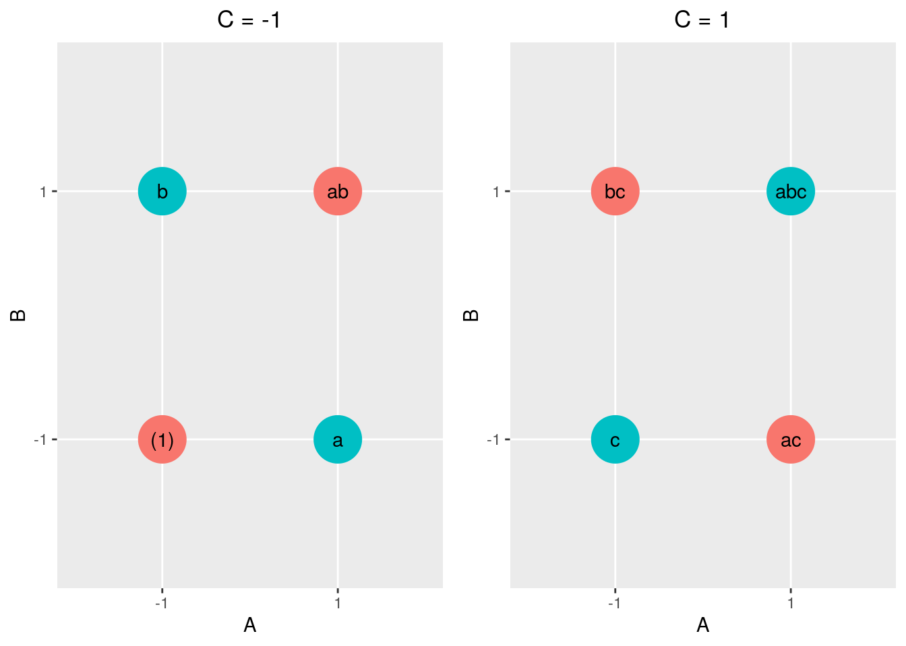

# Fractional Factorial Designs


<!-- SEG Colinearity, vif,  & fractional, blocking, aliasing confounding, replication-->

## Introduction

### Admin

For any errors associated with this section, please contact Steve Gillespie at stephen.e.gillespie.mil@mail.mil or Emma Schlagenhauff at emma.schlagenhauff.civ@mail.mil.


This chapter was published using the following software:

* R version 3.6.0 (2019-04-26).
* On x86_64-pc-linux-gnu (64-bit) running Ubuntu 18.04.2 LTS.
* Packages are explicitly shown in the code snippets with the exception of the `tidyverse` version 1.3.0.

### Overview

Often, doing a full factorial design, even a $2^K$ design is too resource intensive making that choice of an experimental design either impractical or impossible.  However, at the trade-off of a slight loss of fidelity in our understanding of the nature of the effects^[We'll formalize what we mean by this later in the section.], we can learn much about our system (i.e., the relationship between factors and responses) with significantly fewer tests by choosing to test only certain treatment combinations in a smart way (i.e., a way that allows for good subsequent statistical analysis).  The way we make and analyze these designs, their appropriate use, and their relative merits is how we will spend much of the remainder of this course.

One common and powerful class of designs are "fractional factorial" designs.  These are designs where we only take some portion of all the treatment combinations available for a full factorial design.  In particular, we are going to look at $2^{K-P}$ designs, where we consider some $\frac{1}{2^P}$ fraction of a $2^K$ design.  These types of designs are highly useful for screening experiments with a large number of factors.

## $\frac{1}{2}$ Fractional Factorial Design ($2^{K-1}$)

Note, this section may be accompanied by reading from Montgomery's §8.2 @montgomery2017 or the <a href = 'https://www.itl.nist.gov/div898/handbook/pri/section3/pri3.htm'> NIST Engineering Statistics Handbook §3.4 </a>.

### Motivation and Example

Assume you are running a high fidelity, physics based simulation to assess a tank's survivability.  You are varying three factors, the armor thickness (A), the material (B), and the slope of the armor (C).  You have assigned each two levels, a high and a low.  You had initially planned to do a full factorial design and assess all eight treatment combinations.  Unfortunately, high fidelity, physics based simulations are resource intensive and your boss cut your budget and timeline in half.  You can now only run four tests.  The question is, which four do you choose.

Recall your original run matrix and the table of effects and interaction effects:


```{=html}
<div id="htmlwidget-3b62ce829b29f447bcac" style="width:100%;height:auto;" class="datatables html-widget"></div>
<script type="application/json" data-for="htmlwidget-3b62ce829b29f447bcac">{"x":{"filter":"none","data":[["(1)","a","b","ab","c","ac","bc","abc"],[1,1,1,1,1,1,1,1],[-1,1,-1,1,-1,1,-1,1],[-1,-1,1,1,-1,-1,1,1],[1,-1,-1,1,1,-1,-1,1],[-1,-1,-1,-1,1,1,1,1],[1,-1,1,-1,-1,1,-1,1],[1,1,-1,-1,-1,-1,1,1],[-1,1,1,-1,1,-1,-1,1]],"container":"<table class=\"display\">\n  <thead>\n    <tr>\n      <th>TC<\/th>\n      <th>I<\/th>\n      <th>A<\/th>\n      <th>B<\/th>\n      <th>AB<\/th>\n      <th>C<\/th>\n      <th>AC<\/th>\n      <th>BC<\/th>\n      <th>ABC<\/th>\n    <\/tr>\n  <\/thead>\n<\/table>","options":{"columnDefs":[{"className":"dt-right","targets":[1,2,3,4,5,6,7,8]}],"order":[],"autoWidth":false,"orderClasses":false}},"evals":[],"jsHooks":[]}</script>
```

Note that: 

1. Every factor effect or interaction effect is distinct from every other.  Specifically, they are orthogonal to eachother.
2. We are including every treatment combination.

Unfortunately, as we can only run four tests, we must choose only four of the treatment combinations.  The question is which ones.  One option might be to just choose the first four:


```{=html}
<div id="htmlwidget-a04915b208fda8b49456" style="width:100%;height:auto;" class="datatables html-widget"></div>
<script type="application/json" data-for="htmlwidget-a04915b208fda8b49456">{"x":{"filter":"none","data":[["(1)","a","b","ab"],[1,1,1,1],[-1,1,-1,1],[-1,-1,1,1],[1,-1,-1,1],[-1,-1,-1,-1],[1,-1,1,-1],[1,1,-1,-1],[-1,1,1,-1]],"container":"<table class=\"display\">\n  <thead>\n    <tr>\n      <th>TC<\/th>\n      <th>I<\/th>\n      <th>A<\/th>\n      <th>B<\/th>\n      <th>AB<\/th>\n      <th>C<\/th>\n      <th>AC<\/th>\n      <th>BC<\/th>\n      <th>ABC<\/th>\n    <\/tr>\n  <\/thead>\n<\/table>","options":{"columnDefs":[{"className":"dt-right","targets":[1,2,3,4,5,6,7,8]}],"order":[],"autoWidth":false,"orderClasses":false}},"evals":[],"jsHooks":[]}</script>
```

This is not a good choice.  As we can see by inspection, we never assess C at its high level, so we cannot learn anything about what happens as we vary C.

Alternatively, we might choose the tests randomly, for example, we might get:


```{=html}
<div id="htmlwidget-3d1accc1eae49a1f0ce4" style="width:100%;height:auto;" class="datatables html-widget"></div>
<script type="application/json" data-for="htmlwidget-3d1accc1eae49a1f0ce4">{"x":{"filter":"none","data":[["(1)","abc","c","ab"],[1,1,1,1],[-1,1,-1,1],[-1,1,-1,1],[1,1,1,1],[-1,1,1,-1],[1,1,-1,-1],[1,1,-1,-1],[-1,1,1,-1]],"container":"<table class=\"display\">\n  <thead>\n    <tr>\n      <th>TC<\/th>\n      <th>I<\/th>\n      <th>A<\/th>\n      <th>B<\/th>\n      <th>AB<\/th>\n      <th>C<\/th>\n      <th>AC<\/th>\n      <th>BC<\/th>\n      <th>ABC<\/th>\n    <\/tr>\n  <\/thead>\n<\/table>","options":{"columnDefs":[{"className":"dt-right","targets":[1,2,3,4,5,6,7,8]}],"order":[],"autoWidth":false,"orderClasses":false}},"evals":[],"jsHooks":[]}</script>
```

It is perhaps a little less clear, but we might note that we never vary the AB interaction as we see all "+1" in that column.  This is because we can see that A and B are always set to the same level for each treatment combination.  The implication of this is that we won't know if an observed effect is caused by a or caused by B.

To an extent, the challenges we see are inherent in this type of problem.  By limiting ourselves to some fraction of the full factorial set of treatment combinations, we *are* going to lose some information, but losing all information about C or information about A and B independently of each other is not generally a good choice.  To choose the fraction of treatment combinations smartly, we rely on design *generators*.

### Design Generator

Consider the option where we choose only those treatment combinations where ABC = +1:


```{=html}
<div id="htmlwidget-74c3be7af21a9dcbdaf9" style="width:100%;height:auto;" class="datatables html-widget"></div>
<script type="application/json" data-for="htmlwidget-74c3be7af21a9dcbdaf9">{"x":{"filter":"none","data":[["a","b","c","abc"],[1,1,1,1],[1,-1,-1,1],[-1,1,-1,1],[-1,-1,1,1],[-1,-1,1,1],[-1,1,-1,1],[1,-1,-1,1],[1,1,1,1]],"container":"<table class=\"display\">\n  <thead>\n    <tr>\n      <th>TC<\/th>\n      <th>I<\/th>\n      <th>A<\/th>\n      <th>B<\/th>\n      <th>AB<\/th>\n      <th>C<\/th>\n      <th>AC<\/th>\n      <th>BC<\/th>\n      <th>ABC<\/th>\n    <\/tr>\n  <\/thead>\n<\/table>","options":{"columnDefs":[{"className":"dt-right","targets":[1,2,3,4,5,6,7,8]}],"order":[],"autoWidth":false,"orderClasses":false}},"evals":[],"jsHooks":[]}</script>
```

Now, as we look at this, we can note a few things:

* With the exception of ABC and I, every column has exactly two +1 and two -1.
* Columns A, B, and C are orthogonal to each other (proof left to the reader).
* Some of the columns are identical to each other.  Specifically:
    * A = BC
    * B = AC
    * C = AB
    * I = ABC

We can make this explicit with some color:
    

```{=html}
<div id="htmlwidget-900458c7e12af1e28279" style="width:100%;height:auto;" class="datatables html-widget"></div>
<script type="application/json" data-for="htmlwidget-900458c7e12af1e28279">{"x":{"filter":"none","data":[["a","b","c","abc"],[1,1,1,1],[1,-1,-1,1],[-1,1,-1,1],[-1,-1,1,1],[-1,-1,1,1],[-1,1,-1,1],[1,-1,-1,1],[1,1,1,1]],"container":"<table class=\"display\">\n  <thead>\n    <tr>\n      <th>TC<\/th>\n      <th>I<\/th>\n      <th>A<\/th>\n      <th>B<\/th>\n      <th>AB<\/th>\n      <th>C<\/th>\n      <th>AC<\/th>\n      <th>BC<\/th>\n      <th>ABC<\/th>\n    <\/tr>\n  <\/thead>\n<\/table>","options":{"columnDefs":[{"className":"dt-right","targets":[1,2,3,4,5,6,7,8]}],"order":[],"autoWidth":false,"orderClasses":false,"rowCallback":"function(row, data) {\nvar value=data[2]; $(this.api().cell(row, 2).node()).css({'background-color':'red'});\nvar value=data[7]; $(this.api().cell(row, 7).node()).css({'background-color':'red'});\nvar value=data[3]; $(this.api().cell(row, 3).node()).css({'background-color':'blue'});\nvar value=data[6]; $(this.api().cell(row, 6).node()).css({'background-color':'blue'});\nvar value=data[5]; $(this.api().cell(row, 5).node()).css({'background-color':'green'});\nvar value=data[4]; $(this.api().cell(row, 4).node()).css({'background-color':'green'});\nvar value=data[1]; $(this.api().cell(row, 1).node()).css({'background-color':'yellow'});\nvar value=data[8]; $(this.api().cell(row, 8).node()).css({'background-color':'yellow'});\nvar value=data[0]; $(this.api().cell(row, 0).node()).css({'font-weight':'bold'});\nvar value=data[1]; $(this.api().cell(row, 1).node()).css({'font-weight':'bold'});\nvar value=data[2]; $(this.api().cell(row, 2).node()).css({'font-weight':'bold'});\nvar value=data[3]; $(this.api().cell(row, 3).node()).css({'font-weight':'bold'});\nvar value=data[4]; $(this.api().cell(row, 4).node()).css({'font-weight':'bold'});\nvar value=data[5]; $(this.api().cell(row, 5).node()).css({'font-weight':'bold'});\nvar value=data[6]; $(this.api().cell(row, 6).node()).css({'font-weight':'bold'});\nvar value=data[7]; $(this.api().cell(row, 7).node()).css({'font-weight':'bold'});\nvar value=data[8]; $(this.api().cell(row, 8).node()).css({'font-weight':'bold'});\n}"}},"evals":["options.rowCallback"],"jsHooks":[]}</script>
```

What we have done now, is not avoided the problems shown above, but mitigated them.  Specifically, we have done a few things:

* We have chosen $ABC$ as the **generator** for our design.  
* This is equivalent to saying that $I = ABC$ is the **defining relation**.
* We have further **aliased** a number of main and interaction effects.  Specifically, the following pairs are aliases of each other:
    * A and BC.
    * B and AC.
    * C and AB.
    * I and ABC.
    * An **alias**, is therefore, two factors whose effects cannot be distinguished from eachother, and whose levels are equivalent in every treatment combination.
* We chose this structure: the design generator, defining relation, and set of aliases based on the heuristic known as the **sparsity of effects**.  This is the idea that higher order interactions generally have smaller or negligible effects such that we can assume that the observed effect is a result of the main or lower order effect.

There are a few points to note here:

"**Alias Multiplication**": As discussed in the previous chapter, we can "multiply" factor columns together to get the values of another column.  This remains true.  One useful aspect of this is that we can multiply columns together to identify the alias structure.  Recall we have stated that $I = ABC$ and that $I$ is the identity column.  We can use that fact to say that any two columns that are aliased, when multiplied are equivalent to the identity column, or, more simply, a column multiplied by the identity column identifies its alias.  This is best seen as an example:

$$A = I \cdot A = ABC \cdot A = A^2BC = BC$$

This shows us that $A$ and $BC$ are aliased in this design.  The reader can use this to validate the other aliases seen above.

**Principle and Alternate Fraction**: In the above example, we chose all of the treatment combinations where $ABC = +1$.  This is called the principle fraction.  We could have alternatively chosen $ABC = -1$. This is called the alternative (or complementary) fraction.  We could see this here:


```{=html}
<div id="htmlwidget-5f33a0630fba0b37e6ca" style="width:100%;height:auto;" class="datatables html-widget"></div>
<script type="application/json" data-for="htmlwidget-5f33a0630fba0b37e6ca">{"x":{"filter":"none","data":[["(1)","ab","ac","bc"],[1,1,1,1],[-1,1,1,-1],[-1,1,-1,1],[1,1,-1,-1],[-1,-1,1,1],[1,-1,1,-1],[1,-1,-1,1],[-1,-1,-1,-1]],"container":"<table class=\"display\">\n  <thead>\n    <tr>\n      <th>TC<\/th>\n      <th>I<\/th>\n      <th>A<\/th>\n      <th>B<\/th>\n      <th>AB<\/th>\n      <th>C<\/th>\n      <th>AC<\/th>\n      <th>BC<\/th>\n      <th>ABC<\/th>\n    <\/tr>\n  <\/thead>\n<\/table>","options":{"columnDefs":[{"className":"dt-right","targets":[1,2,3,4,5,6,7,8]}],"order":[],"autoWidth":false,"orderClasses":false,"rowCallback":"function(row, data) {\nvar value=data[2]; $(this.api().cell(row, 2).node()).css({'background-color':'red'});\nvar value=data[7]; $(this.api().cell(row, 7).node()).css({'background-color':'red'});\nvar value=data[3]; $(this.api().cell(row, 3).node()).css({'background-color':'blue'});\nvar value=data[6]; $(this.api().cell(row, 6).node()).css({'background-color':'blue'});\nvar value=data[5]; $(this.api().cell(row, 5).node()).css({'background-color':'green'});\nvar value=data[4]; $(this.api().cell(row, 4).node()).css({'background-color':'green'});\nvar value=data[1]; $(this.api().cell(row, 1).node()).css({'background-color':'yellow'});\nvar value=data[8]; $(this.api().cell(row, 8).node()).css({'background-color':'yellow'});\nvar value=data[0]; $(this.api().cell(row, 0).node()).css({'font-weight':'bold'});\nvar value=data[1]; $(this.api().cell(row, 1).node()).css({'font-weight':'bold'});\nvar value=data[2]; $(this.api().cell(row, 2).node()).css({'font-weight':'bold'});\nvar value=data[3]; $(this.api().cell(row, 3).node()).css({'font-weight':'bold'});\nvar value=data[4]; $(this.api().cell(row, 4).node()).css({'font-weight':'bold'});\nvar value=data[5]; $(this.api().cell(row, 5).node()).css({'font-weight':'bold'});\nvar value=data[6]; $(this.api().cell(row, 6).node()).css({'font-weight':'bold'});\nvar value=data[7]; $(this.api().cell(row, 7).node()).css({'font-weight':'bold'});\nvar value=data[8]; $(this.api().cell(row, 8).node()).css({'font-weight':'bold'});\n}"}},"evals":["options.rowCallback"],"jsHooks":[]}</script>
```

Here we see that our alias structure is not exactly the same, rather our aliases are inverses of each other.  For example, $A = -BC$.  We can calculate these in the same manner as before, e.g.:

$$ A = I \cdot A = -ABC \cdot A = -A^2BC = -BC$$

When we are estimating the effects in this case, we are going to see that our estimation includes the difference between the effect of A and BC, for example (the next section covers estimating effects).

**Choice of Generator**:  We are not bound to choose ABC or -ABC as our generator.  This is a common choice based on the principle of sparsity of effects, but sometimes alternative generators make sense if we know something about our system.  For example, consider a system where we strongly believe that $A$ and $B$ alone have negligible effects, but we believe that the interactions $AB$ and $BC$ likely do, we might choose $I = A$ as our defining relation and see a design matrix and alias structure like this:


```{=html}
<div id="htmlwidget-68b122f7f9d8fd619109" style="width:100%;height:auto;" class="datatables html-widget"></div>
<script type="application/json" data-for="htmlwidget-68b122f7f9d8fd619109">{"x":{"filter":"none","data":[["a","ab","ac","abc"],[1,1,1,1],[1,1,1,1],[-1,1,-1,1],[-1,1,-1,1],[-1,-1,1,1],[-1,-1,1,1],[1,-1,-1,1],[1,-1,-1,1]],"container":"<table class=\"display\">\n  <thead>\n    <tr>\n      <th>TC<\/th>\n      <th>I<\/th>\n      <th>A<\/th>\n      <th>B<\/th>\n      <th>AB<\/th>\n      <th>C<\/th>\n      <th>AC<\/th>\n      <th>BC<\/th>\n      <th>ABC<\/th>\n    <\/tr>\n  <\/thead>\n<\/table>","options":{"columnDefs":[{"className":"dt-right","targets":[1,2,3,4,5,6,7,8]}],"order":[],"autoWidth":false,"orderClasses":false,"rowCallback":"function(row, data) {\nvar value=data[8]; $(this.api().cell(row, 8).node()).css({'background-color':'red'});\nvar value=data[7]; $(this.api().cell(row, 7).node()).css({'background-color':'red'});\nvar value=data[3]; $(this.api().cell(row, 3).node()).css({'background-color':'blue'});\nvar value=data[4]; $(this.api().cell(row, 4).node()).css({'background-color':'blue'});\nvar value=data[5]; $(this.api().cell(row, 5).node()).css({'background-color':'green'});\nvar value=data[6]; $(this.api().cell(row, 6).node()).css({'background-color':'green'});\nvar value=data[1]; $(this.api().cell(row, 1).node()).css({'background-color':'yellow'});\nvar value=data[2]; $(this.api().cell(row, 2).node()).css({'background-color':'yellow'});\nvar value=data[0]; $(this.api().cell(row, 0).node()).css({'font-weight':'bold'});\nvar value=data[1]; $(this.api().cell(row, 1).node()).css({'font-weight':'bold'});\nvar value=data[2]; $(this.api().cell(row, 2).node()).css({'font-weight':'bold'});\nvar value=data[3]; $(this.api().cell(row, 3).node()).css({'font-weight':'bold'});\nvar value=data[4]; $(this.api().cell(row, 4).node()).css({'font-weight':'bold'});\nvar value=data[5]; $(this.api().cell(row, 5).node()).css({'font-weight':'bold'});\nvar value=data[6]; $(this.api().cell(row, 6).node()).css({'font-weight':'bold'});\nvar value=data[7]; $(this.api().cell(row, 7).node()).css({'font-weight':'bold'});\nvar value=data[8]; $(this.api().cell(row, 8).node()).css({'font-weight':'bold'});\n}"}},"evals":["options.rowCallback"],"jsHooks":[]}</script>
```

To make this choice is unconventional and requires some reasonable knowledge of the system at hand, but it *can* be a good choice under the right circumstances.

### Estimating Effects

As in full factorial designs, the point of designing an experiment and doing testing is such that we can estimate effects.  In the case of a half fractional factorial design, we can estimate the effects in a manner similar to how we estimated with a full factorial design, with the use of contrasts.  Recall that we use the name of the treatment combination to represent the sum of the responses for that given treatment combination.  We then take the dot product of the treatment combination column and the effect column to get the contrast and multiply by $\frac{1}{n \cdot 2^{K-P-1}}.  

For example, if we have $I = ABC$, we have the following design: 


```{=html}
<div id="htmlwidget-9169a50b0b9b91c8949d" style="width:100%;height:auto;" class="datatables html-widget"></div>
<script type="application/json" data-for="htmlwidget-9169a50b0b9b91c8949d">{"x":{"filter":"none","data":[["a","b","c","abc"],[1,1,1,1],[1,-1,-1,1],[-1,1,-1,1],[-1,-1,1,1],[-1,-1,1,1],[-1,1,-1,1],[1,-1,-1,1],[1,1,1,1]],"container":"<table class=\"display\">\n  <thead>\n    <tr>\n      <th>TC<\/th>\n      <th>I<\/th>\n      <th>A<\/th>\n      <th>B<\/th>\n      <th>AB<\/th>\n      <th>C<\/th>\n      <th>AC<\/th>\n      <th>BC<\/th>\n      <th>ABC<\/th>\n    <\/tr>\n  <\/thead>\n<\/table>","options":{"columnDefs":[{"className":"dt-right","targets":[1,2,3,4,5,6,7,8]}],"order":[],"autoWidth":false,"orderClasses":false,"rowCallback":"function(row, data) {\nvar value=data[2]; $(this.api().cell(row, 2).node()).css({'background-color':'red'});\nvar value=data[7]; $(this.api().cell(row, 7).node()).css({'background-color':'red'});\nvar value=data[3]; $(this.api().cell(row, 3).node()).css({'background-color':'blue'});\nvar value=data[6]; $(this.api().cell(row, 6).node()).css({'background-color':'blue'});\nvar value=data[5]; $(this.api().cell(row, 5).node()).css({'background-color':'green'});\nvar value=data[4]; $(this.api().cell(row, 4).node()).css({'background-color':'green'});\nvar value=data[1]; $(this.api().cell(row, 1).node()).css({'background-color':'yellow'});\nvar value=data[8]; $(this.api().cell(row, 8).node()).css({'background-color':'yellow'});\nvar value=data[0]; $(this.api().cell(row, 0).node()).css({'font-weight':'bold'});\nvar value=data[1]; $(this.api().cell(row, 1).node()).css({'font-weight':'bold'});\nvar value=data[2]; $(this.api().cell(row, 2).node()).css({'font-weight':'bold'});\nvar value=data[3]; $(this.api().cell(row, 3).node()).css({'font-weight':'bold'});\nvar value=data[4]; $(this.api().cell(row, 4).node()).css({'font-weight':'bold'});\nvar value=data[5]; $(this.api().cell(row, 5).node()).css({'font-weight':'bold'});\nvar value=data[6]; $(this.api().cell(row, 6).node()).css({'font-weight':'bold'});\nvar value=data[7]; $(this.api().cell(row, 7).node()).css({'font-weight':'bold'});\nvar value=data[8]; $(this.api().cell(row, 8).node()).css({'font-weight':'bold'});\n}"}},"evals":["options.rowCallback"],"jsHooks":[]}</script>
```

We then see: 

* $[A] = [BC] = \frac{1}{2}(a - b - c + abc)$
* $[B] = [AC] = \frac{1}{2}(-a + b - c + abc)$
* $[C] = [AB] = \frac{1}{2}(-a - b + c + abc)$
* We cannot estimate the effect of ABC as it never varies in value (i.e., it is all 1s).
* Note the notation [effect] is used to indicate that linear combination as indicated above.

Further, what we are really estimating with each of these linear combinations is the sum of the effect of the two aliases.  That is $[A] = [BC] \to A + BC$, meaning this value is really the effect of A plus the effect of BC.  Of course, if we assume $BC \approx 0$, we can reduce this to say, $[A] \to A + BC \approx A + 0 = A$ or that the effect of $A$ is about $[A]$.

Similarly, when we take the alternate fraction, where $I = -ABC$, we are saying $[A]' = [BC]' \to A - BC$, where the $[effect]'$ indicates the inverse of $[A]$.  For example, $[A] = \frac{1}{2}(a - b - c + abc)$ and $[A]' = \frac{1}{2}(-(1) + ab + ac - bc)$

### Geometric View

As with a full factorial design, one can view a fractional factorial design geometrically.  Consider a $2^{3-1}$ design with $ABC$ as the generator.  We can view this in at least two ways:


We can look at multiple 2D Perspectives as such:



Note that the Principle Fraction (represented in red) includes: (1), ab, ac, and bc, and the Alternate Fraction (repreented in blue) includes: a, b, c, and abc.  We can further see that the choices on each "plane" of C the choices of treatment combinations are opposite of each other.

We can also view these in a 3D manner as such:^[Note this uses the `plotly` package for 3D graphing.  This is beyond the scope of this section but you can read more about it <a href = 'https://plotly-r.com'> here </a> fore example]


```{=html}
<div id="htmlwidget-e80055bcfabac41e39fa" style="width:672px;height:480px;" class="plotly html-widget"></div>
<script type="application/json" data-for="htmlwidget-e80055bcfabac41e39fa">{"x":{"visdat":{"e5a341598f2":["function () ","plotlyVisDat"]},"cur_data":"e5a341598f2","attrs":{"e5a341598f2":{"x":{},"y":{},"z":{},"alpha_stroke":1,"sizes":[10,100],"spans":[1,20],"text":{},"type":"scatter3d","mode":"text","inherit":true},"e5a341598f2.1":{"x":{},"y":{},"z":{},"alpha_stroke":1,"sizes":[10,100],"spans":[1,20],"type":"scatter3d","mode":"markers","color":{},"inherit":true}},"layout":{"margin":{"b":40,"l":60,"t":25,"r":10},"scene":{"xaxis":{"title":"A"},"yaxis":{"title":"B"},"zaxis":{"title":"C"}},"xaxis":{"type":"category","categoryorder":"array","categoryarray":["-1","1"]},"yaxis":{"type":"category","categoryorder":"array","categoryarray":["-1","1"]},"hovermode":"closest","showlegend":true},"source":"A","config":{"showSendToCloud":false},"data":[{"x":["-1","1","-1","1","-1","1","-1","1"],"y":["-1","-1","1","1","-1","-1","1","1"],"z":["-1","-1","-1","-1","1","1","1","1"],"text":["(1)","a","b","ab","c","ac","bc","abc"],"type":"scatter3d","mode":"text","marker":{"color":"rgba(31,119,180,1)","line":{"color":"rgba(31,119,180,1)"}},"error_y":{"color":"rgba(31,119,180,1)"},"error_x":{"color":"rgba(31,119,180,1)"},"line":{"color":"rgba(31,119,180,1)"},"frame":null},{"x":["-1","1","1","-1"],"y":["-1","1","-1","1"],"z":["-1","-1","1","1"],"type":"scatter3d","mode":"markers","name":"Alternate","marker":{"color":"rgba(102,194,165,1)","line":{"color":"rgba(102,194,165,1)"}},"textfont":{"color":"rgba(102,194,165,1)"},"error_y":{"color":"rgba(102,194,165,1)"},"error_x":{"color":"rgba(102,194,165,1)"},"line":{"color":"rgba(102,194,165,1)"},"frame":null},{"x":["1","-1","-1","1"],"y":["-1","1","-1","1"],"z":["-1","-1","1","1"],"type":"scatter3d","mode":"markers","name":"Principle","marker":{"color":"rgba(141,160,203,1)","line":{"color":"rgba(141,160,203,1)"}},"textfont":{"color":"rgba(141,160,203,1)"},"error_y":{"color":"rgba(141,160,203,1)"},"error_x":{"color":"rgba(141,160,203,1)"},"line":{"color":"rgba(141,160,203,1)"},"frame":null}],"highlight":{"on":"plotly_click","persistent":false,"dynamic":false,"selectize":false,"opacityDim":0.2,"selected":{"opacity":1},"debounce":0},"shinyEvents":["plotly_hover","plotly_click","plotly_selected","plotly_relayout","plotly_brushed","plotly_brushing","plotly_clickannotation","plotly_doubleclick","plotly_deselect","plotly_afterplot","plotly_sunburstclick"],"base_url":"https://plot.ly"},"evals":[],"jsHooks":[]}</script>
```

Again, we see the nice symmetry in the choice of treatment combinations for each fraction.

### Example $2^{4-1}$ Design

*Note this example has been modified from Example 8.1 in §8.2 of @montgomery2017.*

Consider an experiment with four factors: A, B, C, and D that each take a high and low level and return a response.  A full factorial experiement would require: $2^4 = 16$ tests minimum to test all treatment combinations.  Unfortunately, we only have the resources to conduct 8 tests.  Accordingly, we have opted to conduct a half fractional factorial ($2^{4-1}$) experiment.  We take $ABCD = I$ as the defining relation (with $ABCD$ as the generator); we will choose the principle fraction (i.e., where $ABCD = 1$).

First, let us identify the appropriate treatment combinations.  We can do this in at least two ways.  The first is manually:


```r
# First let us create a full factorial design
# This clearly gets very annoying beyond K = 3
myExample <- data.frame(
  TC = c('(1)', 'a', 'b', 'ab', 'c', 'ac', 'bc', 'abc', 'd', 'ad', 'bd', 'abd', 'cd', 'acd', 'bcd', 'abcd'),
  I = rep(1, 16),
  A = rep(c(-1, 1), 8),
  B = rep(c(-1, -1, 1, 1), 4),
  C = rep(c(rep(-1, 4), rep(1, 4)), 2), 
  D = c(rep(-1, 8), rep(1, 8))
)

myExample
```

```
##      TC I  A  B  C  D
## 1   (1) 1 -1 -1 -1 -1
## 2     a 1  1 -1 -1 -1
## 3     b 1 -1  1 -1 -1
## 4    ab 1  1  1 -1 -1
## 5     c 1 -1 -1  1 -1
## 6    ac 1  1 -1  1 -1
## 7    bc 1 -1  1  1 -1
## 8   abc 1  1  1  1 -1
## 9     d 1 -1 -1 -1  1
## 10   ad 1  1 -1 -1  1
## 11   bd 1 -1  1 -1  1
## 12  abd 1  1  1 -1  1
## 13   cd 1 -1 -1  1  1
## 14  acd 1  1 -1  1  1
## 15  bcd 1 -1  1  1  1
## 16 abcd 1  1  1  1  1
```

```r
# Show interaction effects columns
myExample <- myExample %>% 
  mutate(AB = A*B,
         AC = A*C,
         AD = A*D,
         BC = B*C,
         BD = B*D,
         CD = C*D,
         ABC = A*B*C,
         ABD = A*B*D,
         ACD = A*C*D,
         BCD = B*C*D,
         ABCD = A*B*C*D)

# We can see what a full factorial design would look like
# note that datatable from the DT package is a nice way for outputting 
# tables.  It is quite extensible and you can format your tables in many 
# convenient ways.
datatable(myExample, rownames = F, options = list(pageLength = 16))
```

```{=html}
<div id="htmlwidget-8a8a0071d0446dd92723" style="width:100%;height:auto;" class="datatables html-widget"></div>
<script type="application/json" data-for="htmlwidget-8a8a0071d0446dd92723">{"x":{"filter":"none","data":[["(1)","a","b","ab","c","ac","bc","abc","d","ad","bd","abd","cd","acd","bcd","abcd"],[1,1,1,1,1,1,1,1,1,1,1,1,1,1,1,1],[-1,1,-1,1,-1,1,-1,1,-1,1,-1,1,-1,1,-1,1],[-1,-1,1,1,-1,-1,1,1,-1,-1,1,1,-1,-1,1,1],[-1,-1,-1,-1,1,1,1,1,-1,-1,-1,-1,1,1,1,1],[-1,-1,-1,-1,-1,-1,-1,-1,1,1,1,1,1,1,1,1],[1,-1,-1,1,1,-1,-1,1,1,-1,-1,1,1,-1,-1,1],[1,-1,1,-1,-1,1,-1,1,1,-1,1,-1,-1,1,-1,1],[1,-1,1,-1,1,-1,1,-1,-1,1,-1,1,-1,1,-1,1],[1,1,-1,-1,-1,-1,1,1,1,1,-1,-1,-1,-1,1,1],[1,1,-1,-1,1,1,-1,-1,-1,-1,1,1,-1,-1,1,1],[1,1,1,1,-1,-1,-1,-1,-1,-1,-1,-1,1,1,1,1],[-1,1,1,-1,1,-1,-1,1,-1,1,1,-1,1,-1,-1,1],[-1,1,1,-1,-1,1,1,-1,1,-1,-1,1,1,-1,-1,1],[-1,1,-1,1,1,-1,1,-1,1,-1,1,-1,-1,1,-1,1],[-1,-1,1,1,1,1,-1,-1,1,1,-1,-1,-1,-1,1,1],[1,-1,-1,1,-1,1,1,-1,-1,1,1,-1,1,-1,-1,1]],"container":"<table class=\"display\">\n  <thead>\n    <tr>\n      <th>TC<\/th>\n      <th>I<\/th>\n      <th>A<\/th>\n      <th>B<\/th>\n      <th>C<\/th>\n      <th>D<\/th>\n      <th>AB<\/th>\n      <th>AC<\/th>\n      <th>AD<\/th>\n      <th>BC<\/th>\n      <th>BD<\/th>\n      <th>CD<\/th>\n      <th>ABC<\/th>\n      <th>ABD<\/th>\n      <th>ACD<\/th>\n      <th>BCD<\/th>\n      <th>ABCD<\/th>\n    <\/tr>\n  <\/thead>\n<\/table>","options":{"pageLength":16,"columnDefs":[{"className":"dt-right","targets":[1,2,3,4,5,6,7,8,9,10,11,12,13,14,15,16]}],"order":[],"autoWidth":false,"orderClasses":false,"lengthMenu":[10,16,25,50,100]}},"evals":[],"jsHooks":[]}</script>
```

```r
# We can then select our principle freaction of ABCD = I by filtering for ABCD = 1 in the table
datatable(myExample %>% filter(ABCD == 1), rownames = F, options = list(pageLength = 8))
```

```{=html}
<div id="htmlwidget-12af6cc0b852f711a6d1" style="width:100%;height:auto;" class="datatables html-widget"></div>
<script type="application/json" data-for="htmlwidget-12af6cc0b852f711a6d1">{"x":{"filter":"none","data":[["(1)","ab","ac","bc","ad","bd","cd","abcd"],[1,1,1,1,1,1,1,1],[-1,1,1,-1,1,-1,-1,1],[-1,1,-1,1,-1,1,-1,1],[-1,-1,1,1,-1,-1,1,1],[-1,-1,-1,-1,1,1,1,1],[1,1,-1,-1,-1,-1,1,1],[1,-1,1,-1,-1,1,-1,1],[1,-1,-1,1,1,-1,-1,1],[1,-1,-1,1,1,-1,-1,1],[1,-1,1,-1,-1,1,-1,1],[1,1,-1,-1,-1,-1,1,1],[-1,-1,-1,-1,1,1,1,1],[-1,-1,1,1,-1,-1,1,1],[-1,1,-1,1,-1,1,-1,1],[-1,1,1,-1,1,-1,-1,1],[1,1,1,1,1,1,1,1]],"container":"<table class=\"display\">\n  <thead>\n    <tr>\n      <th>TC<\/th>\n      <th>I<\/th>\n      <th>A<\/th>\n      <th>B<\/th>\n      <th>C<\/th>\n      <th>D<\/th>\n      <th>AB<\/th>\n      <th>AC<\/th>\n      <th>AD<\/th>\n      <th>BC<\/th>\n      <th>BD<\/th>\n      <th>CD<\/th>\n      <th>ABC<\/th>\n      <th>ABD<\/th>\n      <th>ACD<\/th>\n      <th>BCD<\/th>\n      <th>ABCD<\/th>\n    <\/tr>\n  <\/thead>\n<\/table>","options":{"pageLength":8,"columnDefs":[{"className":"dt-right","targets":[1,2,3,4,5,6,7,8,9,10,11,12,13,14,15,16]}],"order":[],"autoWidth":false,"orderClasses":false,"lengthMenu":[8,10,25,50,100]}},"evals":[],"jsHooks":[]}</script>
```

We can calculate our alias structure using effect multiplication:

* $A = A \cdot ABCD = BCD$
* $B = B \cdot ABCD = ACD$
* $C = C \cdot ABCD = ABD$
* $D = D \cdot ABCD = ABC$
* $AB = AB \cdot ABCD = CD$
* $AC = AC \cdot ABCD = BD$
* $AD = AD \cdot ABCD = BC$

With this, we see every main effect is aliased with a third-order interaction effect, and every second-order interaction effect is aliased with another second-order interaction effect.

We can see this on our run matrix by color coding the aliased columns:


```r
datatable(myExample %>% filter(ABCD == 1), rownames = F, options = list(pageLength = 8)) %>% 
  formatStyle(c('I', 'ABCD'), backgroundColor = 'red') %>% 
  formatStyle(c('A', 'BCD'), backgroundColor = 'orange') %>% 
  formatStyle(c('B', 'ACD'), backgroundColor = 'yellow') %>% 
  formatStyle(c('C', 'ABD'), backgroundColor = 'green') %>% 
  formatStyle(c('D', 'ABC'), backgroundColor = 'blue') %>% 
  formatStyle(c('AB', 'CD'), backgroundColor = 'purple') %>% 
  formatStyle(c('AC', 'BD'), backgroundColor = 'grey') %>% 
  formatStyle(c('AD', 'BC'), backgroundColor = 'white')
```

```{=html}
<div id="htmlwidget-3760c7e8cfc3447f5ece" style="width:100%;height:auto;" class="datatables html-widget"></div>
<script type="application/json" data-for="htmlwidget-3760c7e8cfc3447f5ece">{"x":{"filter":"none","data":[["(1)","ab","ac","bc","ad","bd","cd","abcd"],[1,1,1,1,1,1,1,1],[-1,1,1,-1,1,-1,-1,1],[-1,1,-1,1,-1,1,-1,1],[-1,-1,1,1,-1,-1,1,1],[-1,-1,-1,-1,1,1,1,1],[1,1,-1,-1,-1,-1,1,1],[1,-1,1,-1,-1,1,-1,1],[1,-1,-1,1,1,-1,-1,1],[1,-1,-1,1,1,-1,-1,1],[1,-1,1,-1,-1,1,-1,1],[1,1,-1,-1,-1,-1,1,1],[-1,-1,-1,-1,1,1,1,1],[-1,-1,1,1,-1,-1,1,1],[-1,1,-1,1,-1,1,-1,1],[-1,1,1,-1,1,-1,-1,1],[1,1,1,1,1,1,1,1]],"container":"<table class=\"display\">\n  <thead>\n    <tr>\n      <th>TC<\/th>\n      <th>I<\/th>\n      <th>A<\/th>\n      <th>B<\/th>\n      <th>C<\/th>\n      <th>D<\/th>\n      <th>AB<\/th>\n      <th>AC<\/th>\n      <th>AD<\/th>\n      <th>BC<\/th>\n      <th>BD<\/th>\n      <th>CD<\/th>\n      <th>ABC<\/th>\n      <th>ABD<\/th>\n      <th>ACD<\/th>\n      <th>BCD<\/th>\n      <th>ABCD<\/th>\n    <\/tr>\n  <\/thead>\n<\/table>","options":{"pageLength":8,"columnDefs":[{"className":"dt-right","targets":[1,2,3,4,5,6,7,8,9,10,11,12,13,14,15,16]}],"order":[],"autoWidth":false,"orderClasses":false,"lengthMenu":[8,10,25,50,100],"rowCallback":"function(row, data) {\nvar value=data[1]; $(this.api().cell(row, 1).node()).css({'background-color':'red'});\nvar value=data[16]; $(this.api().cell(row, 16).node()).css({'background-color':'red'});\nvar value=data[2]; $(this.api().cell(row, 2).node()).css({'background-color':'orange'});\nvar value=data[15]; $(this.api().cell(row, 15).node()).css({'background-color':'orange'});\nvar value=data[3]; $(this.api().cell(row, 3).node()).css({'background-color':'yellow'});\nvar value=data[14]; $(this.api().cell(row, 14).node()).css({'background-color':'yellow'});\nvar value=data[4]; $(this.api().cell(row, 4).node()).css({'background-color':'green'});\nvar value=data[13]; $(this.api().cell(row, 13).node()).css({'background-color':'green'});\nvar value=data[5]; $(this.api().cell(row, 5).node()).css({'background-color':'blue'});\nvar value=data[12]; $(this.api().cell(row, 12).node()).css({'background-color':'blue'});\nvar value=data[6]; $(this.api().cell(row, 6).node()).css({'background-color':'purple'});\nvar value=data[11]; $(this.api().cell(row, 11).node()).css({'background-color':'purple'});\nvar value=data[7]; $(this.api().cell(row, 7).node()).css({'background-color':'grey'});\nvar value=data[10]; $(this.api().cell(row, 10).node()).css({'background-color':'grey'});\nvar value=data[8]; $(this.api().cell(row, 8).node()).css({'background-color':'white'});\nvar value=data[9]; $(this.api().cell(row, 9).node()).css({'background-color':'white'});\n}"}},"evals":["options.rowCallback"],"jsHooks":[]}</script>
```

This of course becomes overwhelming as $K$ increases, both from a visualization perspective and from a practical recording the data perspective.  There a variety of computer programs and packages that can do much of this for us.  One is the `FrF2` package in *R*.  We will demonstrate it here:


```r
#install.packages('FrF2') # Install the package if you have not already done so.
library(FrF2)

# The FrF2 function in FrF2 produces a data frame with some additional information:

myDesign <- FrF2(
  # Choose the total number of treatment combinations you desire.  Must be a power of 2
  nruns = 8, 
  # Choose the number of factors
  nfactors = 4, 
  # The default is to name factors A, B, C...; you can choose other names, however
  # with a character vector of the same length as the number of factors
  factor.names = LETTERS[1:4], 
  # There are a variety of options.  One is to include alias info up to aliases of 3rd order interactions
  alias.info = 3)

# We can view the design by calling it
myDesign
```

```
##    A  B  C  D
## 1  1 -1  1 -1
## 2  1  1 -1 -1
## 3  1  1  1  1
## 4 -1 -1 -1 -1
## 5 -1 -1  1  1
## 6 -1  1 -1  1
## 7  1 -1 -1  1
## 8 -1  1  1 -1
## class=design, type= FrF2
```

```r
# Note two things: 
# 1) the factors are a factor data type.  This is useful, though if you want to multiply columns, you'll have to convert
# the data type
# 2) This is not strictly a data frame, it is an object of class design
# We can see this with its structure

# If we call the structure of `myDesign` we can learn a lot about it
str(myDesign)
```

```
## Classes 'design' and 'data.frame':	8 obs. of  4 variables:
##  $ A: Factor w/ 2 levels "-1","1": 2 2 2 1 1 1 2 1
##   ..- attr(*, "contrasts")= num [1:2, 1] -1 1
##   .. ..- attr(*, "dimnames")=List of 2
##   .. .. ..$ : chr  "-1" "1"
##   .. .. ..$ : NULL
##  $ B: Factor w/ 2 levels "-1","1": 1 2 2 1 1 2 1 2
##   ..- attr(*, "contrasts")= num [1:2, 1] -1 1
##   .. ..- attr(*, "dimnames")=List of 2
##   .. .. ..$ : chr  "-1" "1"
##   .. .. ..$ : NULL
##  $ C: Factor w/ 2 levels "-1","1": 2 1 2 1 2 1 1 2
##   ..- attr(*, "contrasts")= num [1:2, 1] -1 1
##   .. ..- attr(*, "dimnames")=List of 2
##   .. .. ..$ : chr  "-1" "1"
##   .. .. ..$ : NULL
##  $ D: Factor w/ 2 levels "-1","1": 1 1 2 1 2 2 2 1
##   ..- attr(*, "contrasts")= num [1:2, 1] -1 1
##   .. ..- attr(*, "dimnames")=List of 2
##   .. .. ..$ : chr  "-1" "1"
##   .. .. ..$ : NULL
##  - attr(*, "desnum")= num [1:8, 1:4] 1 1 1 -1 -1 -1 1 -1 -1 1 ...
##   ..- attr(*, "dimnames")=List of 2
##   .. ..$ : chr  "1" "2" "3" "4" ...
##   .. ..$ : chr  "A" "B" "C" "D"
##  - attr(*, "run.order")='data.frame':	8 obs. of  3 variables:
##   ..$ run.no.in.std.order: Factor w/ 8 levels "1","2","3","4",..: 6 4 8 1 5 3 2 7
##   ..$ run.no             : int  1 2 3 4 5 6 7 8
##   ..$ run.no.std.rp      : Factor w/ 8 levels "1","2","3","4",..: 6 4 8 1 5 3 2 7
##  - attr(*, "design.info")=List of 13
##   ..$ type        : chr "FrF2"
##   ..$ nruns       : num 8
##   ..$ nfactors    : num 4
##   ..$ factor.names:List of 4
##   .. ..$ A: num  -1 1
##   .. ..$ B: num  -1 1
##   .. ..$ C: num  -1 1
##   .. ..$ D: num  -1 1
##   ..$ catlg.name  : chr "catlg"
##   ..$ catlg.entry :List of 1
##   .. ..$ 4-1.1:List of 9
##   .. .. ..$ res           : int 4
##   .. .. ..$ nfac          : num 4
##   .. .. ..$ nruns         : num 8
##   .. .. ..$ gen           : num 7
##   .. .. ..$ WLP           : num  0 0 0 1 0 0 0
##   .. .. ..$ nclear.2fis   : num 0
##   .. .. ..$ clear.2fis    : num 
##   .. .. ..$ all.2fis.clear: num 
##   .. .. ..$ dominating    : logi FALSE
##   .. ..- attr(*, "class")= chr  "catlg" "list"
##   ..$ aliased     :List of 4
##   .. ..$ legend: chr  "A=A" "B=B" "C=C" "D=D"
##   .. ..$ main  : chr  "A=BCD" "B=ACD" "C=ABD" "D=ABC"
##   .. ..$ fi2   : chr  "AB=CD" "AC=BD" "AD=BC"
##   .. ..$ fi3   : chr 
##   ..$ FrF2.version: chr "2.2-2"
##   ..$ replications: num 1
##   ..$ repeat.only : logi FALSE
##   ..$ randomize   : logi TRUE
##   ..$ seed        : NULL
##   ..$ creator     : language FrF2(nruns = 8, nfactors = 4, factor.names = LETTERS[1:4], alias.info = 3)
```

```r
# We see the main columns $A, $B, $C, $D
# We can also see that the data frame has a number of attributes

# We can call information about the attributes using the `attr` command
# For example, we can call the attribute 'design.info'  using the command below
attr(myDesign, 'design.info')
```

```
## $type
## [1] "FrF2"
## 
## $nruns
## [1] 8
## 
## $nfactors
## [1] 4
## 
## $factor.names
## $factor.names$A
## [1] -1  1
## 
## $factor.names$B
## [1] -1  1
## 
## $factor.names$C
## [1] -1  1
## 
## $factor.names$D
## [1] -1  1
## 
## 
## $catlg.name
## [1] "catlg"
## 
## $catlg.entry
## Design:  4-1.1 
##    8  runs,  4  factors,  
##    Resolution  IV 
##    Generating columns:  7 
##    WLP (3plus):  0 1 0 0 0 ,  0  clear 2fis
## 
## $aliased
## $aliased$legend
## [1] "A=A" "B=B" "C=C" "D=D"
## 
## $aliased$main
## [1] "A=BCD" "B=ACD" "C=ABD" "D=ABC"
## 
## $aliased$fi2
## [1] "AB=CD" "AC=BD" "AD=BC"
## 
## $aliased$fi3
## character(0)
## 
## 
## $FrF2.version
## [1] "2.2-2"
## 
## $replications
## [1] 1
## 
## $repeat.only
## [1] FALSE
## 
## $randomize
## [1] TRUE
## 
## $seed
## NULL
## 
## $creator
## FrF2(nruns = 8, nfactors = 4, factor.names = LETTERS[1:4], alias.info = 3)
```

```r
# We can "dig into" this in our normal indexing manner, for example, we can learn about our aliases and the gnerators
attr(myDesign, 'design.info')$aliased
```

```
## $legend
## [1] "A=A" "B=B" "C=C" "D=D"
## 
## $main
## [1] "A=BCD" "B=ACD" "C=ABD" "D=ABC"
## 
## $fi2
## [1] "AB=CD" "AC=BD" "AD=BC"
## 
## $fi3
## character(0)
```

```r
# This shows us the main effects aliases, the 2nd order interaction aliases, 
# and if there third order interactions aliased with higher order ones, you would see that here

# If we want to really dig into this, we can call the elements of this list.
# This would, for example, allow you to state the main interactions in a report
attr(myDesign, 'design.info')$aliased$main
```

```
## [1] "A=BCD" "B=ACD" "C=ABD" "D=ABC"
```

```r
# We can view the generators
attr(myDesign, 'design.info')$catlg.entry
```

```
## Design:  4-1.1 
##    8  runs,  4  factors,  
##    Resolution  IV 
##    Generating columns:  7 
##    WLP (3plus):  0 1 0 0 0 ,  0  clear 2fis
```

```r
# We can dig even deeper into this to get the numeric vector of generators
attr(myDesign, 'design.info')$catlg.entry[[1]]$gen
```

```
## [1] 7
```

```r
# This is somewhat cryptic
# FrF2 uses an internal vector of generator names that correspond to its vector "Yates"
# We can see this by:
names(Yates)[7]
```

```
## [1] "ABC"
```

```r
# We also have to remember that FrF2 does not provide generators in the form I = [My Generator]
# They are in the form Factor = [My Generator]
# Where the factor is identified by the order in the provided vector and the size of the fraction
# For example, if you have P generators and K factors, the first value corresponds to the (K-P+1) letter
# In our case we have four factors, A, B, C, and D
# We have one generator, so we have ABC = D as ABC is our only generator and K - 1 + 1 = 4 and D is the 4th letter

# Finally, if you wanted to write the design to a file, you can do this in the normal manner 
# and it will write what you see in the main data frame.  For example:
write.csv(myDesign, '../html/_Chapter4_ProblemSets/myDesign.csv', row.names = F)
```

Regardless of how you choose to build a design, once you have the design and the responses, you can use the information available to assess the effects.  Consider the following results:


```r
exampleData <- data.frame(
  TC = c('(1)', 'ad', 'bd', 'ab', 'cd', 'ac', 'bc', 'abcd'),
  A = rep(c(-1, 1), 4),
  B = rep(c(-1, -1, 1, 1), 2),
  C = c(rep(-1, 4), rep(1, 4)), 
  D = c(-1, 1, 1, -1, 1, -1, -1, 1),
  Response = c(45, 100, 45, 65, 75, 60, 80, 96)
)

exampleData <- exampleData %>% 
  mutate(AB = A*B, AC = A*C, AD = A*D, BC = B*C, BD = B*D, CD = C*D)

exampleData
```

```
##     TC  A  B  C  D Response AB AC AD BC BD CD
## 1  (1) -1 -1 -1 -1       45  1  1  1  1  1  1
## 2   ad  1 -1 -1  1      100 -1 -1  1  1 -1 -1
## 3   bd -1  1 -1  1       45 -1  1 -1 -1  1 -1
## 4   ab  1  1 -1 -1       65  1 -1 -1 -1 -1  1
## 5   cd -1 -1  1  1       75  1 -1 -1 -1 -1  1
## 6   ac  1 -1  1 -1       60 -1  1 -1 -1  1 -1
## 7   bc -1  1  1 -1       80 -1 -1  1  1 -1 -1
## 8 abcd  1  1  1  1       96  1  1  1  1  1  1
```

```r
# Note that in our data frame, the factors and response are listed as doubles (i.e., numeric)
# This is advantageous to us to calculate the effects
```

**Visualize the data**:  It is always a good practice to visualize the data.  We can do that as follows:

Main effects visualization:


```r
ggpubr::ggarrange(
  ggplot(exampleData) + 
    geom_boxplot(aes(x = as.factor(A), y = Response)) + 
    xlab('Factor A'),
  ggplot(exampleData) + 
    geom_boxplot(aes(x = as.factor(B), y = Response)) + 
    xlab('Factor B'),
  ggplot(exampleData) + 
    geom_boxplot(aes(x = as.factor(C), y = Response)) + 
    xlab('Factor C'),
  ggplot(exampleData) + 
    geom_boxplot(aes(x = as.factor(D), y = Response)) + 
    xlab('Factor D')
)
```


It appears that C and D are almost certainly significant, and probably A.  It is unlikely that B is.  It is also possible that these effects could be from the corresponding aliased third order interactions, though we assess that as unlikely given the sparsity of effects principle.  Keep in mind, there are only four data points in each of the "boxes."

Interaction effects:


```r
ggpubr::ggarrange(
  # These plots are created in the same way as we have done other plots
  # Just note it is convenient to convert the factors to factor types for visualization
  ggplot(exampleData %>% mutate(A = as.factor(A), B = as.factor(B), C = as.factor(C), D = as.factor(D)), 
         aes(x = A, y = Response, group = B, color = B)) + 
    stat_summary(fun = 'mean', geom = 'point') + 
    stat_summary(fun = 'mean', geom = 'line') + 
    ggtitle('AB Interaction'), 

  ggplot(exampleData %>% mutate(A = as.factor(A), B = as.factor(B), C = as.factor(C), D = as.factor(D)), 
         aes(x = A, y = Response, group = C, color = C)) + 
    stat_summary(fun = 'mean', geom = 'point') + 
    stat_summary(fun = 'mean', geom = 'line') + 
    ggtitle('AC Interaction'),
  
  ggplot(exampleData %>% mutate(A = as.factor(A), B = as.factor(B), C = as.factor(C), D = as.factor(D)), 
         aes(x = A, y = Response, group = D, color = D)) + 
    stat_summary(fun = 'mean', geom = 'point') + 
    stat_summary(fun = 'mean', geom = 'line') +
    ggtitle('AD Interaction'),
  
  ggplot(exampleData %>% mutate(A = as.factor(A), B = as.factor(B), C = as.factor(C), D = as.factor(D)), 
         aes(x = B, y = Response, group = C, color = C)) + 
    stat_summary(fun = 'mean', geom = 'point') + 
    stat_summary(fun = 'mean', geom = 'line') + 
    ggtitle('BC Interaction'),

  ggplot(exampleData %>% mutate(A = as.factor(A), B = as.factor(B), C = as.factor(C), D = as.factor(D)), 
         aes(x = B, y = Response, group = D, color = D)) + 
    stat_summary(fun = 'mean', geom = 'point') + 
    stat_summary(fun = 'mean', geom = 'line') + 
    ggtitle('BD Interaction'),
  
  ggplot(exampleData %>% mutate(A = as.factor(A), B = as.factor(B), C = as.factor(C), D = as.factor(D)), 
    aes(x = C, y = Response, group = D, color = D)) + 
    stat_summary(fun = 'mean', geom = 'point') + 
    stat_summary(fun = 'mean', geom = 'line') + 
    ggtitle('CD Interaction')
)
```


We can say from this that there is an interaction effect between either AC or BD (as they are aliased) and also between AD or BC (as they are aliased).  It does not appear that there is much of an interaction occuring between AB or CD.

**Calculate the Effects**:  We can calculate the effects using our formula:

* $[A] = [BCD] \to A + BCD =$ 19.  
    * We calculate this using the contrasts: `(2^-(4-1-1))*sum(exampleData$A * exampleData$Response)`
* $[B] = [ACD] \to B + ACD =$ 1.5.  
    * We calculate this using the contrasts: `(2^-(4-1-1))*sum(exampleData$B * exampleData$Response)`
* $[C] = [ABD] \to C + ABD =$ 14.  
    * We calculate this using the contrasts: `(2^-(4-1-1))*sum(exampleData$C * exampleData$Response)`
* $[D] = [ABC] \to D + ABC =$ 16.5.  
    * We calculate this using the contrasts: `(2^-(4-1-1))*sum(exampleData$D * exampleData$Response)`
* $[AB] = [CD] \to AB + CD =$ -1.  
    * We calculate this using the contrasts: `(2^-(4-1-1))*sum(exampleData$AB * exampleData$Response)`
* $[AC] = [BD] \to AC + BD =$ -18.5.  
    * We calculate this using the contrasts: `(2^-(4-1-1))*sum(exampleData$AC * exampleData$Response)`
* $[AD] = [BC] \to AD + BC =$ 19.  
    * We calculate this using the contrasts: `(2^-(4-1-1))*sum(exampleData$AD * exampleData$Response)`

From this, we can generally conclude that, if we assume third order interaction effects are negligible, (i.e. $ABC \approx ABD \approx ACD \approx BCD \approx 0$), we can conclude that $A$, $C$, and $D$ are significant.  The second-order interaction effects require a somewhat more nuance approach:

* For the $AB$ / $CD$ interaction, we see the effect is close to zero. We can interpret this as $AB \approx CD \approx 0$.  Alternatively, it is possible that $AB \approx -CD$ and that both are significant but in opposite ways.
* For the $AC$ / $BD$ and the $AD$ / $BD$ interactions we can interpret that either both have moderate effects or that a single one of the interactions has a large effect.  
* In both instances above, it is impossible to know for certain what the absolutely correct interpretation is without additional testing.  However we may make some reasonable assumptions:
    * We have good reason to believe that $B$ is negligible.  We can therefore, most simply assume that the interactions without $B$ are likely to be more significant.  That is, if, for example, $A$ is significant, we can say an interaction with $A$, e.g., $AC$, is more likely to be significant as this is the most simple explanation.
    * This **does not** conclusively say that the above statements are true, it simply is a reasonable logic in absence of other information.  One should use their system specific subject matter expertise and / or conduct additional testing if this is important.

**ANOVA:** We can conduct an ANOVA to confirm mathematically what we have already observed.  As we have already shown that $B$ is likely not signficant, we can gain some information by dropping it as a factor and effectively gaining design points to have an unreplicated $2^3$ design (i.e., projecting our design onto that design).  


```r
summary(aov(Response ~ A + C + D + A:C + A:D + C:D, data = exampleData %>% mutate(A = as.factor(A), C = as.factor(C), D = as.factor(D))))
```

```
##             Df Sum Sq Mean Sq F value Pr(>F)  
## A            1  722.0   722.0 160.444 0.0502 .
## C            1  392.0   392.0  87.111 0.0680 .
## D            1  544.5   544.5 121.000 0.0577 .
## A:C          1  684.5   684.5 152.111 0.0515 .
## A:D          1  722.0   722.0 160.444 0.0502 .
## C:D          1    2.0     2.0   0.444 0.6257  
## Residuals    1    4.5     4.5                 
## ---
## Signif. codes:  0 '***' 0.001 '**' 0.01 '*' 0.05 '.' 0.1 ' ' 1
```

We see through this that what we stated in our effects analysis appears to be generally true.  $A$, $C$, $D$, $AC$, and $AD$ all are potentially significant (though we get realitvely weak p-values given the lack of replication).

Finally, through this example, it is important to note a few things when doing statistics:

* Look at the results through multiple "lenses."  For example, here we used graphs, effects, and ANOVA to understand something about the problem.
* Use logic to think through most likely results in absence of other information.  We did this with the discussion of second-order effects.  All things being equal, a simpler model is generally better than a more complex one.
* Use non-statistical knowledge about the problem.  We did this problem "in the blind" here, but the reality is that we should have subject matter experts help us to interpret the data in a meaningful way.
* Use the knowledge gained in one experiment to inform future experiments.  In this case, we could use the knowledge we have to conduct another experiment with more runs with perhaps just A, C, and D to gain more information.  

### $\frac{1}{2}$ Fractional Factorial Design ($2^{K-1}$) Problem Set

The problem set for this section is located <a href = '/_Chapter4_ProblemSets/Half_Fractional_Factorial_Design_PS_Questions.html'> here </a>.  

For your convenience, the problem set as an R markdown is located <a href = '/_Chapter4_ProblemSets/Half_Fractional_Factorial_Design_PS_Questions.Rmd'> here </a>

The answers for this problem set are <a href = '/_Chapter4_ProblemSets/Half_Fractional_Factorial_Design_PS_Answer.html'> here </a>.

<!--------------------------------------------------------------------------------------------------------------------------------------------------------------------------------------------------------------------------------------------------------------------------------------------------->

## General $2^{K-P}$ Designs

### Introduction

Often even half fractional factorial designs do not sufficiently reduce the number of requiste tests relative to the resources available.  Fortuntately, we can continue the concepts we introduced in a half fractional factorial design by considering fractions of the form $\frac{1}{2^P}$ - i.e., half, quarter, eighth, etc.

### Quarter Fractional Design

Consider an experiment with six factors ($A, B, C, D, E, F$), each with a high $+1$ and low $-1$ level.  If one executed this as a full factorial design, there would be $2^6 = 64$ treatment combinations to test.  A $2^{6-1}$ design would have 32 treatment combinations.  This may, however, even be too much.  We can opt for even fewer runs, with a $2^{6-2}$ quarter fractional factorial design.  To do this, we must identify two generators.  Consider the choice of $I = ABCE$ and $I = BCDF$ as generators for this design.  We can learn a few things:

1. With multiple generators, we have a generalized interaction.  As $I = ABCE = BCDF$ and $I \cdot I = I$, we can also say $I = ABCE \cdot BCDF = AB^2C^2DEF = ADEF$.
2. We can then identify the alias structure by multiplying any factor or interaction by these generators.  For example:
    * $A = A \cdot ABCE = BCE$
    * $A = A \cdot BCDF = ABCDF$
    * $A = A \cdot ADEF = DEF$
    * Thus, when we are estimating the effect of $A$ with $[A]$ we are really estimating $A + BCE + ABCDF + DEF$.
3. By inspection, we can see that every main effect is aliased with third or higher order interactions, and every 2nd order effect is aliased with either 2nd or higher order interactions.

We can see the complete alias structure in the following table:

<center>

|  | |  |
| --- | --- | --- |
| $A = BCE = DEF = ABCDF$ | &nbsp; &nbsp; &nbsp; &nbsp; &nbsp; | $AB = CE = ACDF = BDEF$ |
| $B = ACE = CDF = ABDEF$ |  | $AC = BE = ABDF = CDEF$ |
| $C = ABE = BDF = ACDEF$ |  | $AD = EF = BCDE = ABCF$ |
| $D = BCF = AEF = ABCDE$ |  | $AE = BC = DF = ABCDEF$ |
| $E = ABC = ADF = BCDEF$ |  | $AF = DE = BCEF = ABCD$ |
| $F = BCD = ADE = ABCEF$ |  | $BD = CF = ACDE = ABEF$ |
|  |  | $BF = CD = ACEF = ABDE$ |
|  |  |
| $ABD = CDE = ACF = BEF$ |  | $ACD = BDE = ABF = CEF$ |

</center>

We can also see this in *R* as follows:

We can do it manually:


```r
# ID the table
myData <- data.frame(
  A = rep(c(-1,1), 32),
  B = rep(c(-1, -1, 1, 1), 16),
  C = rep(c(rep(-1, 4), rep(1, 4)), 8),
  D = rep(c(rep(-1, 8), rep(1, 8)), 4),
  E = rep(c(rep(-1, 16), rep(1, 16)), 2),
  F = c(rep(-1, 32), rep(1, 32))
)

myDesign <- myData %>% filter(A*B*C*E == 1 & B*C*D*F == 1 & A*D*E*F == 1)
myDesign
```

```
##     A  B  C  D  E  F
## 1  -1 -1 -1 -1 -1 -1
## 2  -1  1  1 -1 -1 -1
## 3   1  1 -1  1 -1 -1
## 4   1 -1  1  1 -1 -1
## 5   1 -1 -1 -1  1 -1
## 6   1  1  1 -1  1 -1
## 7  -1  1 -1  1  1 -1
## 8  -1 -1  1  1  1 -1
## 9   1  1 -1 -1 -1  1
## 10  1 -1  1 -1 -1  1
## 11 -1 -1 -1  1 -1  1
## 12 -1  1  1  1 -1  1
## 13 -1  1 -1 -1  1  1
## 14 -1 -1  1 -1  1  1
## 15  1 -1 -1  1  1  1
## 16  1  1  1  1  1  1
```

This of course starts to become laborious and does not immediately show us the alias structure.  Alternatively, we can use a package like `FrF2`


```r
# To get a fractional factorial design using FrF2 we must specify a number of things:
# First, we specify the number of factors: `nfactors`.  This is straight forward.
# Second we specify the number of runs: `nruns`.  This must be some power of 2.  In particular, 
#   it is 2^(K-P)
# Third we specify the generators.  This is (IMHO) not intuitive.  It works as follows (as best I can see):
# you supply it with a a vector of P generators, where you are giving it the short hand for
# a main factor is aliased with xyz... this is best seen through an example
# In our example, we had I = ABCE and I = BCDF
# FrF2 wants a vector that corresponds to: c(E = ..., F = ...)
# We get that by saying: E*I = E*ABCE = ABC and
#   F*I = F*BCDF = BCD
# So we supply the function the vector as seen below

# Finally, note that we opted for randomize as false, as we want to be able to directly compare our results
# and we choose alias.info to go to third order interactions
myDesign.FrF2 <- FrF2::FrF2(nfactors = 6, nruns = 16, generators = c('ABC', 'BCD'), randomize = F, alias.info = 3)

myDesign.FrF2
```

```
##     A  B  C  D  E  F
## 1  -1 -1 -1 -1 -1 -1
## 2   1 -1 -1 -1  1 -1
## 3  -1  1 -1 -1  1  1
## 4   1  1 -1 -1 -1  1
## 5  -1 -1  1 -1  1  1
## 6   1 -1  1 -1 -1  1
## 7  -1  1  1 -1 -1 -1
## 8   1  1  1 -1  1 -1
## 9  -1 -1 -1  1 -1  1
## 10  1 -1 -1  1  1  1
## 11 -1  1 -1  1  1 -1
## 12  1  1 -1  1 -1 -1
## 13 -1 -1  1  1  1 -1
## 14  1 -1  1  1 -1 -1
## 15 -1  1  1  1 -1  1
## 16  1  1  1  1  1  1
## class=design, type= FrF2.generators
```

```r
# When we view this we can see that this is the same design as we produced manually, 

# We can further ascertain the alias structure from this design as shown in the previous section:
attr(myDesign.FrF2, "design.info")
```

```
## $type
## [1] "FrF2.generators"
## 
## $nruns
## [1] 16
## 
## $nfactors
## [1] 6
## 
## $factor.names
## $factor.names$A
## [1] -1  1
## 
## $factor.names$B
## [1] -1  1
## 
## $factor.names$C
## [1] -1  1
## 
## $factor.names$D
## [1] -1  1
## 
## $factor.names$E
## [1] -1  1
## 
## $factor.names$F
## [1] -1  1
## 
## 
## $generators
## [1] "E=ABC" "F=BCD"
## 
## $aliased
## $aliased$legend
## [1] "A=A" "B=B" "C=C" "D=D" "E=E" "F=F"
## 
## $aliased$main
## [1] "A=BCE=DEF" "B=ACE=CDF" "C=ABE=BDF" "D=AEF=BCF" "E=ABC=ADF" "F=ADE=BCD"
## 
## $aliased$fi2
## [1] "AB=CE"    "AC=BE"    "AD=EF"    "AE=BC=DF" "AF=DE"    "BD=CF"    "BF=CD"   
## 
## $aliased$fi3
## [1] "ABD=ACF=BEF=CDE" "ABF=ACD=BDE=CEF"
## 
## 
## $FrF2.version
## [1] "2.2-2"
## 
## $replications
## [1] 1
## 
## $repeat.only
## [1] FALSE
## 
## $randomize
## [1] FALSE
## 
## $seed
## NULL
## 
## $creator
## FrF2::FrF2(nfactors = 6, nruns = 16, generators = c("ABC", "BCD"), 
##     randomize = F, alias.info = 3)
```

```r
# Again, we can compare this to our earlier results and see that our alias structure is the same
# Though the function does not calculate fourth or higher interactions as they are assumed to be irrelevant
# If necessary, you can clearly calculate these by hand
```

With this information, we can analyze the results of an experiment in a manner similar to previous analyses.  For example, we will use this same design and data from @montgomery2017 Example 8.4.


```r
# This is the response data from our experiment
myDesign$Response <- c(6, 26, 60, 5, 10, 60, 34, 16, 60, 15, 8, 37, 32, 4, 12, 52)

# We can visualize our data:

ggpubr::ggarrange(
  ggplot(myDesign, aes(x = as.factor(A), y = Response)) + 
    geom_boxplot() + xlab('A'), 
  ggplot(myDesign, aes(x = as.factor(B), y = Response)) + 
    geom_boxplot() + xlab('B'), 
  ggplot(myDesign, aes(x = as.factor(C), y = Response)) + 
    geom_boxplot() + xlab('C'), 
  ggplot(myDesign, aes(x = as.factor(D), y = Response)) + 
    geom_boxplot() + xlab('D'), 
  ggplot(myDesign, aes(x = as.factor(E), y = Response)) + 
    geom_boxplot() + xlab('E'), 
  ggplot(myDesign, aes(x = as.factor(F), y = Response)) + 
    geom_boxplot() + xlab('F')
)
```


```r
# We can see that its quite apparent that B has an effect, and also likely A

# We can visualize 2-way interactions:
# I broke these into two groups, b/c there are so many.  

ggpubr::ggarrange(
  ggplot(myDesign, aes(x = as.factor(A), y = Response, color = as.factor(B), group = as.factor(B))) + 
    stat_summary(fun = 'mean', geom = 'line') + stat_summary(fun = 'mean', geom = 'point'),
  ggplot(myDesign, aes(x = as.factor(A), y = Response, color = as.factor(C), group = as.factor(C))) + 
    stat_summary(fun = 'mean', geom = 'line') + stat_summary(fun = 'mean', geom = 'point'),
  ggplot(myDesign, aes(x = as.factor(A), y = Response, color = as.factor(D), group = as.factor(D))) + 
    stat_summary(fun = 'mean', geom = 'line') + stat_summary(fun = 'mean', geom = 'point'),
  ggplot(myDesign, aes(x = as.factor(A), y = Response, color = as.factor(E), group = as.factor(E))) + 
    stat_summary(fun = 'mean', geom = 'line') + stat_summary(fun = 'mean', geom = 'point'),
  ggplot(myDesign, aes(x = as.factor(A), y = Response, color = as.factor(F), group = as.factor(F))) + 
    stat_summary(fun = 'mean', geom = 'line') + stat_summary(fun = 'mean', geom = 'point'),
  ggplot(myDesign, aes(x = as.factor(B), y = Response, color = as.factor(C), group = as.factor(C))) + 
    stat_summary(fun = 'mean', geom = 'line') + stat_summary(fun = 'mean', geom = 'point'),
  ggplot(myDesign, aes(x = as.factor(B), y = Response, color = as.factor(D), group = as.factor(D))) + 
    stat_summary(fun = 'mean', geom = 'line') + stat_summary(fun = 'mean', geom = 'point'),
  ggplot(myDesign, aes(x = as.factor(B), y = Response, color = as.factor(E), group = as.factor(E))) + 
    stat_summary(fun = 'mean', geom = 'line') + stat_summary(fun = 'mean', geom = 'point')
)
```


```r
ggpubr::ggarrange(
  ggplot(myDesign, aes(x = as.factor(B), y = Response, color = as.factor(F), group = as.factor(F))) + 
    stat_summary(fun = 'mean', geom = 'line') + stat_summary(fun = 'mean', geom = 'point'),
  ggplot(myDesign, aes(x = as.factor(C), y = Response, color = as.factor(D), group = as.factor(D))) + 
    stat_summary(fun = 'mean', geom = 'line') + stat_summary(fun = 'mean', geom = 'point'),
  ggplot(myDesign, aes(x = as.factor(C), y = Response, color = as.factor(E), group = as.factor(E))) + 
    stat_summary(fun = 'mean', geom = 'line') + stat_summary(fun = 'mean', geom = 'point'),
  ggplot(myDesign, aes(x = as.factor(C), y = Response, color = as.factor(F), group = as.factor(F))) + 
    stat_summary(fun = 'mean', geom = 'line') + stat_summary(fun = 'mean', geom = 'point'),
  ggplot(myDesign, aes(x = as.factor(D), y = Response, color = as.factor(E), group = as.factor(E))) + 
    stat_summary(fun = 'mean', geom = 'line') + stat_summary(fun = 'mean', geom = 'point'),
  ggplot(myDesign, aes(x = as.factor(D), y = Response, color = as.factor(F), group = as.factor(F))) + 
    stat_summary(fun = 'mean', geom = 'line') + stat_summary(fun = 'mean', geom = 'point'),
  ggplot(myDesign, aes(x = as.factor(E), y = Response, color = as.factor(F), group = as.factor(F))) + 
    stat_summary(fun = 'mean', geom = 'line') + stat_summary(fun = 'mean', geom = 'point')
)
```


```r
# We see potential interactions among the following: AB, AD, CE, DE, DF, EF

# We can estimate the effects in the same way we have been doing:
# Recall we can estimate effects with the following formula (1/(n*2^(K-P-1)))([Factor Column]*[Column of response])
Effect.A <- (1/8)*sum(myDesign$A*myDesign$Response)
Effect.B <- (1/8)*sum(myDesign$B*myDesign$Response)
Effect.C <- (1/8)*sum(myDesign$C*myDesign$Response)
Effect.D <- (1/8)*sum(myDesign$D*myDesign$Response)
Effect.E <- (1/8)*sum(myDesign$E*myDesign$Response)
Effect.F <- (1/8)*sum(myDesign$F*myDesign$Response)
Effect.AB.CE <- (1/8)*sum(myDesign$A*myDesign$B*myDesign$Response)
Effect.AC.BE <- (1/8)*sum(myDesign$A*myDesign$C*myDesign$Response)
Effect.AD.EF <- (1/8)*sum(myDesign$A*myDesign$D*myDesign$Response)
Effect.AE.BC.DF <- (1/8)*sum(myDesign$A*myDesign$E*myDesign$Response)
Effect.AF.DE <- (1/8)*sum(myDesign$A*myDesign$F*myDesign$Response)
Effect.BD.CF <- (1/8)*sum(myDesign$B*myDesign$D*myDesign$Response)
Effect.BF.CE <- (1/8)*sum(myDesign$B*myDesign$F*myDesign$Response)
```

Recall that these estimates are really estimates of the sums of effects.  For example `Effect.A` is really:

$$[A] = [BCE] = [DEF] = [ABCDF] = A + BCE + DEF + ABCDF$$

Which, if we assume higher order (3rd plus) effects are negligible (i.e., about 0), we can say:

$$[A] = A + BCE + DEF + ABCDF \approx A + 0 + 0 + 0 = A$$

Using our alias structure and analysis above, we can then say:


```r
# This is not strictly necessary - we've already identified the alias structure and should know this from that
# In doing this, we are simply attempting to make it explict what the measured effects really are showing

DT::datatable(
  data.frame(Effect.1 = c('A', 'B', 'C', 'D', 'E', 'F', 'AB', 'AC', 'AD', 'AE', 'AF', 'BD', 'BF', 'ABD', 'ACD' ),
           Effect.2 = c('BCE', 'ACE', 'ABE', 'BCF', 'ABC', 'BCD', 'CE', 'BE', 'EF', 'BC', 'DE', 'CF', 'CD', 'CDE', 'BDE'),
           Effect.3 = c('DEF', 'CDF', 'BDF', 'AEF', 'ADF', 'ADE', 'ACDF', 'ABDF', 'BCDE', 'DF', 'BCEF', 'ACDE', 'ACEF', 'ACF', 'ABF'),
           Effect.4 = c('ABCDF', 'ABDEF', 'ACDEF', 'ABCDE', 'BCDEF', 'ABCEF', 'BDEF', 'CDEF', 'ABCF', 'ABCDEF', 'ABCD', 'ABEF', 'ABDE', 'BEF', 'CEF'),
           Effect = c(Effect.A, Effect.B, Effect.C, Effect.D, Effect.E, Effect.F, Effect.AB.CE, Effect.AC.BE, Effect.AD.EF, Effect.AE.BC.DF, Effect.AF.DE, Effect.BD.CF, Effect.BF.CE, NA, NA)),
  rownames = F, options = list(pageLength = 16)) 
```

```{=html}
<div id="htmlwidget-854508dd12f98fe24e6a" style="width:100%;height:auto;" class="datatables html-widget"></div>
<script type="application/json" data-for="htmlwidget-854508dd12f98fe24e6a">{"x":{"filter":"none","data":[["A","B","C","D","E","F","AB","AC","AD","AE","AF","BD","BF","ABD","ACD"],["BCE","ACE","ABE","BCF","ABC","BCD","CE","BE","EF","BC","DE","CF","CD","CDE","BDE"],["DEF","CDF","BDF","AEF","ADF","ADE","ACDF","ABDF","BCDE","DF","BCEF","ACDE","ACEF","ACF","ABF"],["ABCDF","ABDEF","ACDEF","ABCDE","BCDEF","ABCEF","BDEF","CDEF","ABCF","ABCDEF","ABCD","ABEF","ABDE","BEF","CEF"],[13.875,35.625,-0.875,1.375,0.375,0.375,11.875,-1.625,-5.375,-1.875,0.625,-0.125,-0.125,null,null]],"container":"<table class=\"display\">\n  <thead>\n    <tr>\n      <th>Effect.1<\/th>\n      <th>Effect.2<\/th>\n      <th>Effect.3<\/th>\n      <th>Effect.4<\/th>\n      <th>Effect<\/th>\n    <\/tr>\n  <\/thead>\n<\/table>","options":{"pageLength":16,"columnDefs":[{"className":"dt-right","targets":4}],"order":[],"autoWidth":false,"orderClasses":false,"lengthMenu":[10,16,25,50,100]}},"evals":[],"jsHooks":[]}</script>
```

```r
# We can see from this that A, B and AB all have very apparent effects.  
# We may also consider AD, though its effect is somewhat less
    
# We can also view this via an ANOVA
# We can consider first the entire set of 2 factor interactions
summary(aov(Response ~ (.)^2, data = myDesign))  
```

```
##             Df Sum Sq Mean Sq F value  Pr(>F)   
## A            1    770     770  16.191 0.05657 . 
## B            1   5077    5077 106.735 0.00924 **
## C            1      3       3   0.064 0.82339   
## D            1      8       8   0.159 0.72862   
## E            1      1       1   0.012 0.92333   
## F            1      1       1   0.012 0.92333   
## A:B          1    564     564  11.859 0.07496 . 
## A:C          1     11      11   0.222 0.68387   
## A:D          1    116     116   2.430 0.25939   
## A:E          1     14      14   0.296 0.64112   
## A:F          1      2       2   0.033 0.87288   
## B:D          1      0       0   0.001 0.97438   
## B:F          1      0       0   0.001 0.97438   
## Residuals    2     95      48                   
## ---
## Signif. codes:  0 '***' 0.001 '**' 0.01 '*' 0.05 '.' 0.1 ' ' 1
```

```r
# We can also project this as a replicated design onto an experiment with just A and B as factors:
summary(aov(Response ~ A + B + A:B, data = myDesign))
```

```
##             Df Sum Sq Mean Sq F value   Pr(>F)    
## A            1    770     770   37.15 5.38e-05 ***
## B            1   5077    5077  244.90 2.39e-09 ***
## A:B          1    564     564   27.21 0.000216 ***
## Residuals   12    249      21                     
## ---
## Signif. codes:  0 '***' 0.001 '**' 0.01 '*' 0.05 '.' 0.1 ' ' 1
```

```r
# This makes it seem quite apparent that A, B and their interaction are significant
```

At this point, we have done a fairly reasonably screening experiment.  An analyst can then opt to do further experimentation with just varying A and B at different levels and building more detailed statistical models of the results.^[Note, at this point, we have not done too much statistical modeling.  We will return to these types of results when we begin regression in this course.]

### General $2^{K-P}$ Design

Of course, a quarter fraction is often not sufficient.  Fortunately, we can continue the process we saw for half and quarter fractional factorial designs arbitrarily.  We simply must have $P$ generators to to make a $\frac{1}{2^P}$ fractional design.  These generators must be independent.  That is, when the design is chosen, the generators cannot be aliased.  

Doing this manually is certainly an option, however, it is more common to either look up a table of generators.  These are typically contained in textbooks.  There is alaso a useful example on the <a href = 'https://www.itl.nist.gov/div898/handbook/pri/section3/pri3347.htm'> NIST Engineering Statistics Handbook </a>.  Just note that various sources may use differing notations.

Further, you can use computer packages to generate designs.  For example, we have used `FrF2`.  In the previous example, we specified our generators; however, that is not required.  For example, consider an experiment with 10 factors at two levels each.  That would require 1024 treatment combinations in a full design.  Consider the case where we might only be able to do $2^6 = 64$ tests.  We would then want a $2^{10-4}$ design.  We could use `FrF2` as follows:


```r
# Note that we do not have to assign generators
my.10.minus.4.design <- FrF2::FrF2(nfactors = 10, nruns = 64, randomize = F, alias.info = 3)

# We can view the design:
my.10.minus.4.design
```

```
##     A  B  C  D  E  F  G  H  J  K
## 1  -1 -1 -1 -1 -1 -1 -1  1  1  1
## 2   1 -1 -1 -1 -1 -1  1 -1 -1 -1
## 3  -1  1 -1 -1 -1 -1  1 -1 -1  1
## 4   1  1 -1 -1 -1 -1 -1  1  1 -1
## 5  -1 -1  1 -1 -1 -1  1  1  1 -1
## 6   1 -1  1 -1 -1 -1 -1 -1 -1  1
## 7  -1  1  1 -1 -1 -1 -1 -1 -1 -1
## 8   1  1  1 -1 -1 -1  1  1  1  1
## 9  -1 -1 -1  1 -1 -1 -1 -1 -1  1
## 10  1 -1 -1  1 -1 -1  1  1  1 -1
## 11 -1  1 -1  1 -1 -1  1  1  1  1
## 12  1  1 -1  1 -1 -1 -1 -1 -1 -1
## 13 -1 -1  1  1 -1 -1  1 -1 -1 -1
## 14  1 -1  1  1 -1 -1 -1  1  1  1
## 15 -1  1  1  1 -1 -1 -1  1  1 -1
## 16  1  1  1  1 -1 -1  1 -1 -1  1
## 17 -1 -1 -1 -1  1 -1 -1 -1  1 -1
## 18  1 -1 -1 -1  1 -1  1  1 -1  1
## 19 -1  1 -1 -1  1 -1  1  1 -1 -1
## 20  1  1 -1 -1  1 -1 -1 -1  1  1
## 21 -1 -1  1 -1  1 -1  1 -1  1  1
## 22  1 -1  1 -1  1 -1 -1  1 -1 -1
## 23 -1  1  1 -1  1 -1 -1  1 -1  1
## 24  1  1  1 -1  1 -1  1 -1  1 -1
## 25 -1 -1 -1  1  1 -1 -1  1 -1 -1
## 26  1 -1 -1  1  1 -1  1 -1  1  1
## 27 -1  1 -1  1  1 -1  1 -1  1 -1
## 28  1  1 -1  1  1 -1 -1  1 -1  1
## 29 -1 -1  1  1  1 -1  1  1 -1  1
## 30  1 -1  1  1  1 -1 -1 -1  1 -1
## 31 -1  1  1  1  1 -1 -1 -1  1  1
## 32  1  1  1  1  1 -1  1  1 -1 -1
## 33 -1 -1 -1 -1 -1  1 -1  1 -1 -1
## 34  1 -1 -1 -1 -1  1  1 -1  1  1
## 35 -1  1 -1 -1 -1  1  1 -1  1 -1
## 36  1  1 -1 -1 -1  1 -1  1 -1  1
## 37 -1 -1  1 -1 -1  1  1  1 -1  1
## 38  1 -1  1 -1 -1  1 -1 -1  1 -1
## 39 -1  1  1 -1 -1  1 -1 -1  1  1
## 40  1  1  1 -1 -1  1  1  1 -1 -1
## 41 -1 -1 -1  1 -1  1 -1 -1  1 -1
## 42  1 -1 -1  1 -1  1  1  1 -1  1
## 43 -1  1 -1  1 -1  1  1  1 -1 -1
## 44  1  1 -1  1 -1  1 -1 -1  1  1
## 45 -1 -1  1  1 -1  1  1 -1  1  1
## 46  1 -1  1  1 -1  1 -1  1 -1 -1
## 47 -1  1  1  1 -1  1 -1  1 -1  1
## 48  1  1  1  1 -1  1  1 -1  1 -1
## 49 -1 -1 -1 -1  1  1 -1 -1 -1  1
## 50  1 -1 -1 -1  1  1  1  1  1 -1
## 51 -1  1 -1 -1  1  1  1  1  1  1
## 52  1  1 -1 -1  1  1 -1 -1 -1 -1
## 53 -1 -1  1 -1  1  1  1 -1 -1 -1
## 54  1 -1  1 -1  1  1 -1  1  1  1
## 55 -1  1  1 -1  1  1 -1  1  1 -1
## 56  1  1  1 -1  1  1  1 -1 -1  1
## 57 -1 -1 -1  1  1  1 -1  1  1  1
## 58  1 -1 -1  1  1  1  1 -1 -1 -1
## 59 -1  1 -1  1  1  1  1 -1 -1  1
## 60  1  1 -1  1  1  1 -1  1  1 -1
## 61 -1 -1  1  1  1  1  1  1  1 -1
## 62  1 -1  1  1  1  1 -1 -1 -1  1
## 63 -1  1  1  1  1  1 -1 -1 -1 -1
## 64  1  1  1  1  1  1  1  1  1  1
## class=design, type= FrF2
```

```r
# Further, we can look at some useful 
attr(my.10.minus.4.design, "design.info")
```

```
## $type
## [1] "FrF2"
## 
## $nruns
## [1] 64
## 
## $nfactors
## [1] 10
## 
## $factor.names
## $factor.names$A
## [1] -1  1
## 
## $factor.names$B
## [1] -1  1
## 
## $factor.names$C
## [1] -1  1
## 
## $factor.names$D
## [1] -1  1
## 
## $factor.names$E
## [1] -1  1
## 
## $factor.names$F
## [1] -1  1
## 
## $factor.names$G
## [1] -1  1
## 
## $factor.names$H
## [1] -1  1
## 
## $factor.names$J
## [1] -1  1
## 
## $factor.names$K
## [1] -1  1
## 
## 
## $catlg.name
## [1] "catlg"
## 
## $catlg.entry
## Design:  10-4.1 
##    64  runs,  10  factors,  
##    Resolution  IV 
##    Generating columns:  7 27 43 53 
##    WLP (3plus):  0 2 8 4 0 ,  33  clear 2fis
##  Factors with all 2fis clear:  D K
## 
## $aliased
## $aliased$legend
##  [1] "A=A" "B=B" "C=C" "D=D" "E=E" "F=F" "G=G" "H=H" "J=J" "K=K"
## 
## $aliased$main
## [1] "A=BCG" "B=ACG" "C=ABG" "E=FHJ" "F=EHJ" "G=ABC" "H=EFJ" "J=EFH"
## 
## $aliased$fi2
##  [1] "AB=CG=DEH=DFJ" "AC=BG=EFK=HJK" "AD=BEH=BFJ"    "AE=BDH=CFK"   
##  [5] "AF=BDJ=CEK"    "AG=BC"         "AH=BDE=CJK"    "AJ=BDF=CHK"   
##  [9] "AK=CEF=CHJ"    "BD=AEH=AFJ"    "BE=ADH=FGK"    "BF=ADJ=EGK"   
## [13] "BH=ADE=GJK"    "BJ=ADF=GHK"    "BK=EFG=GHJ"    "CD=EGH=FGJ"   
## [17] "CE=AFK=DGH"    "CF=AEK=DGJ"    "CH=AJK=DEG"    "CJ=AHK=DFG"   
## [21] "CK=AEF=AHJ"    "DE=ABH=CGH"    "DF=ABJ=CGJ"    "DG=CEH=CFJ"   
## [25] "DH=ABE=CEG"    "DJ=ABF=CFG"    "EF=HJ=ACK=BGK" "EG=BFK=CDH"   
## [29] "EH=FJ=ABD=CDG" "EJ=FH"         "EK=ACF=BFG"    "FG=BEK=CDJ"   
## [33] "FK=ACE=BEG"    "GH=BJK=CDE"    "GJ=BHK=CDF"    "GK=BEF=BHJ"   
## [37] "HK=ACJ=BGJ"    "JK=ACH=BGH"   
## 
## $aliased$fi3
##  [1] "ABK=CGK"         "ACD=BDG"         "ADG=BCD=EJK=FHK" "ADK=EGJ=FGH"    
##  [5] "AEG=BCE=DJK"     "AEJ=AFH=DGK"     "AFG=BCF=DHK"     "AGH=BCH=DFK"    
##  [9] "AGJ=BCJ=DEK"     "AGK=BCK=DEJ=DFH" "BDK=CEJ=CFH"     "BEJ=BFH=CDK"    
## [13] "DEF=DHJ"         "EHK=FJK"        
## 
## 
## $FrF2.version
## [1] "2.2-2"
## 
## $replications
## [1] 1
## 
## $repeat.only
## [1] FALSE
## 
## $randomize
## [1] FALSE
## 
## $seed
## NULL
## 
## $creator
## FrF2::FrF2(nfactors = 10, nruns = 64, randomize = F, alias.info = 3)
```

```r
# In particular, we get our alias structure which is useful
```

We can, of course, then run our tests and do our analysis in the same manner as we have done previously.

### Resolution

In the output of FrF2, you may have noticed that there is a reference to the "Resolution" of a design.  The resolution of a design is a useful way of categorizing the alias structure of designs.  In particular, we generally talk about Resolution III, IV, and V designs.  They are defined as:

* Resolution III: No main factor is aliased with any other main factor, but may be aliased with 2nd order interactions.
* Resolution IV: No main factor is aliased with any main or 2nd order interaction, but 2nd order interactions may be aliased with eachother.
* Resolution V: No  main factor or 2nd order interaction is aliased with any other main or 2nd order interaction.

If we consider the design above, we can note that FrF2 said our $2^{10-4}$ design was "Resolution IV" and we can see that in the alias structure as:

* Main Factors: A=BCG, B=ACG, C=ABG, E=FHJ, F=EHJ, G=ABC, H=EFJ, J=EFH
* 2nd Order: AB=CG=DEH=DFJ, AC=BG=EFK=HJK, AD=BEH=BFJ, AE=BDH=CFK, AF=BDJ=CEK, AG=BC, AH=BDE=CJK, AJ=BDF=CHK, AK=CEF=CHJ, BD=AEH=AFJ, BE=ADH=FGK, BF=ADJ=EGK, BH=ADE=GJK, BJ=ADF=GHK, BK=EFG=GHJ, CD=EGH=FGJ, CE=AFK=DGH, CF=AEK=DGJ, CH=AJK=DEG, CJ=AHK=DFG, CK=AEF=AHJ, DE=ABH=CGH, DF=ABJ=CGJ, DG=CEH=CFJ, DH=ABE=CEG, DJ=ABF=CFG, EF=HJ=ACK=BGK, EG=BFK=CDH, EH=FJ=ABD=CDG, EJ=FH, EK=ACF=BFG, FG=BEK=CDJ, FK=ACE=BEG, GH=BJK=CDE, GJ=BHK=CDF, GK=BEF=BHJ, HK=ACJ=BGJ, JK=ACH=BGH

We can see that there are no main factors aliased with anything less than a third order interaction.  However, we see second order interactions aliased with eachother, for example, `AB = CG`

We can also use packages to build designs of certain resolutions.  For example, we could use `FrF2` to give us a Resolution V design for 10 factors as follows:


```r
my.Res5.10Factor.Design <- FrF2::FrF2(nfactors = 10, resolution = 5, randomize = F, alias.info = 3)

# We can view the design:
my.Res5.10Factor.Design
```

```
##      A  B  C  D  E  F  G  H  J  K
## 1   -1 -1 -1 -1 -1 -1 -1 -1 -1  1
## 2    1 -1 -1 -1 -1 -1 -1  1  1 -1
## 3   -1  1 -1 -1 -1 -1 -1  1  1 -1
## 4    1  1 -1 -1 -1 -1 -1 -1 -1  1
## 5   -1 -1  1 -1 -1 -1 -1  1  1  1
## 6    1 -1  1 -1 -1 -1 -1 -1 -1 -1
## 7   -1  1  1 -1 -1 -1 -1 -1 -1 -1
## 8    1  1  1 -1 -1 -1 -1  1  1  1
## 9   -1 -1 -1  1 -1 -1 -1  1 -1 -1
## 10   1 -1 -1  1 -1 -1 -1 -1  1  1
## 11  -1  1 -1  1 -1 -1 -1 -1  1  1
## 12   1  1 -1  1 -1 -1 -1  1 -1 -1
## 13  -1 -1  1  1 -1 -1 -1 -1  1 -1
## 14   1 -1  1  1 -1 -1 -1  1 -1  1
## 15  -1  1  1  1 -1 -1 -1  1 -1  1
## 16   1  1  1  1 -1 -1 -1 -1  1 -1
## 17  -1 -1 -1 -1  1 -1 -1  1 -1  1
## 18   1 -1 -1 -1  1 -1 -1 -1  1 -1
## 19  -1  1 -1 -1  1 -1 -1 -1  1 -1
## 20   1  1 -1 -1  1 -1 -1  1 -1  1
## 21  -1 -1  1 -1  1 -1 -1 -1  1  1
## 22   1 -1  1 -1  1 -1 -1  1 -1 -1
## 23  -1  1  1 -1  1 -1 -1  1 -1 -1
## 24   1  1  1 -1  1 -1 -1 -1  1  1
## 25  -1 -1 -1  1  1 -1 -1 -1 -1 -1
## 26   1 -1 -1  1  1 -1 -1  1  1  1
## 27  -1  1 -1  1  1 -1 -1  1  1  1
## 28   1  1 -1  1  1 -1 -1 -1 -1 -1
## 29  -1 -1  1  1  1 -1 -1  1  1 -1
## 30   1 -1  1  1  1 -1 -1 -1 -1  1
## 31  -1  1  1  1  1 -1 -1 -1 -1  1
## 32   1  1  1  1  1 -1 -1  1  1 -1
## 33  -1 -1 -1 -1 -1  1 -1 -1  1 -1
## 34   1 -1 -1 -1 -1  1 -1  1 -1  1
## 35  -1  1 -1 -1 -1  1 -1  1 -1  1
## 36   1  1 -1 -1 -1  1 -1 -1  1 -1
## 37  -1 -1  1 -1 -1  1 -1  1 -1 -1
## 38   1 -1  1 -1 -1  1 -1 -1  1  1
## 39  -1  1  1 -1 -1  1 -1 -1  1  1
## 40   1  1  1 -1 -1  1 -1  1 -1 -1
## 41  -1 -1 -1  1 -1  1 -1  1  1  1
## 42   1 -1 -1  1 -1  1 -1 -1 -1 -1
## 43  -1  1 -1  1 -1  1 -1 -1 -1 -1
## 44   1  1 -1  1 -1  1 -1  1  1  1
## 45  -1 -1  1  1 -1  1 -1 -1 -1  1
## 46   1 -1  1  1 -1  1 -1  1  1 -1
## 47  -1  1  1  1 -1  1 -1  1  1 -1
## 48   1  1  1  1 -1  1 -1 -1 -1  1
## 49  -1 -1 -1 -1  1  1 -1  1  1 -1
## 50   1 -1 -1 -1  1  1 -1 -1 -1  1
## 51  -1  1 -1 -1  1  1 -1 -1 -1  1
## 52   1  1 -1 -1  1  1 -1  1  1 -1
## 53  -1 -1  1 -1  1  1 -1 -1 -1 -1
## 54   1 -1  1 -1  1  1 -1  1  1  1
## 55  -1  1  1 -1  1  1 -1  1  1  1
## 56   1  1  1 -1  1  1 -1 -1 -1 -1
## 57  -1 -1 -1  1  1  1 -1 -1  1  1
## 58   1 -1 -1  1  1  1 -1  1 -1 -1
## 59  -1  1 -1  1  1  1 -1  1 -1 -1
## 60   1  1 -1  1  1  1 -1 -1  1  1
## 61  -1 -1  1  1  1  1 -1  1 -1  1
## 62   1 -1  1  1  1  1 -1 -1  1 -1
## 63  -1  1  1  1  1  1 -1 -1  1 -1
## 64   1  1  1  1  1  1 -1  1 -1  1
## 65  -1 -1 -1 -1 -1 -1  1 -1  1  1
## 66   1 -1 -1 -1 -1 -1  1  1 -1 -1
## 67  -1  1 -1 -1 -1 -1  1  1 -1 -1
## 68   1  1 -1 -1 -1 -1  1 -1  1  1
## 69  -1 -1  1 -1 -1 -1  1  1 -1  1
## 70   1 -1  1 -1 -1 -1  1 -1  1 -1
## 71  -1  1  1 -1 -1 -1  1 -1  1 -1
## 72   1  1  1 -1 -1 -1  1  1 -1  1
## 73  -1 -1 -1  1 -1 -1  1  1  1 -1
## 74   1 -1 -1  1 -1 -1  1 -1 -1  1
## 75  -1  1 -1  1 -1 -1  1 -1 -1  1
## 76   1  1 -1  1 -1 -1  1  1  1 -1
## 77  -1 -1  1  1 -1 -1  1 -1 -1 -1
## 78   1 -1  1  1 -1 -1  1  1  1  1
## 79  -1  1  1  1 -1 -1  1  1  1  1
## 80   1  1  1  1 -1 -1  1 -1 -1 -1
## 81  -1 -1 -1 -1  1 -1  1  1  1  1
## 82   1 -1 -1 -1  1 -1  1 -1 -1 -1
## 83  -1  1 -1 -1  1 -1  1 -1 -1 -1
## 84   1  1 -1 -1  1 -1  1  1  1  1
## 85  -1 -1  1 -1  1 -1  1 -1 -1  1
## 86   1 -1  1 -1  1 -1  1  1  1 -1
## 87  -1  1  1 -1  1 -1  1  1  1 -1
## 88   1  1  1 -1  1 -1  1 -1 -1  1
## 89  -1 -1 -1  1  1 -1  1 -1  1 -1
## 90   1 -1 -1  1  1 -1  1  1 -1  1
## 91  -1  1 -1  1  1 -1  1  1 -1  1
## 92   1  1 -1  1  1 -1  1 -1  1 -1
## 93  -1 -1  1  1  1 -1  1  1 -1 -1
## 94   1 -1  1  1  1 -1  1 -1  1  1
## 95  -1  1  1  1  1 -1  1 -1  1  1
## 96   1  1  1  1  1 -1  1  1 -1 -1
## 97  -1 -1 -1 -1 -1  1  1 -1 -1 -1
## 98   1 -1 -1 -1 -1  1  1  1  1  1
## 99  -1  1 -1 -1 -1  1  1  1  1  1
## 100  1  1 -1 -1 -1  1  1 -1 -1 -1
## 101 -1 -1  1 -1 -1  1  1  1  1 -1
## 102  1 -1  1 -1 -1  1  1 -1 -1  1
## 103 -1  1  1 -1 -1  1  1 -1 -1  1
## 104  1  1  1 -1 -1  1  1  1  1 -1
## 105 -1 -1 -1  1 -1  1  1  1 -1  1
## 106  1 -1 -1  1 -1  1  1 -1  1 -1
## 107 -1  1 -1  1 -1  1  1 -1  1 -1
## 108  1  1 -1  1 -1  1  1  1 -1  1
## 109 -1 -1  1  1 -1  1  1 -1  1  1
## 110  1 -1  1  1 -1  1  1  1 -1 -1
## 111 -1  1  1  1 -1  1  1  1 -1 -1
## 112  1  1  1  1 -1  1  1 -1  1  1
## 113 -1 -1 -1 -1  1  1  1  1 -1 -1
## 114  1 -1 -1 -1  1  1  1 -1  1  1
## 115 -1  1 -1 -1  1  1  1 -1  1  1
## 116  1  1 -1 -1  1  1  1  1 -1 -1
## 117 -1 -1  1 -1  1  1  1 -1  1 -1
## 118  1 -1  1 -1  1  1  1  1 -1  1
## 119 -1  1  1 -1  1  1  1  1 -1  1
## 120  1  1  1 -1  1  1  1 -1  1 -1
## 121 -1 -1 -1  1  1  1  1 -1 -1  1
## 122  1 -1 -1  1  1  1  1  1  1 -1
## 123 -1  1 -1  1  1  1  1  1  1 -1
## 124  1  1 -1  1  1  1  1 -1 -1  1
## 125 -1 -1  1  1  1  1  1  1  1  1
## 126  1 -1  1  1  1  1  1 -1 -1 -1
## 127 -1  1  1  1  1  1  1 -1 -1 -1
## 128  1  1  1  1  1  1  1  1  1  1
## class=design, type= FrF2
```

```r
# We can also view the info about the design:
attr(my.Res5.10Factor.Design, "design.info")
```

```
## $type
## [1] "FrF2"
## 
## $nruns
## [1] 128
## 
## $nfactors
## [1] 10
## 
## $factor.names
## $factor.names$A
## [1] -1  1
## 
## $factor.names$B
## [1] -1  1
## 
## $factor.names$C
## [1] -1  1
## 
## $factor.names$D
## [1] -1  1
## 
## $factor.names$E
## [1] -1  1
## 
## $factor.names$F
## [1] -1  1
## 
## $factor.names$G
## [1] -1  1
## 
## $factor.names$H
## [1] -1  1
## 
## $factor.names$J
## [1] -1  1
## 
## $factor.names$K
## [1] -1  1
## 
## 
## $catlg.name
## [1] "catlg"
## 
## $catlg.entry
## Design:  10-3.1 
##    128  runs,  10  factors,  
##    Resolution  V 
##    Generating columns:  31 103 43 
##    WLP (3plus):  0 0 3 3 ,  45  clear 2fis
## 
## $aliased
## $aliased$legend
##  [1] "A=A" "B=B" "C=C" "D=D" "E=E" "F=F" "G=G" "H=H" "J=J" "K=K"
## 
## $aliased$main
## character(0)
## 
## $aliased$fi2
##  [1] "AB=DFK"     "AD=BFK"     "AF=BDK"     "AK=BDF"     "BD=AFK"    
##  [6] "BF=ADK"     "BK=ADF"     "CD=GJK"     "CE=FHK"     "CF=EHK"    
## [11] "CG=DJK"     "CH=EFK"     "CJ=DGK"     "CK=DGJ=EFH" "DF=ABK"    
## [16] "DG=CJK"     "DJ=CGK"     "DK=ABF=CGJ" "EF=CHK"     "EH=CFK"    
## [21] "EK=CFH"     "FH=CEK"     "FK=ABD=CEH" "GJ=CDK"     "GK=CDJ"    
## [26] "HK=CEF"     "JK=CDG"    
## 
## $aliased$fi3
##  [1] "ABC=DEH=FGJ" "ABE=CDH"     "ABG=CFJ"     "ABH=CDE"     "ABJ=CFG"    
##  [6] "ACD=BEH"     "ACE=BDH"     "ACF=BGJ"     "ACG=BFJ"     "ACH=BDE"    
## [11] "ACJ=BFG"     "ADE=BCH"     "ADH=BCE"     "AEH=BCD"     "AFG=BCJ"    
## [16] "AFJ=BCG"     "AGJ=BCF"     "DEF=GHJ"     "DEG=FHJ"     "DEJ=FGH"    
## [21] "DFG=EHJ"     "DFH=EGJ"     "DFJ=EGH"     "DGH=EFJ"     "DHJ=EFG"    
## 
## 
## $FrF2.version
## [1] "2.2-2"
## 
## $replications
## [1] 1
## 
## $repeat.only
## [1] FALSE
## 
## $randomize
## [1] FALSE
## 
## $seed
## NULL
## 
## $creator
## FrF2::FrF2(nfactors = 10, resolution = 5, randomize = F, alias.info = 3)
```

We can see this is a $2^{10-3}$ design with 128 tests and the alias structure pretty clearly.

The general notation for discussing these types of designs is generally: $2_{[Resolution]}^{K-P}$, where $K$ is the number of factors, $P$ is the fraction, and $[Resolution]$ is the resolution number, typically in Roman numerals.  For example, a quarter fractional factorial design that is resolution IV would be: $2_{IV}^{6-2}$.

**Advantage of Fractional Factorials**  One thing that is quite amazing is that, as $K$ increases, how small of a fraction one needs to get a reasonable resolution.  We can calculate the minimum number of runs required to get a design with a given resolution with $K$ factorsby the following formulas:

* Resolution III: $1 + K$
* Resolution V: $1 + K + {K\choose2}$
* Resolution VII: $1 + K + {K\choose2} + {K\choose3}$ (Note, a Resolution VII design is one in which none of the three-way interactions are aliased with any third or lower order interactions).
* In general, to calculate the minimum number of requisite treatment combinations, the formula is 1 + the number of main effects (K) + the number of 2-way interactions (K choose 2) + .... 
* Unfortunately, there does not appear to be a closed form to find the exact number of tests to achieve a given resolution.

We can see how advantageous this is for us in the following graphs (Note 1: The y scale is logarthmic; Note 2: This data was generated manually with the `FrF2` package):


It is simply incredible how much information we can gain with such a relatively small sample of all the possible treatment combinations so long as we do it in a smart way!  

### General $2^{K-P}$ Designs Problem Set

The problem set for this section is located <a href = '/_Chapter4_ProblemSets/2K_General_Fractional_ProblemSet_Questions.html'> here </a>.  

For your convenience, the problem set as an R markdown is located <a href = '/_Chapter4_ProblemSets/2K_General_Fractional_ProblemSet_Questions.Rmd'> here </a>

The answers for this problem set are <a href = '/_Chapter4_ProblemSets/2K_General_Fractional_ProblemSet_Answers.html'> here </a>.


## Additional Notes on $2^{K-P}$ Designs

### Additional Topics

The world of designing and  analyzing two level factorial designs is rather large, and there are additional topics.  For a more detailed treatment on additional topics, we can study:

* **Plackett-Burman Designs**: These are a special class of 2-level designs that are highly efficient at screening for main effects.  They are unique in how they are generated, with every main effect being "partially aliased" with every two-way interaction not including itself.  You can read more about them at the <a href = 'https://www.itl.nist.gov/div898/handbook/pri/section3/pri335.htm'> NIST Engineering Statistics Handbook </a>, @montgomery2017 §8.6.3,  @box2005 §7.1, or their <a href = 'https://www.jstor.org/stable/pdf/2332195.pdf?casa_token=eoTdz8-vlOkAAAAA:91FVj0dWQZ5S-Md_QLBGJZsLKIDLQzUoS4PIPOZp2BBs9gcXeNWHWDYimF5fCxJLsI19Tp2ZmsmOe_RB81NI5abBj-gezEjyjak9lP3I24qycgGxwPuc'> original paper, *The Design of Optimum Multifactorial Experiments* </a>.
* **Folding**: Often we find that we need to increase our resolution for a given experiment after our initial results.  We can do this smartly with the concept of **folding** or **fold-over**. We can read more about that at <a href = 'https://www.itl.nist.gov/div898/handbook/pri/section3/pri338.htm'> the NIST Engineering Statistics Handbook </a>, @montgomery2017 §8.6.2, 8.7.2, or @box2005 §6.8.
* **Projection**: While we briefly touched on this concept, projection is the idea that in any $2^{K-P}$ design, one may have a higher resolution or full factorial design with some number of factors $R < K$.  We can read more about this in @montgomery2017 §8.2.3 or §8.4.2.
* **Additional Levels**: Often we need to consider more than two levels, we will discuss the addition of center points and $3^K$ designs in a future section of this course.

### Sequencing Experiments

As we have noted, factorial designs are often used as screening experiments.  That is, they are purposefully used to gain additional information about the nature of the factors and their relationship with resopnses of interest such that one can conduct more informative experiments in an economical manner.  @montgomery2017 suggests that it is generally a mistake to design a single, large, comprehensive experiment as the potential for error and wasted resources (i.e., experimenting with inconsequential factors) is large. He suggests that as a general rule, one should devote no more than 25% of available resources to the first experiment (§1.4).  Depending on the results of an initial experiment, one has several options.  These include (paraphrased from @montgomery2017):

* Perform confirmation runs to verify intial results and/or replicate some of the runs to improve precision.
* Add additional runs to resolve aliasing or account for curvature (e.g., center point designs).
* Change the scale on factors (for example, one may not see an effect if the difference between a low and high level is too small).
* Drop or add factors (i.e., drop factors that are clearly inconsequential - this allows you to project your design to a higher resolution one with fewer factors).
* Move to a new experimental design region.

A method of moving to a new experimental design region is called the method of steepest ascents.  It was described by Hunter in the <a href = 'https://youtu.be/hTviHGsl5ag?t=443'> introductory video of the previous section (link starts at discussion of steepest ascents)</a>.  You can read more about it at the <a href = 'https://www.itl.nist.gov/div898/handbook/pri/section5/pri5.htm'> NIST Engineering Statistics Handbook </a>, @montgomery2017 §11.2, or @box2005 §12.  These methods require some discussion of response surface modeling that we have not yet covered.

As has been previously discussed, a significant concern for experimental design is the independence of the tests from eachother.  In particular, in physical experiments, tests may vary with environmental conditions or subject adaptation that corresponds to time.  Fortunately, with computer simulation, we mitigate that concern as we can precisely describe our conditions and keep tests independent from each other (presuming we use the same set of inputs, version of the simulation software, independent random seeds and so forth).  This allows us to use simulation results conducted in an initial experiment to inform subsequent experiments (assuming we keep the computer simulation conditions constant).  

Finally, the NIST Engineering Statistics Handbook has a <a href = 'https://www.itl.nist.gov/div898/handbook/pri/section4/pri41.htm'> nice flowchart </a> describing DOE analysis.  There are some thing we have not yet done (e.g., transforming variables and regression), but this is a good overview and reminder.  It is important, the authors of that flow chart note that this flowchart is **not** a "hard-and-fast-rule" for step by step analysis, rather it is a guideline.  Recall that there is always a question of judgement and acceptance that must be made in any statistical process or analysis as one is 1) never fully certain and 2) trading off resources for information.  The question is generally, have I done enough to answer my questions.

### Fractional Factorial Design Simulation Problem Set

The problem set for this section reviews using a fractional factorial design with a simulation.  Each person's work and resuls will be unique.  

The problem set is located <a href = '/_Chapter4_ProblemSets/FF_Design_SimLab_PS.html'> here </a>.  

The simulation is a shiny app (link in the problem set).  Please note, it is a notional simulation and not reflective of any proprietary, Army, or DoD simualtion.


## Screening Experiments and Selecting Factors

<font color = 'red'> TBP </font>

<!--

Dangers of dropping factors
Benefits of dropping factors
Methods to choose what factors to drop
What to do in simulation with necessary input factors (fixed, etc..)

-->

## Conclusion

Hopefully, the reader can see the power of two level factorial designs by now, particularly fractional factorial designs.  These designs are deceptively simple, but highly powerful, particularly when one is attempting to identify relevant factors for continued studies (with more detailed designs).  Recall a few of the key points in our study of these designs:

* We have $K$ factors under study, each with 2 levels, a "low" and "high" that we code as $-1$ and $+1$ respectively.
* The factors and their associated levels may be quantitative, but can also be categorical and include a number of related changes (e.g., one can choose two vehicles each with a number of attributes that vary by the choice of vehicle).
* Our modeling assumption is that the relationship between a low and high level is approximately linear.
* We choose our design points such that the factors and interactions are orthogonal to each other.  This allows for the subsequent analysis of effects.
* We can calculate the treatment effect for any factor or interaction by the formula: $\frac{1}{n \cdot 2^{K-P-1}} [Contrast]$, where the contrast is the linear combination of the sum of the responses for each treatment combination and the value (+/- 1) for that factor in the treatment combination.
* When we choose to use a fractional factorial design, we do so with the introduction of a design generator.  This introduces an alias structure to our design.  The alias structure shows us what we can estimate and what we cannot.  
* In general, we can make a reasonable assumption that higher order interactions (e.g., 3rd plus) are negligible (principle of sparsity of effects), and thus have an effect close to 0.  Therefore, our estimation of a main or second-order factor is approximately what we calculate for the effect of the alias structure.
* $2^{K-P}$ designs for varying resolutions need not be calculated by hand (in general), but can be either looked up in references or generated by computer programs (e.g., `FrF2` in *R*).
